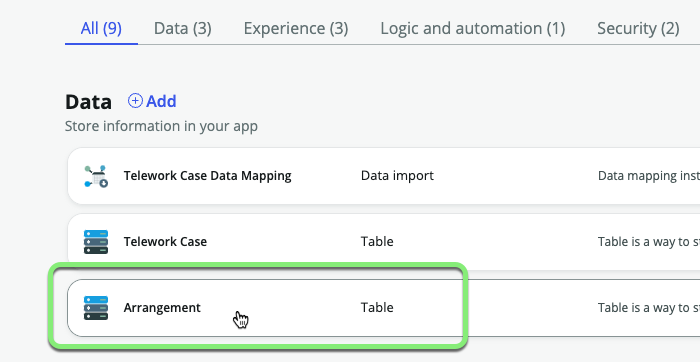
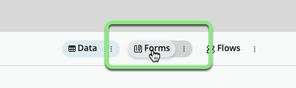
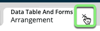

## Overview

In this exercise, you will open the `Arrangement` table in **Table Builder** so that a default form view is created. 

This will prevent errors later when we create the Workspace.

## Instructions

1. Click on the **Arrangement** table in the Data section.

2. Click the **Forms** pill in the top middle of the page. 

:::info
Here you can edit the Arrangement form as needed.  No changes are needed at this time.

This step is necessary so that the system will create a Default form view for the table. 
:::

3. Click the AES tab for the **Arrangement** table.

**Exercise Recap**

In this exercise, we ensured that a Default view for the `Arrangement` table was created. 

This will be important later when the workspace is created. 