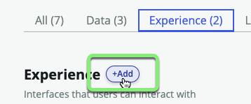
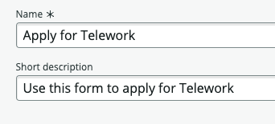
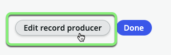
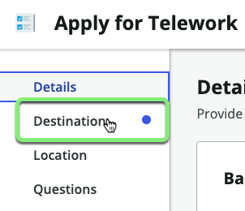
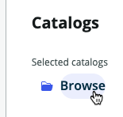
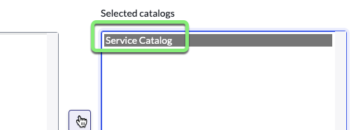
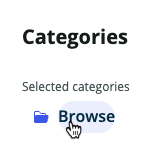
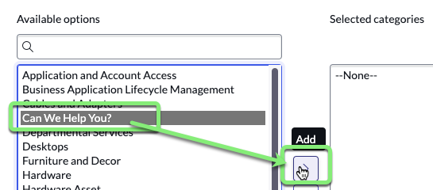
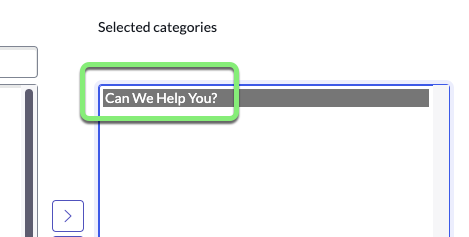
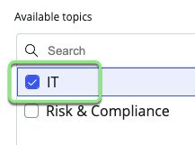

## Overview

The first set of requirements for the **Record Producer** form concern where the Telework requests get created.  They should get created on our 'Telework Case' table. 

We also need to present the **Record Producer** in an easy to use portal for the **requester** users. 

Follow the instructions below to learn to create a **Record Producer** that fulfills the requirements above. 

## Instructions

1. Click the **Experience** tab.

2. Click +Add.

3. Click **Record Producer**.

:::info
A Record Producer is a specific type of Catalog Item that allows end users to create records from a Service Catalog.
:::

4. Click Begin.

5. **Let's set up your record producer.**
    - Set the following values, then click Continue. 

    || 
    |--|--|
    |**Name**             |`Apply for Telework`
    |**Short description**|`Use this form to apply for Telework`

    

6. Click on the Edit record producer button.

7. **The Record Producer destination will be the `Telework Case` table.**
   1. Click on **Destination** 
   
   2. Type **Tel**.
   3. Select the **Telework Case** table.
   
   4. Click Continue to Location.

:::info Catalogs and Categories
Just like in real life, a ServiceNow **Catalog** contains **Categories** of items and services that can be ordered by a **requester**.

A **Topic** is a newer way in ServiceNow to organize **Catalog Items** and **Record Producers** for the **Employee Center** portal.
:::

8. **Add the Record Producer to a Catalog.**
    1. In the **Catalogs** box, click Browse.
    
    2. Move **Service Catalog** to the right hand box, 'Selected catalogs'.
    
    
    3. Click Save selections.

9. **Add the Record Producer to a Category.**
    1. In the **Categories** box, click Browse.
    
    2. Move **Can We Help You?** to the right hand box, 'Selected categories'.
    
    
    3. Click Save selections.

10. **Add the Record Producer to a Topic.**
    1. In the **Topics** box, click Browse.
    
    2. Check the box for **IT**.
    
    3. Click Save selection.

11. Click Continue to Questions.

## Exercise Recap

You have configured where the **Record Producer** will be visible for **requester** users to submit Telework requests. 