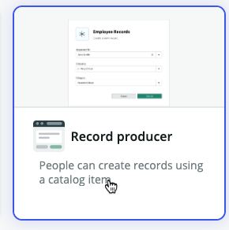
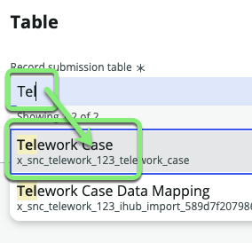

## Overview

The requirements for the **Record Producer** form is that it should contain the following questions: 

* **Who is the request for?**
  * Auto-populates with the name of the current user, but can be edited to a different user. 
* **When do you need this?**
    * Today
    * Tomorrow
    * This week
    * Next Week
* **What type of Telework are you applying for?**
  *  Regular and Recurring Telework
  *  Remote Telework
  *  Situational Telework 
* **Number of Days per Week?**
  *  Text field, but validate the input is an integer
* **What is the reason for Teleworking?**
  * Dependent Care
  * Medical
  * Reasonable Accommodation

Follow the instructions below to learn to create a **Record Producer** that fulfills the requirements above. 

## Instructions

1. Click the **Experience** tab.

2. Click +Add.

3. Click **Record Producer**.

:::info
A Record Producer is a specific type of Catalog Item that allows end users to create records from a Service Catalog.
:::

5. Click Begin.

6. **Let's set up your record producer.**
    - Set the following values, then click Continue. 

    || 
    |--|--|
    |**Name**             |`Apply for Telework`
    |**Short description**|`Use this form to apply for Telework`

    

7. Click on the Edit record producer button.

8. **Set the Record Producer to produce records for the `Telework Case` table.**
   1. Click on **Destination** 
   
   2. Type **Tel**.
   3. Select the **Telework Case** table.
   
   4. Click Continue to Location.

9. **Catalogs**
   1. In the **Catlaogs** box, click Browse.
   
   2. Move **Service Catalog** to the right hand box, 'Selected catalogs'.
   3. Click Save selections.

10. **Categories**
    1. In the **Categories** box, click Browse.
    
    2. Move **Can We Help You?** to the right hand box, 'Selected categories'.
    3. Click Save selections.

11. **Topics**
    1. In the **Topics** box, click Browse.
    
    2. Check the box for **IT**.
    
    3. Click Save selection.

12. Click Continue to Questions.

## Exercise Recap

The initial form has been created to produce records for the `Telework Case` table. 

In the next exercise, you will add questions for the user to answer when submitting the form. 