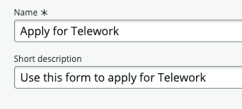
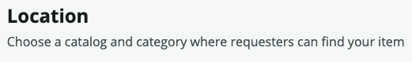
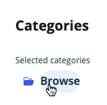
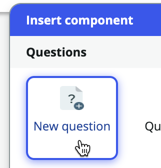
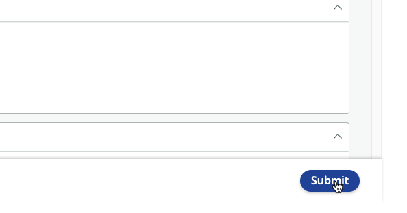

## Overview

In this exercise, we will create an experience for users to submit new Telework Case requests from an end user portal. 

You will create a **Record Producer** Catalog Item in App Engine Studio. 

When a requester user submits the Record Producer form a new Telework Case will be created. 

## Instructions

1. Click the **Experience** tab.

2. Click +Add.

3. Click **Record Producer**.

:::info
A Record Producer is a specific type of Catalog Item that allows end users to create records from a Service Catalog.
:::

5. Click Begin.

6. **Let's set up your record producer.**
    - Set the following values, then click Continue. 

    || 
    |--|--|
    |**Name**             |`Apply for Telework`
    |**Short description**|`Use this form to apply for Telework`

    

7. Click on the Edit record producer button.

8. **Set the Record Producer to produce records for the `Telework Case` table.**
   1. Click on **Destination** 
   
   2. Type **Tel**.
   3. Select the **Telework Case** table.
   
   4. Click Continue to Location.

9. **Catalogs**
   1. In the **Catlaogs** box, click Browse.
   
   2. Move **Service Catalog** to the right hand box, 'Selected catalogs'.
   3. Click Save selections.

10. **Categories**
    1. In the **Categories** box, click Browse.
    
    2. Move **Can We Help You?** to the right hand box, 'Selected categories'.
    3. Click Save selections.

11. **Topics**
    1. In the **Topics** box, click Browse.
    
    2. Check the box for **IT**.
    
    3. Click Save selection.

12. Click Continue to Questions.

**The Telework Case fulfiller users have asked that the users requesting to Telework can open a case on behalf of another user.**

13. **Insert a Question set**
    1. Click the arrow next to Insert new question.
    2. Click 'Question set'.
    
    3. Type `Standard`.
    4. Click on '**Standard** Employee Questions'.
    
    5. Click the arrow to the left of 'Standard Employee Questions' to expand the Question set and see what questions it contains.
    

:::info
A **Question set** is a set of questions that can be re-used across multiple Record Producers and Catalog Items.  
Some questions might have special logic to validate input or auto-populate answers.  
The Question set 'Standard Employee Questions' you added above has two questions that will auto-populate answers. 

By clicking the 'Who is this request for?' question, a user submitting the form can select a different user.

Adding this Question set fulfills the request from the Telework Case fullfiller users for requesters to submit a request on behalf of another user. 
:::
  

**The Telework Case fulfillers asked if a question could be added to ask what type of Telework Arrangement the user is requesting.**  

14. **Add a new question that references the Arrangement table.**
    1. Click Insert new question.  
    2. Configure the following values:

    | | |
    |--|--|
    |**Question type:** | Choice
    |**Question subtype:** | Record reference
    

    3. Scroll down to the **Details** section.
    4. Configure the following values: (💡 double-click, copy & paste into the form). 

    |Field Name                   | Field Value
    |-----------------------------| --------------
    |**Map to a specific field**  | Checked
    |**Table field**              | choose **Arrangement**
    |**Question label**           | What type of Telework arrangement are you applying for? 
    |**Mandatory**                | Checked 
    |**Question Preview** | Notice on the right panel, then **Question Preview** shows what the question will look like to the user. 

    :::info
    Notice the **Question Preview** that shows what the question will look like to the user.
    
    :::

    6. Click Continue to Additional details
    

    7. Type 'Arrangement' the **Source table** box and click the `Arrangement` table in the drop-down.
    

    8.  Click on the **Annotation** tab.
    

    In the current process, the team is spending a lot of time correcting and manually re-routing applications due to people confusing the different types of Telework arrangement.   
    Add an annotation to help the users understand what they are selecting.  

    9. Check the box **Show instructions**.

    10. Open the file: `telework_form_annotation.docx`.

    11. Copy all the text in the file ( ⌘ Cmd  or CTRL+A, CTRL+C )

    12. Paste it into the Instructions box (⌘ Cmd  or CTRL+V ). You can choose to either keep or remove formatting.
    

    13. Click Insert Question.

15. **Add the next question a different way.**
    1.  Click + Insert below the last question you added. 
    
    2. Click the 'New question' tile. 
    
    3. Set the following values in the **Type** section:  

    |Field Name       | Field Value
    |-----------------| --------------
    |Question type    | Text
    |Question subtype | Single line
    

    4. Scroll down to the **Details** section.

    5. In the **Details** section, enter the following information: (💡 double-click, copy & paste into the form).

    Field Name                   | Field Value
    -----------------------------| --------------
    Map to a specific field      | Checked
    Table field                  | Days per week
    Question label	             | Number of Days per Week?
    Name                         | days_per_week

    4. Click on **Additional details**.
    5. Click the drop-down and select **Number**.
    
    6. Click Insert Question.

**The Telework Case fulfiller users want 'Number of days per week' to only appear if the user answers 'Situational Telework'...**

**This can be done with a behavior.**

16. **Configure the behavior.**
    1. Hover over the question 'Number of days per week'.
    
    2. On the right side of the row, click this button.
    
    
    3. Click Define new behavior
    

    2. In the **Actions** tab, we'll specify the behavior we need:

    |Field Name                     | Field Value
    |------------------------------ | --------------
    | Make the question mandatory | Yes
    | Make the question visible   | Yes

    

    3. Click on the **Conditions** tab.

    

    4. Set the **Dynamic Behavior Condition** filter to 

    | | |
    |--|--|--
    |arrangement | is | Situational Telework

    
    5. Click Add behavior.
    

:::info
This will create a UI effect where the "Number of Days per Week" field will only appear when "What type of Telework arrangement are you apply for?" is "Situational Telework". 
:::

17. 

23. Back on the **Questions** page, we're going to ask for the reason for Teleworking. Click on Insert New Question.
    
    1. In the **Type** section set the following values:

    |Field Name                    | Field Value
    |-----------------------------| --------------
    |Question type                | Choice
    |Question subtype             | Dropdown (fixed values)

    

    2. Scroll down to the **Details** section.

    3. In the **Details** section, enter the following information: (💡 Copy & paste into the form). 
    
    Field Name                   | Field Value
    -----------------------------| --------------
    **Map to a specific field**  | Checked
    **Table field**              | Reason
    **Question label**           | What is the reason for Teleworking? 
    **Name**                     | reason
    **Mandatory**                | Checked 

    
    
    4. Click on **Continue to Choices**. 

    
  
    5. Check **Include none choice**. 

    

    6. In the **Available choices** section, click the + to insert a new choice. Add the following choices. (💡 Type in the Display Name and the value is created for you).

    

    

    |Display Name                 | Value
    |-----------------------------| --------------
    |Medical                      | medical
    |Dependent Care               | dependent_care
    |Reasonable Accommodation     | reasonable_accommodation

    Should look like this when complete:

    

    7. Click Insert Question in the bottom right. 

    

Your screen should now look like this:

24. Back to the questions page:

    1. Click Save.

    

    2. Click Preview.

    

25. The **Preview** page allows to visualize what our form will look like in different experiences. (You can interact with the item but not submit it).

    | **Portal** | **Now Mobile**
    | --- | --- |
    |  | 

26. Close the Preview by clicking on the X on the top right.

:::info
If you want to preview your catalog item in the Virtual Agent you will need to activate the plugins_ _ **Glide Virtual Agent** and **Service Management Virtual Agent Topic Blocks**.
Additional setup beyond that is required to get NLU to perform a topic conversation via the Virtual Agent.
Feel free to experiment this after completing the entire lab.
:::

27. Let's publish the form to the Service Portal.
 
    1. Click on **Review and Submit**.

    

    2. Click Submit in the bottom right.

    

28. **Congratulations!** The form is published on your development instance.   
Click Return to my application.

### Let's see how users can easily find it on the Service Portal

30. Go to the browser tab with ServiceNow Admin Home page.

31. Open the Service Portal by doing the following:
    1. Click All.
    2. Type **Portal**.
    3. Click on **Service Portal Home**.
    

32. In the portal, search for "Telework"

### The catalog item is found.

33. Click on the item to Apply for Telework.

34. In the **Details** section, enter the following information: (💡 double-click, copy & paste into the form).

    |Step |Field Name                  | Field Value
    |--|--------------------------- | --------------
    |1 | Who is this request for?   | David Loo
    |2 | When do you need this?     | This week
    |3 | What type of Telework arrangement are you applying for? | Situational Telework
    |4 | Number of days per week?   | 3
    |5 | What is the reason for Teleworking? | Dependent Care
    |6 | Click on the Submit button.

    

## **Exercise Recap**

In this exercise, we learned how to use App Engine Studio (AES) to easily create customized Catalog Items that users can access in Service Portal and on mobile devices.

Our next exercise will focus on taking the building blocks created to this point and making them actionable to drive automation and process optimization