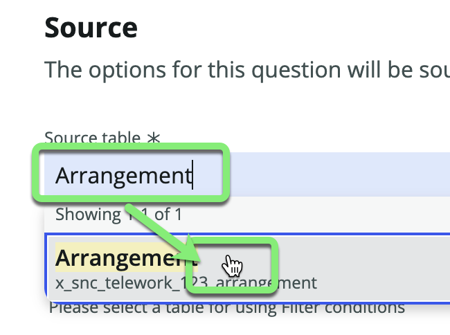
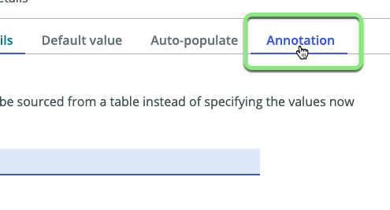
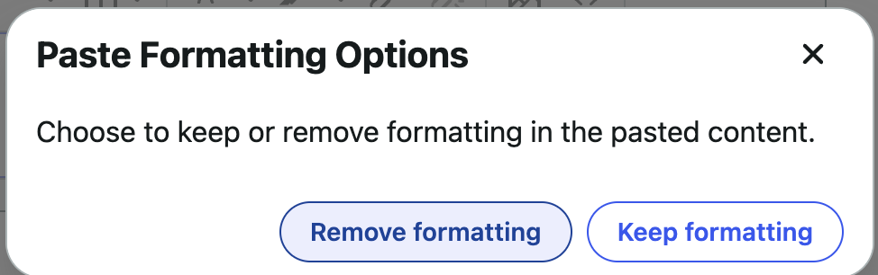
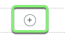

## Overview

The requirements for the **Record Producer** form is that it should contain the following questions: 

* **Who is the request for?**
  * Auto-populates with the name of the current user, but can be edited to a different user. 
* **When do you need this?**
    * Today
    * Tomorrow
    * This week
    * Next Week
* **What type of Telework are you applying for?**
  *  Regular and Recurring Telework
  *  Remote Telework
  *  Situational Telework 
* **Number of Days per Week?**
  *  Text field, but validate the input is an integer
  *  Should only appear if previous answer is 'Situational Telework'
* **What is the reason for Teleworking?**
  * Dependent Care
  * Medical
  * Reasonable Accommodation

A **Question set** is a ServiceNow term for a set of questions that can be re-used across multiple Record Producers and Catalog Items. Some questions in the set might have special logic to validate input or auto-populate answers.

The first two questions you will add to your **Record Producer** already exist on the system as part of a **Question set**  called 'Standard Employee Questions'. 

* **Who is the request for?**
* **When do you need this?**

:::note
Advanced ServiceNow users may know Questions sets outside of App Engine Studio by a different name 'Variable sets'.
:::

## Instructions

1. **Add the 'Standard Employee Questions' Question set.**
    1. Click the arrow next to Insert new question.
    2. Click 'Question set'.
    
    3. Type `Standard`.
    4. Click on '**Standard** Employee Questions'.
    
    5. Click the arrow to the left of 'Standard Employee Questions' to expand the Question set and see what questions it contains.
    

2. **Add the question 'What type of Telework are you applying for?'**
    1. Click Insert new question.  
    2. Configure the following values:

    | | |
    |--|--|
    |**Question type:** | Choice
    |**Question subtype:** | Record reference
    

    3. Scroll down to the **Details** section.
    4. Configure the following values: (💡 double-click, copy & paste into the form). 

    |Field Name                   | Field Value
    |-----------------------------| --------------
    |**Map to a specific field**  | Checked
    |**Table field**              | choose **Arrangement**
    |**Question label**           | What type of Telework arrangement are you applying for? 
    |**Mandatory**                | Checked 
    |**Question Preview** | Notice on the right panel, then **Question Preview** shows what the question will look like to the user. 

    :::info
    Notice the **Question Preview** that shows what the question will look like to the user.
    
    :::

    5. Click Continue to Additional details.
    

    6. Type 'Arrangement' the **Source table** box and click the `Arrangement` table in the drop-down.
    

    7.  Click on the **Annotation** tab.
    

    In the current process, the team is spending a lot of time correcting and manually re-routing applications due to people confusing the different types of Telework arrangement.   
    Add an annotation to help the users understand what they are selecting.  

    8. Check the box **Show instructions**.

    9.  Open the file: `telework_form_annotation.docx`.

    10. Copy all the text in the file ( ⌘ Cmd  or CTRL+A, CTRL+C )

    11. Paste it into the Instructions box (⌘ Cmd  or CTRL+V ). You can choose to either keep or remove formatting.
    

    12. Click Insert Question.

3. **Add the question 'Number of Days per Week?' using a different way.**
    1.  Click + Insert below the last question you added. 
    
    2. Click the 'New question' tile. 
    
    3. Set the following values in the **Type** section:  

    |Field Name       | Field Value
    |-----------------| --------------
    |Question type    | Text
    |Question subtype | Single line
    

    4. Scroll down to the **Details** section.

    5. In the **Details** section, enter the following information: (💡 double-click, copy & paste into the form).

    Field Name                   | Field Value
    -----------------------------| --------------
    Map to a specific field      | Checked
    Table field                  | Days per week
    Question label	             | Number of Days per Week?
    Name                         | days_per_week

    6. Click on **Additional details**.
    7. Click the drop-down and select **Number**.
    
    8. Click Insert Question.

**The Telework Case fulfiller users want 'Number of days per week' to only appear if the user answers 'Situational Telework'...**

**This can be done with a Behavior.**

:::note
Advanced ServiceNow users may know Behviors outside of App Engine Studio by a different name 'UI Policies'.
:::

4. **Add a behavior.**
    1. Hover over the question 'Number of days per week'.
    
    2. On the right side of the row, click this button.
    
    
    3. Click Define new behavior
    

    2. In the **Actions** tab, we'll specify the behavior we need:

    |Field Name                     | Field Value
    |------------------------------ | --------------
    | Make the question mandatory | Yes
    | Make the question visible   | Yes

    

    3. Click on the **Conditions** tab.

    

    4. Set the **Dynamic Behavior Condition** filter to 

    | | |
    |--|--|--
    |arrangement | is | Situational Telework

    
    5. Click Add behavior.
    

:::info
This will create a UI effect where the "Number of Days per Week" field will only appear when "What type of Telework arrangement are you apply for?" is "Situational Telework". 
:::

5. **Add the final question: What is the reason for Teleworking?**
    1. Click Insert New Question.
    2. In the **Type** section set the following values:

    |Field Name                    | Field Value
    |-----------------------------| --------------
    |Question type                | Choice
    |Question subtype             | Dropdown (fixed values)
    

    2. Scroll down to the **Details** section.

    3. In the **Details** section, enter the following information: (💡 Copy & paste into the form). 
    
    Field Name                   | Field Value
    -----------------------------| --------------
    **Map to a specific field**  | Checked
    **Table field**              | Reason
    **Question label**           | What is the reason for Teleworking? 
    **Name**                     | reason
    **Mandatory**                | Checked 

    
    
    4. Click Continue to Choices.

    
  
    5. Check **Include none choice**. 

    6. In the **Available choices** section, hover over the + and click + Insert to add a new choice. 
    
    

    7. Add the following choices. (💡 Type in the Display Name and the value is created for you).

    |Display Name                 | Value
    |-----------------------------| --------------
    |Medical                      | medical
    |Dependent Care               | dependent_care
    |Reasonable Accommodation     | reasonable_accommodation

    

    8. Click Insert Question.

Your screen should now look like this:

18. Click Save.

## Exercise Recap

The **Record Producer** form now has the required fields and behavior added to it.  You were able to leverage a 'Question set' so that you did not have to recreate the Standard Employee Questions. 

In the next exercise, you will learn to preview the **Record Producer** form before it is published. 