## Overview

A ServiceNow Flow consists of two main parts:

* A Trigger
* A set of automated steps

There are various types of triggers that can make the Flow start such as when a record is created or what time of day it is. 

A Flow can contain many automated steps; however, if you find the Flow getting too long it is useful to move large sets of steps to a Subflow if possible. This allows you to modularize your steps to make the Flow easier to understand and troubleshoot. 

Follow the instructions below to create a Flow that will execute each time a new Telework Case request is submitted. 

## Instructions

1. From the App Home tab, in the "Logic and automation" section, **click Add**.


2. Click "Flow".


3. Click **Build from scratch** to create a new workflow.


4. Create the flow with the following information:

    |Field | Value |
    |-|-|
    |Name | Main |
    |Description | Manage the Telework flow of work.

    Click on the <span className="button-purple">Continue</span> button.


5. **Click** the **Edit this flow** button to begin the configuration process.
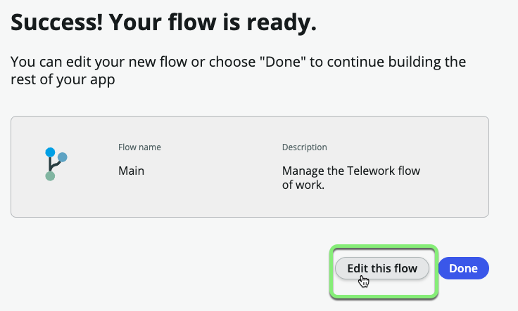


6. You may see a tour popup. Let's skip the tour for now, by clicking the **Skip tour** button.

## The first thing we'll do is set up our trigger to define when this flow will run.

7. Click on **Add a trigger** in the upper left of the flow designer screen.
    
    1. Select **Created** from the Record section.
    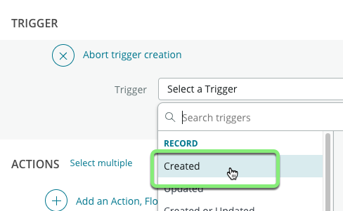
    2. Select the **Telework Case** table.
    
    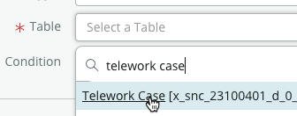
    3. Click <span className="button-purple">Done</span> to close the trigger.

## After defining the Trigger, you will next add the steps that will take place when the Flow is triggered. 

8. 
    1. Click **Add an Action, Flow logic, or Subflow**.
    2. Choose **Action**.
    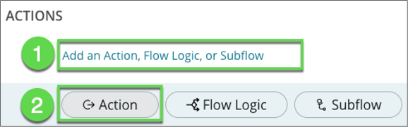


9. The first step in the Flow will be to request an approval to the manager of the user in the 'Opened by' field. 
    1. In the search field, type "approval".
    2. Select **Ask for Approval**.
    


10. 
    1. Click on the data picker.
    2. Select **Trigger – Record Created**.
    3. Select **Telework Case Record**.
    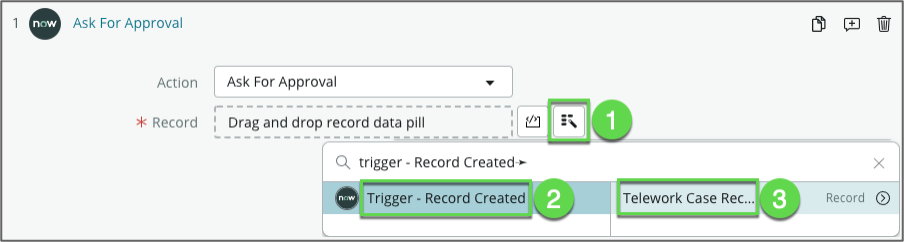


11. In the **Rules** section, let's configure the approval rule.
    1. Choose **Anyone approves** for the Approval rule.
    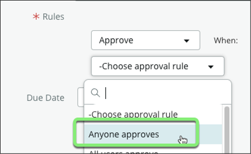
    2. Click on the Data Pill Picker button (_the magic wand button_).
    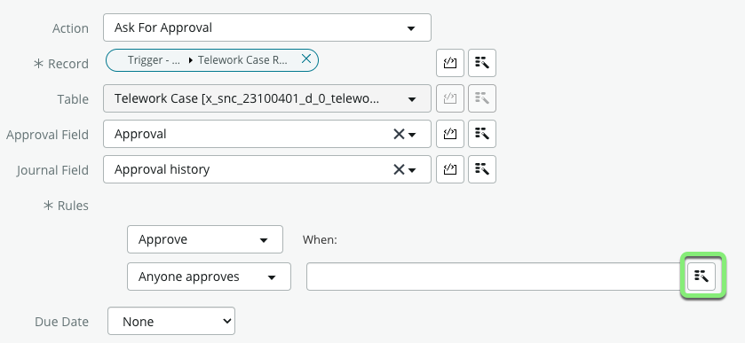
    3. Click **Trigger - Record created**.
    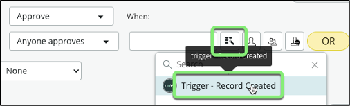
    4. Click on the chevron to access the list of fields.
    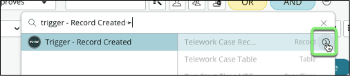
    5. Locate the **Opened by** field and click on the chevron next to it.
    
    6. Select **Manager**.
    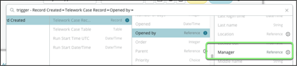
    7. Click <span className="button-purple">Done</span>.


12. Now let's configure what happens when the manager approves:
    1. Under the Ask for Approval, **click** on the **"Add an Action. Flow logic or Sub flow**.
    2. Select **Flow Logic**.
    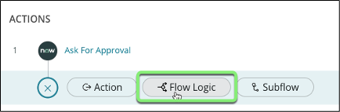
    3. Select **If**.
    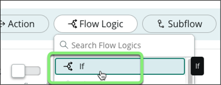


13. Let's define the condition:
    1. In the **Condition Label** field type "Manager approves".
    
    2. Click on the Data Pill Picker (_magic wand button_).
    3. Click **1 – Ask for Approval**.
    4. Click **Approval State**.
    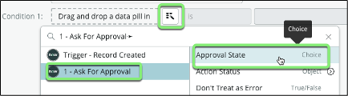
    5. Set drop-down to **Approved**.
    
    6. Click <span className="button-purple">Done</span>.


14. Next, if the manager approves, a task should be submitted to IT get the person a VPN Remote Access Token.
    1. Under _If Manager approves_ click the small + to add a step.
    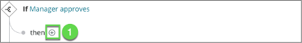
    2. Select **Action** > **ServiceNow Core** > **Create Task**.
    3. For Table, select "Ticket".
    4. Click **Add field value**.
    5. Search and select **Parent**.
    6. Click on the Data Pill Picker (_magic wand button_).
    
    7. Select **Trigger - Record created** > **Telework Case Record**.
    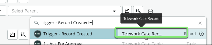
    8. Click **+ Add field value** and add two other fields:

        |Field Name              | Field Value
        |------------------------| --------------
        |Short description   | Remote Access Token |
        |Assigned to         | for testing assign it to yourself (System administrator) |

    This is how the Field Values should look:
    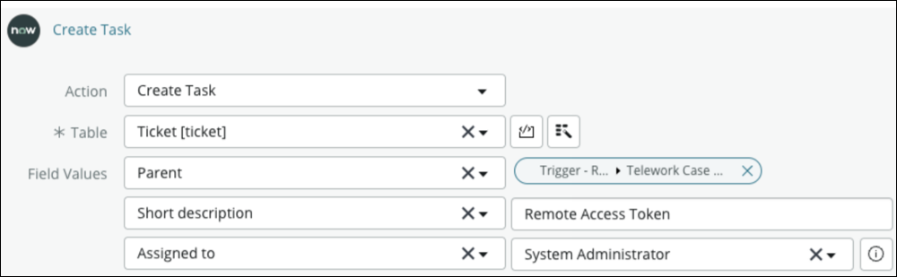
    9. Let's add an annotation and set it to "Request Remote Access Token".
    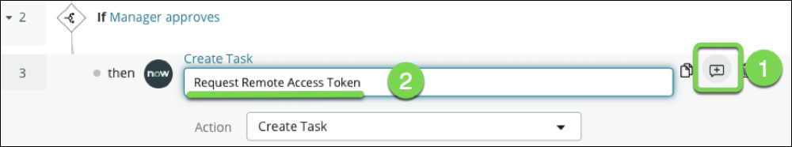
    10. Click <span className="button-purple">Done</span>.


15. Send an email to the 'Opened by' user and let them know their Telework Case request has been approved.
    1. Under **3 - Create Task** click the small + to add a step.
    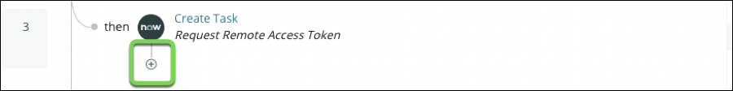
    2. Select **Action** > **ServiceNow Core** > **Send Email**.
    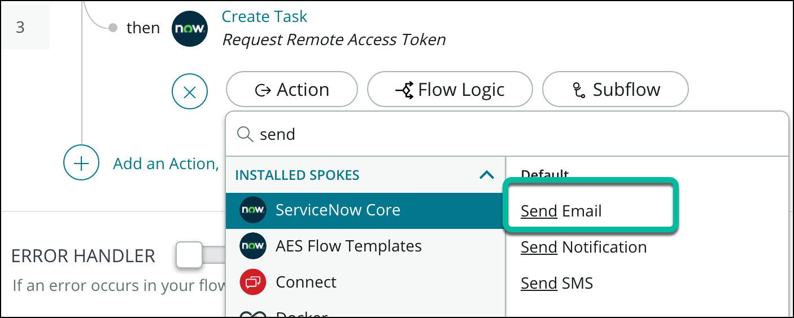
    3. Let's add an annotation and set it to "Notify Requester".
    
    4. For the Target record, use the Data Pill Picker to select  **Trigger - Record created** > **Telework Case Record**.
    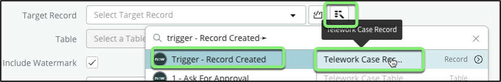
    5. For the **To** field,
        1. Click on the record picker.
        2. Select **Trigger - Record created**.
        3. Click on the chevron to access the list of fields.
        4. Locate the **Opened by** field and click on the chevron next to it.
        5. Select **Email**.

    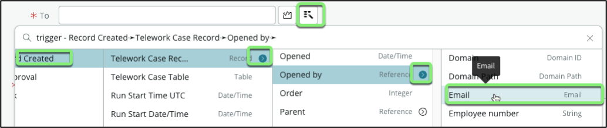

    6. For the **Subject**, enter:
    ```
    Your Telework application is approved.
    ```

    7. For the **Body**:
        1. Start by entering: "Dear " (followed by a whitespace).
        2. Use the record picker to select the **Opened by** > **Name** field.
        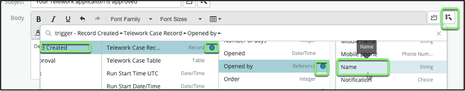
        3. Hit Enter to move to the next line.
        4. Type "Your application for ".
        5. Use the Data Pill Picker to select the **Arrangement** > **Code** field.
        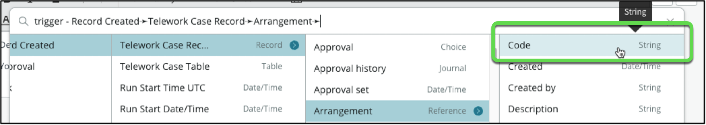
        6. Type " is approved" after the data pill (preceeded by a whitespace).
        7. The Body should look like this:
        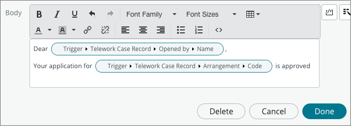


16. Click <span className="button-purple">Done</span>.


17. Your flow should look like this:


18. Click on the Toggle view to visualize the flow as a Diagram.
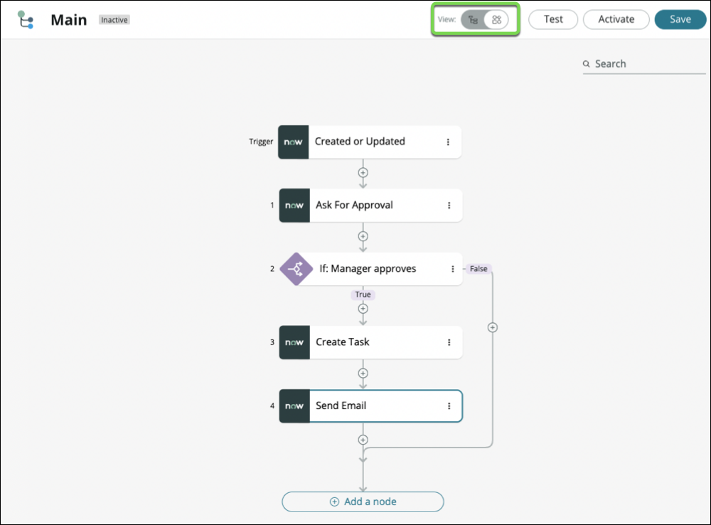


20. In the top right corner of the screen, Click <span className="button-purple">Save</span>.


21. Click <span className="button-purple">Activate</span> on the left of the Save button. This makes the Flow 'live' in the app.  


22. In the Confirmation box click the <span className="button-purple">Activate</span> button.

## Exercise Recap

You've built a Flow that takes care of managing tasks and communications across multiple departments.

Next, you will test the Flow to see it in action. 