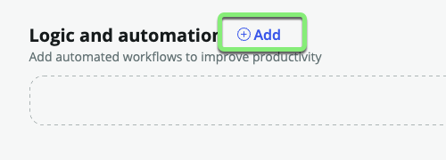
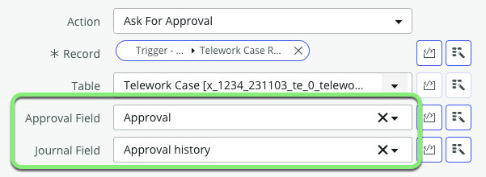
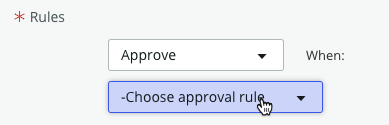
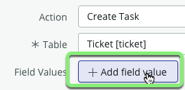
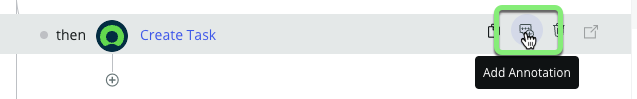
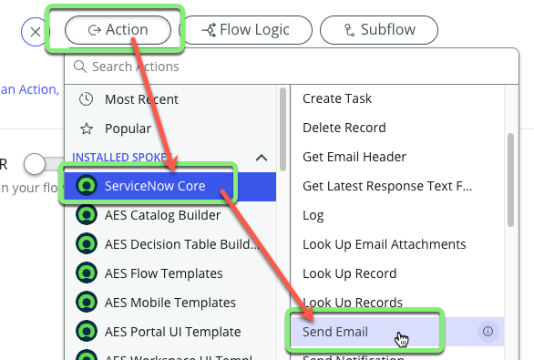
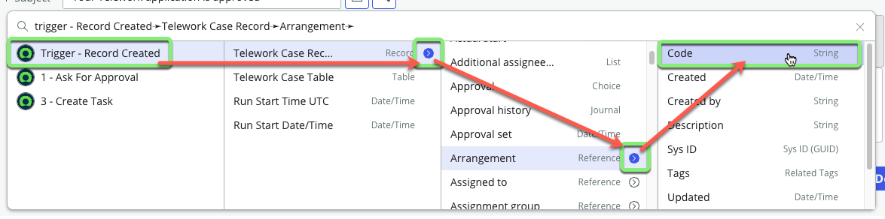
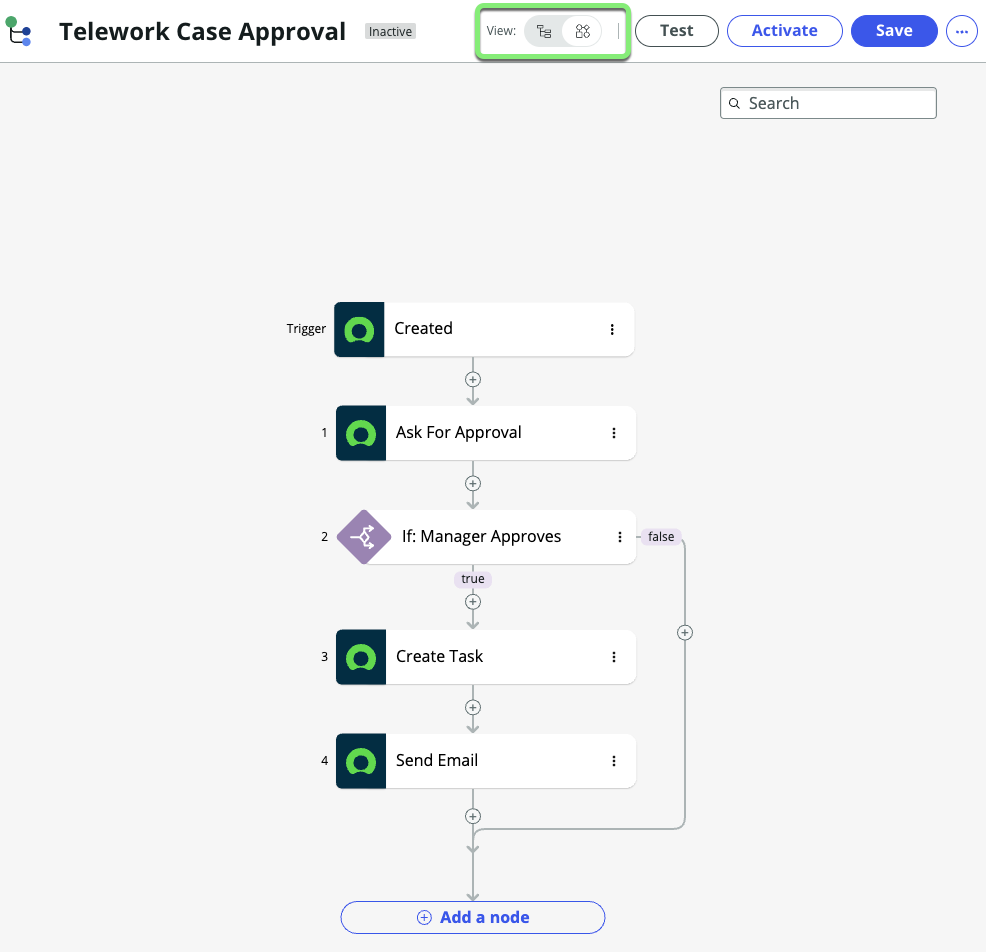

## Overview

A Flow is an automated process consisting of a trigger and a sequence of reusable actions. The trigger specifies when to run the flow. The actions perform a sequence of operations on your data.

A Flow can include these components:
* **Trigger**
  * An activity that initiates the flow, such as a record created in a specified table or a scheduled job.
* **Conditions** 
  * Statements that determine when or how an action runs. For example, run an action only if a field is over a certain value.
* **Actions** 
  * Operations executed by the system, such as a field value updated, approval requested, or a value logged.

To understand basic flows, create an approval Flow for new Telework Cases. The Flow will:

* Run when a Telework Case record is created.
* Sends to the 'Opened by' person's manager for approval.
* If approved,
  * Creates a Ticket for IT to configure a remote VPN access token for the person.
  * Sends an email to the 'Opened by' user letting them know their request was approved. 

:::caution
* Your Flow work only exists in your browser until you click the Save button. 
* You are encouraged to click the Save button as frequently as you would like to ensure you don't lose any progress. 

:::

## Instructions

1. From the App Home tab, in the "Logic and automation" section, **click Add**.

2. Click **Flow**.

3. Click **Build from scratch** to create a new workflow.

4. Create the flow with the following information:

    |Field | Value |
    |-|-|
    |Name | Telework Case Approval |
    |Description | Approve and fulfill new Telework Cases.

    

    Click on the Continue button.

5. **Click** the **Edit this flow** button to begin the configuration process.
    

6. You may see a tour popup. Let's skip the tour for now, by clicking the **Skip tour** button.

7. **Add a trigger to determine when and how the Flow will run.**
    1. Click on **Add a trigger** in the upper left of the flow designer screen.
    
    2. Select **Created** from the Record section.
    
    3. Click the 'Table' drop-down.
    
    4. Type `telework case` and click the **Telework Case** table.
    
    5. Click Done to close the trigger.

8. **Request an approval from the 'Opened by' user's manager with the 'Ask for Approval' Action.**
    1. Click **Add an Action, Flow Logic, or Subflow**.
    
    2. Click **Action**.
    
    3. Click **Ask For Approval**.
    
     **Add the record the manager is approving.**
    4. Click on the **Data Pill Picker**.
    
    5. Select **Trigger – Record Created**.
    6. Select **Telework Case Record**.
    

:::info
* Did you noticed that the **Approval Field** and **Journal Field** automatically populated?

* This is because these fields already existed on the **Task** table that we extended **Telework Case** from. 
* **REMEMBER:** 
  * If you're tracking any kind of work (tickets, requests, etc.) it's _always_ a good idea to extend from **Task** unless you have a good reason not to.
:::

9.  **Configure the Rules for when this record is approved.**
    1. Click the '-Choose approval rule' drop-down.
    
    2. Choose **Anyone approves**.
    
    **Next, you need to specify which person the approval will go to.**
    3. Click on the **Data Pill Picker** to look up data on the 'Telework Case' record that triggered this flow. 
    
    4. Click **Trigger - Record Created**.
    
    5. Click on the chevron to access the list of fields on the 'Telework Case' record. 
    
    6. Scroll down to locate the **Opened by** field and click on the chevron next to it.
    
    7. Scroll down to locate the **Manager** field and click on it. 
    
    8. Click Done to finish configuring the 'Ask for Approval' Action. 
    

:::info
Going from Record to Record to Record to find a specific field in ServiceNow is called "Dot-Walking".
:::

10. **Add Flow Logic for _If the manager approves_...**
    1. Under the 'Ask for Approval' Action, **click** on **Add an Action. Flow Logic, or Subflow**.
    
    2. Click **Flow Logic**.
    3. Click **If**.
    
    4. In the **Condition Label** field type "Manager approves".
    
    5. Click on the **Data Pill Picker** next to 'Condition 1'.
    6. Click **1 – Ask for Approval**.
    7. Click **Approval State**.
    
    8. Click the 'Select a choice' drop-down.
    9. Click 'Approved'.
    
    10. Click Done.

:::info
Adding the **Condition Label** of 'Manager Approves' was like adding a comment to our code. 

This will make any troubleshooting easier later as you can see what the Flow Logic does without opening it up. 
:::

Next, if the manager approves, a task should be submitted to IT to configure VPN access for the person. 

14. **Add the Create a Ticket Action.**
    1. Under _If Manager approves_ click ⊕ next to 'then'.
    
    2. Select **Action** > **ServiceNow Core** > **Create Task**.
    
    3. For Table, select "Ticket".
    
    3. Click **Add a field value**.
    
    4. Click 'Select a field'.
    5. Search for 'Parent' in the drop-down and click it. 
    
    **Set the 'Parent' field on the new 'Ticket' record to be the 'Telework Case' record that triggered this Flow.**
    6. Click on the **Data Pill Picker**.
    7. Select **Trigger - Record created** > **Telework Case Record**.
    
    **Result:**
    
    8. Click **+ Add field value** and add two other fields:
    

    |Field Name              | Field Value
    |------------------------| --------------
    |**Short description**   | VPN Access |
    |**Assigned to**         | System administrator (_Normally you would not specify a user here, but we are doing this for the lab to make it easier later._)|

    9. If the Field Values look like below, click Done.
    
    10. Click the **Add Annotation** button to the right of the **Create Task** Action. 
    
    11. Type `Request VPN Access` and hit ENTER.
    

:::info
Adding Annotations makes the Flow easier to read.

:::

**Send an email to the 'Opened by' user and let them know their Telework Case request has been approved.**

15. **Add and configure the 'Send Email' Action.**
    1. Click ⊕ under **Create Task**.
    
    2. Select **Action** > **ServiceNow Core** > **Send Email**.
    
    3. Click the **Add Annotation** button.
    4. Type `Notify Opened By` in the field and hit ENTER. 
    
    **Emails need to be associated to a target record for tracking.**
    5. Click the **Data Pill Picker** next to **Target Record**.
    6. Select  **Trigger - Record created** > **Telework Case Record**.
    
    7. Click the **Data Pill Picker** next to the **To** field.
    8. Click **Trigger - Record created**. 
    9. Click the chevron next to 'Telework Case Record'.
    10. Click the chevron next to 'Opened by'.
    11. Click 'Email'.
    

    12. For the **Subject**, enter: `Your Telework application is approved`

    **Set the Body of the email.**

    13. In the **Body** field, type `Dear ` _(Be sure to include the extra space at the end)_.
    
    14. Click the **Data Pill Picker** to the right of the **Body** field. 
    
    15. Dot-walk to and click the field **Trigger - Record Created** >> **Telework Case Record** >> **Opened by** >> **Name**.
    
    **RESULT:**
    
    16. In the **Body** field, hit Enter to move to the cursor to the next line.
    17. Type `Your application for ` _(Be sure to include the extra space at the end)_.
    
    18. Click the **Data Pill Picker** to the right of the **Body** field. 
    
    19. Dot-walk to and click the field **Trigger - Record Created** >> **Telework Case Record** >> **Arrangement** >> **Code**.
    
    20. Type `<space>is approved.` after the data pill. _(Be sure to include an extra space before the words)_.
    
    21. Click Done.

17. Your flow should look like this:

18. Click on the Toggle view to visualize the flow as a Diagram.

20. In the top right corner of the screen, Click Save.

21. Click Activate on the left of the Save button. This makes the Flow 'live' in the app.  

22. In the Confirmation box click the Activate button.

## Exercise Recap

You've built a Flow that takes care of managing tasks and communications across multiple departments.

Next, you will test the Flow to see it in action. 