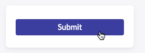

In this section, we will test the flow we just created and make sure it functions as expected.

We need to test with a user who has a manger. Fortunately ServiceNow allows admins to impersonate other authenticated users for testing purposes.

Let's go back to the ServiceNow admin page.

1. In the banner frame, click the profile photo in the top right to open the user menu.

2. Select **Impersonate User**.
    
    The Impersonate User dialog box appears.
    1. Search for and select "David Loo" (it's one of the demo user who has a manager).
    2. Click *Impersonate User*
    

3. Let's submit a new application.

4. Go to the tab with ServiceNow Admin Home page.

5. **Open the Employee Center**.
    1. Click All.
    2. Type `employee center`.
    3. Click **Employee Center**.
    

6. In the ServiceNow Portal page.
    1. Search for "Telework".
    2. Open the catalog item.
    3. Complete the form as below and Submit.
    
    

7. Let's check the execution
    1. Go back to the ServiceNow admin page.
    2. Impersonate David Loo's manager : "Bud Richman".
    3. With email enabled on the instance and a valid email address, the manager would get an email notification and allow the manager to approve or reject.
    4. Let's check if the manager has any approval request in **My Approvals** list.
        1. In the **All** menu, search for and select, type **My Approvals**.
        
        2. Yes, there is one! Right-click on the **Requested**.
        3. Select **Approve**.
        

8. Next, let's check if an email was sent.
    1. In the top right, click the profile photo to open the User menu.
    2. Select  **End Impersonation**.
    
    3. In the **All** menu, search for and select **Outbox**.
    
    4. Click on the **Created** column name to show most recent at the top. We have an email! Click on it to open it.
    
    5. On the email record, scroll down to the bottom of the page, and click on the **Preview Email** related link.
    
    6. And voila! Observe the email that was sent.
       1. We have automated case updates notifications.
       2. Notice the watermark at the bottom of the email. ServiceNow generates a watermark label at the bottom of each notification email to allow matching incoming email to existing records. This helps track emails sent as part of a case and manage responses to emails.
        

## Congratulations! 

You successfully built and tested a workflow that saves a lot of time in the organization and makes sure tasks are assigned properly.