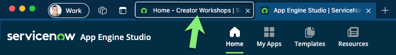
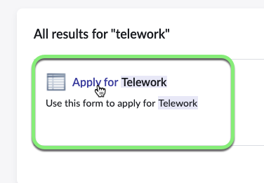

## Overview

In this section, we will test the flow we just created and make sure it functions as expected.

We need to test with a user who has a manger. Fortunately ServiceNow allows admins to impersonate other authenticated users for testing purposes.

## Instructions

1. Go to the browser tab that says 'Home - Creator Workshops'.

2. Click the avatar photo in the top right corner of the page. 

3. **Impersonate 'David Loo'.**
   1. Select **Impersonate User**.
   
   2. Search for `David Loo` and click his name in the search results.
   
   2. Click Impersonate User.

4. Close the **New to Vancouver** pop-up.

5. **Open the Employee Center**.
    1. Click All.
    2. Type `employee center`.
    3. Click **Employee Center**.
    

6. Type `telework` in the Search box and hit ENTER.

7. Click **Apply for Telework** in the search results.

8. Fill out the form with the following values: (💡 double-click, copy & paste into the form).

    |Field Name               | Field Value
    |--------------------------- | --------------
    |**Who is this request for?**   | David Loo
    |**When do you need this?**     | Today
    |**What type of Telework arrangement are you applying for?** | Situational Telework
    |**Number of days per week?**   | 3
    |**What is the reason for Teleworking?** | Dependent Care

    

    Click Submit.

    

7. Let's check the execution
    1. Go back to the ServiceNow admin page.
    2. Impersonate David Loo's manager : "Bud Richman".
    3. With email enabled on the instance and a valid email address, the manager would get an email notification and allow the manager to approve or reject.
    4. Let's check if the manager has any approval request in **My Approvals** list.
        1. In the **All** menu, search for and select, type **My Approvals**.
        
        2. Yes, there is one! Right-click on the **Requested**.
        3. Select **Approve**.
        

8. Next, let's check if an email was sent.
    1. In the top right, click the profile photo to open the User menu.
    2. Select  **End Impersonation**.
    
    3. In the **All** menu, search for and select **Outbox**.
    
    4. Click on the **Created** column name to show most recent at the top. We have an email! Click on it to open it.
    
    5. On the email record, scroll down to the bottom of the page, and click on the **Preview Email** related link.
    
    6. And voila! Observe the email that was sent.
       1. We have automated case updates notifications.
       2. Notice the watermark at the bottom of the email. ServiceNow generates a watermark label at the bottom of each notification email to allow matching incoming email to existing records. This helps track emails sent as part of a case and manage responses to emails.
        

## Exercise Recap

In this exercise, you tested the Automated Flow by impersonating a user, submitted a record, and ensuring the automated steps took place. 