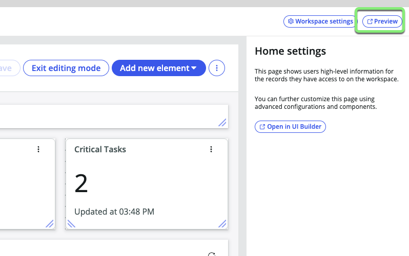
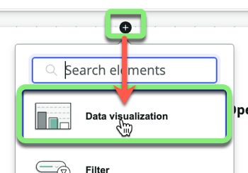
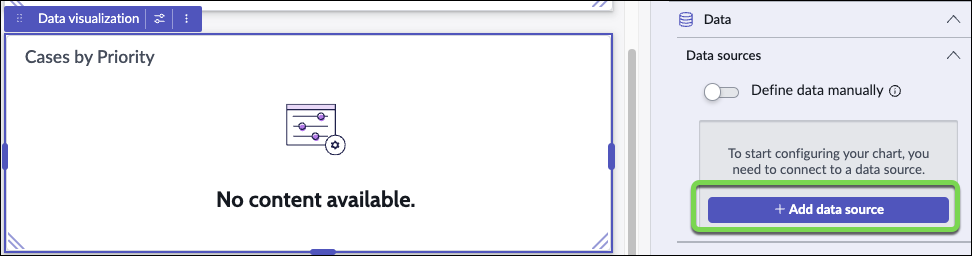
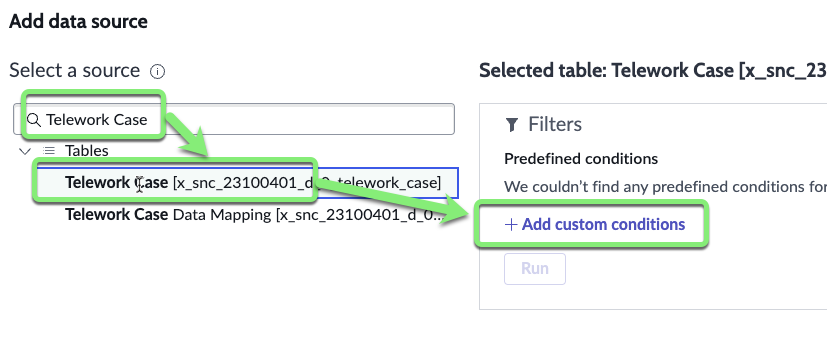
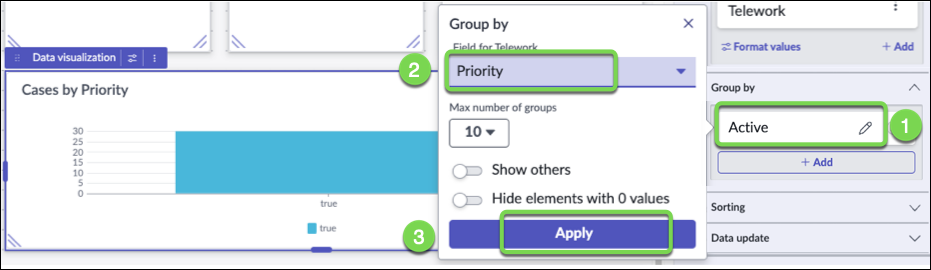
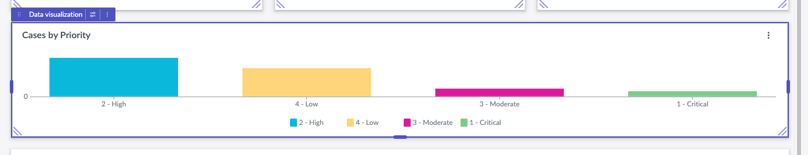
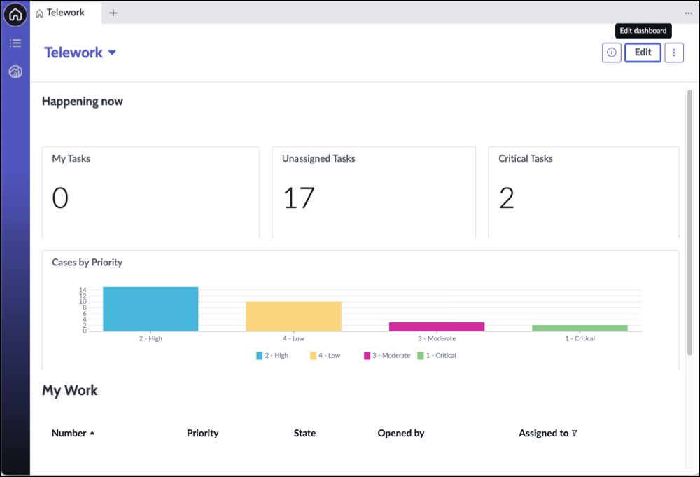

## Overview

The Workspace Builder empowers users of all skill sets to build a custom workspace in a no-code environment. With this builder, you can quickly create a workspace and configure its layout, lists, and record pages. If you need access to more advanced functionalities and configurations, you can open the workspace in UI Builder from within this builder.

A lot has been pre-configured for us. We'll make a couple of changes to improve it.

Let's help the business users visualize quickly cases by priority.

## Instructions

1. Click the **Preview** button in the upper right to open the workspace in a new browser tab. 

2. Go into Edit Mode by clicking the **Edit** button 

3. Add a new Data Visualization. 
   1. Click the **My Work** data visualization.
   2. Click the black plus icon at the top center of the **My Work** data visualization.
   
   3. Click **Data Visualization**.
   
   4. Click **New Visualization**.
   
   5. Click the bottom-right corner of the new **Visualization** and drag it across the page. 
   

4. **Set the type of Visualization**.
   1. Click the **Visualization type** dropdown.
   2. Scroll down and click on **Vertical bar**.
   

5. **Name the chart.** 
   1. Click on **Header and border** to expand that section. 
   2. Type `Cases by Priority` in the **Chart Title** field.
   

9. Under Data sources, click **+ Add data source**.

10. 
    1. Type **Telework Case** in the "Select a source" field. 
    2. Click **Telework Case** in the search results.
    3. Click **+ Add custom conditions**.
    

11. We want to see only the non-closed cases.
    1. Set **State is one of Pending, Open, Work in Progress**. 
    
    2. Click **Add this source** in the bottom right.
    

12. In the **Group by** section, 
    1. Click the pencil icon next to **Active**.
    2. Set **Priority** for the Group by.
    3. Click **Apply**.
    
    

13. On the top right, Click **Save** then **Exit Edit Mode** 

Your workspace should look like the image below. 

## Exercise Recap

In this exercise, we learned how to create a custom workspace and used the the Workspace Builder to display key performance indicators and organize information in ways that benefit our users.