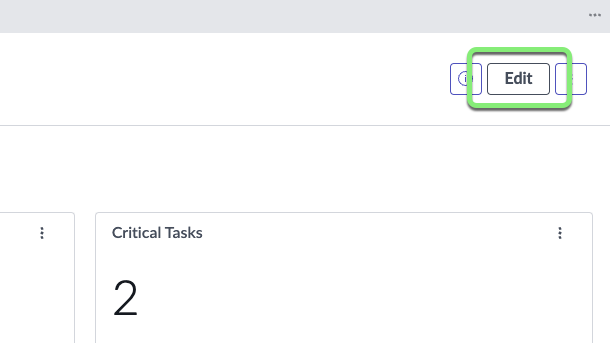
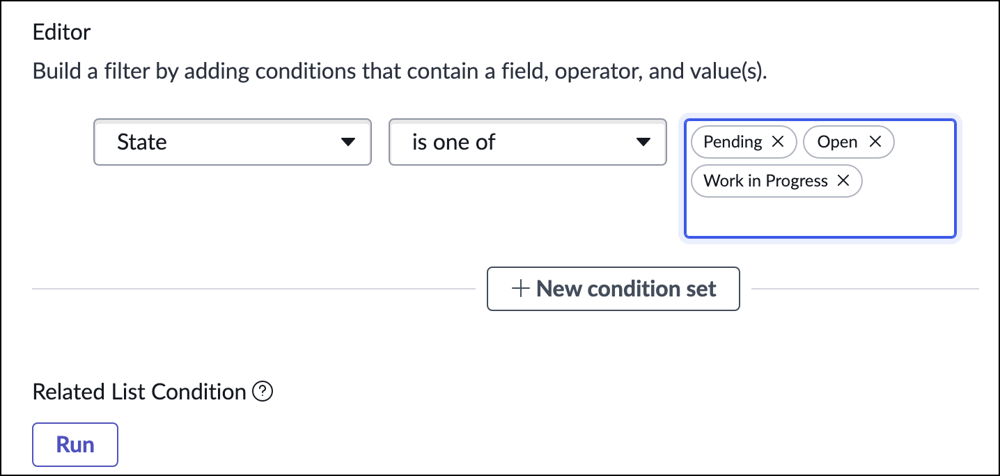
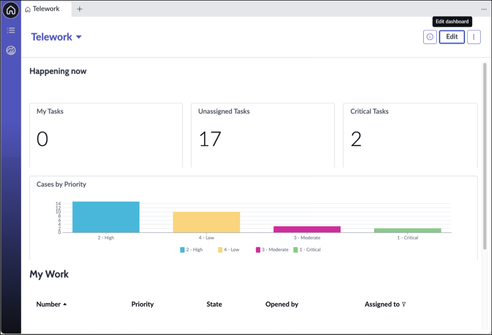

## Overview

The Workspace Builder empowers users of all skill sets to build a custom workspace in a no-code environment. With this builder, you can quickly create a workspace and configure its layout, lists, and record pages. If you need access to more advanced functionalities and configurations, you can open the workspace in UI Builder from within this builder.

A lot has been pre-configured for us. We'll make a couple of changes to improve it.

Let's help the business users visualize quickly cases by priority.

## Instructions

1. Click the **Preview** button in the upper right to open the workspace in a new browser tab. 

2. Go into Edit Mode by clicking the **Edit** button 

3. Add a new Data Visualization. 
   1. Click on **Add new element**.
   2. Select **Data visualization**.
   

4.  Scroll down, the component has been added at the bottom of the page.

5. Drag and drop the new data component from the bottom of the dashboard to right above the My Work section and size it to expand across the screen.

6. On the new component, click the configure icon

7. In the configuration panel:

   **(1)** Click the **Visualization Type Dropdown** 

   **(2)** type "vert" 

   **(3)** select **Vertical bar**.
   

8.  
    **(1)** Click on **Header and border** to expand that section, 

    **(2)** Type "Cases by Priority" in the **Chart Title** field.
    

9. Under Data sources, click **+ Add data source**.

10. 
    1. Type **Telework Case** in the "Select a source" field. 
    2. Click **Telework Case** in the search results.
    3. Click **+ Add custom conditions**.
    

11. We want to see only the non-closed cases.
    1. Set **State is one of Pending, Open, Work in Progress**. 
    
    2. Click **Add this source** in the bottom right.
    

12. In the **Group by** section, 
    1. Click the pencil icon next to **Active**.
    2. Set **Priority** for the Group by.
    3. Click **Apply**.
    
    

13. On the top right, Click **Save** then **Exit Edit Mode** 

Your workspace should look like the image below. 

## Exercise Recap

In this exercise, we learned how to create a custom workspace and used the the Workspace Builder to display key performance indicators and organize information in ways that benefit our users.