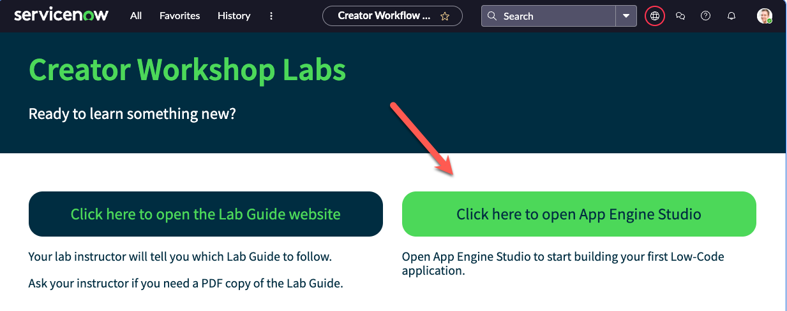
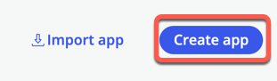
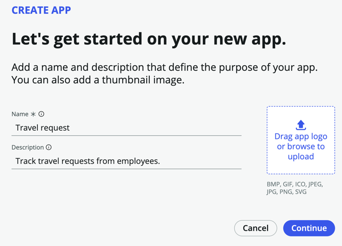

**Duration: 5 minutes**

Before we begin, we will need to create our scoped application.  It will contain all of the tables, forms, flows, and other assets that make up our application. 

1. On the Landing Page click the bright green button that says **Click here to open App Engine Studio**, and it will take you to the App Engine Studio home page. 

2. Click **Create app** on the top right of the screen

3. On the Create App page, name the app "Travel request", and for description, enter "Track travel requests from employees."

4. Click **Continue**

5. Leave the default roles - *admin* and *user*, and click **Continue**

6. Click **Go to app dashboard**

:::info
**What you've just done is create a scoped application. Scope uniquely identifies every application file, why is this important?**
- Scope protects an application, its files, and its data from conflicts with other applications.
- Scope determines which parts of an application are available for use by other applications in ServiceNow.
- Scope allows developers to configure which parts of their application can be acted on by other applications.
- Scope prevents work done in the main ServiceNow browser window (not in Studio) from becoming part of an application's files.
- Without Scope, it will be very difficult to govern new applications!
:::