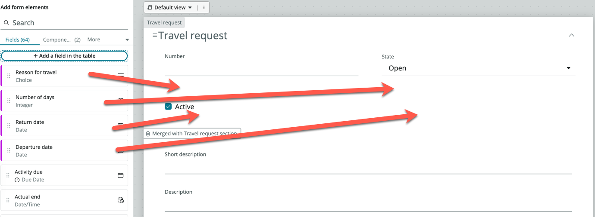
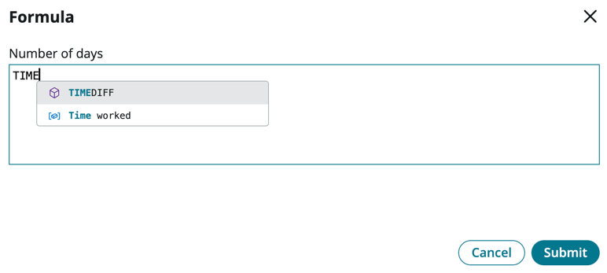
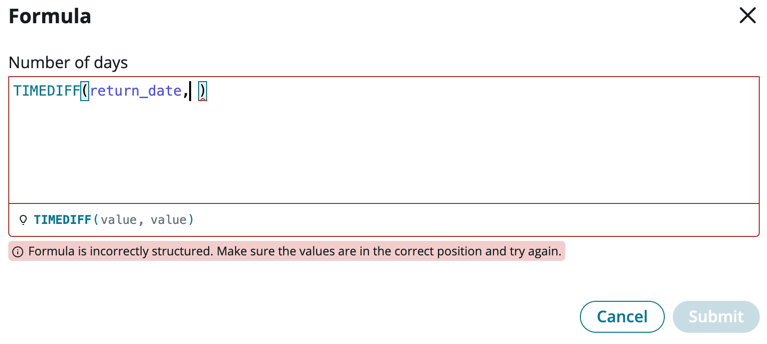

**Duration: 10 minutes**

1. Under **Data**, click **Add**

2. On the *Add Data* page, click **Create a blank table**

3. Click **Continue**

4. On the next page, select **Create from an extensible table**

5. Click **Continue**

6. On the next page, click **Table**, and select **Task** under *Recommended Tables*

:::info
The task table is one of the core tables provided on the platform. Any table that extends task can take advantage of task-specific functionality such as SLAs and Approvals. This speeds up the overall process and ease of building logic and functionality.
:::

7. Click **Continue**

8. For Table label, enter **Travel request**. Table name should be auto-populated.

9. Check **Auto number**

10. For Prefix, enter **TRV**

11. Click **Continue**

12. Allow all access for *admin* and **Create** and **Read** access for *user*

13. Click **Continue**

14. Click **Edit table**

15. If presented with the **Welcome to Table builder** pop-up, read through the steps, then close it

16. You should now be on the *Table Builder* interface, in the *Spreadsheet* view

:::note
Instead of adding fields individually via table builder, we will add fields directly onto the form view instead. But note that there are several ways to add fields to a table.
:::

17. Click on the **Forms** pill

18. The current form layout is inherited from the **task** table, we will only keep the fields relevant to us

19. Remove the following fields from the form:
    - Priority
    - Assigned to
    - Configuration item
    - Parent

20. The form should look like this

21. On the left panel, click **Add a field in the table**

22. On the pop-up modal, enter **Departure date** under **Column label**, the **Column name** should be auto-populated

23. Change **Type** to **Date**

24. Click **Add**

25. Click **Add another one**

26. Enter **Return date** under **Column label**, the **Column name** should be auto-populated

27. Change **Type** to **Date**

28. Click **Add**

29. Click **Add another one**

30. Repeat the steps above for the following 2 fields:

    |Column label | Type
    |-------------- | --------------
    |Number of days | Integer
    |Reason for travel | Choice

31. The panel on the left should show 4 new fields with a purple highlight

32. Drag and drop those 4 fields onto the form

:::tip
You will need to ensure that you see a grey outline box with a plus icon before releasing the field

:::

33. Search and add two more standard fields onto the form: **Opened by, Approval** (These come standard with the **Task** table)

34. Click **Save** on the top right of the form

35. Within your form, locate and click **Reason for travel**

36. The right-side panel will update for the configuration of this field. Expand **Choices**, then click **Edit (1)**

37. On the **Edit choices for Reason for travel** screen, click **+ Add a choice**

38. Under **Label**, enter Customer meeting, the **Value** field should auto-populate

39. Add another two Labels: **Internal meeting** and **Training**

40. On the bottom right, click **Apply**

41. Click **Number of days**

42. On the right-side panel, expand **Formula** and click **+Add**

43. In the pop-up **Formula** box, you are able to enter Excel based formulas. Here, we would like to calculate the number of days traveled

44. Enter **TIME**, the it should automatically pickup the operator for **TIMEDIFF**, press Enter

45. The inputs are shown in the formula example below, we need to provide two different date values

46. Within the brackets, first type *return**, then select your custom field **return_date**

47. Key in a **comma**

:::tip
If this does not appear, it means you haven't saved your form yet, so go ahead and click **Save** on the top right.
:::

48. Finish off the formula by entering and selecting **departure_date**

49. You can copy and paste the whole formula if you are having trouble with the auto-fill capability: **TIMEDIFF(return_date, departure_date)**

50. Click **Submit**

51. Click **Save**

    At this point, we could also capture the Origin and Destination via a String field so that the users can enter free text, but for more consistency, let's create an **Airports** table so that users can select these locations (like how you would select on any airline reservation website)

:::note
Great, you now have a table to store the Travel Requests!
:::
