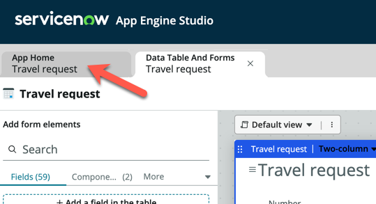
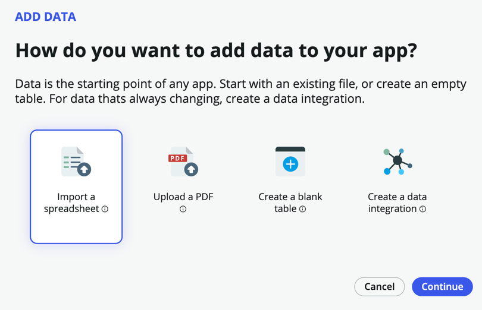
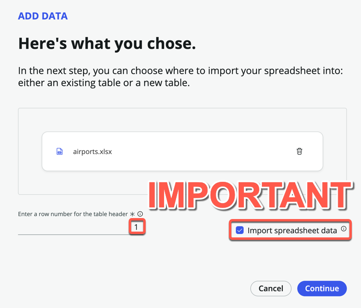
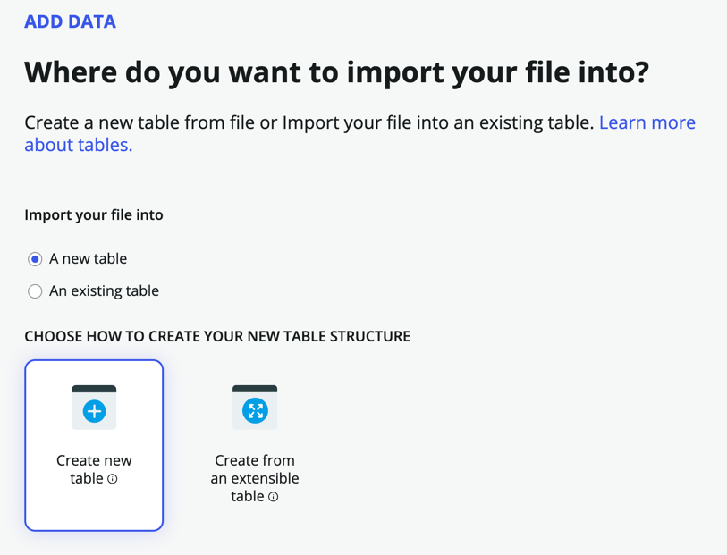
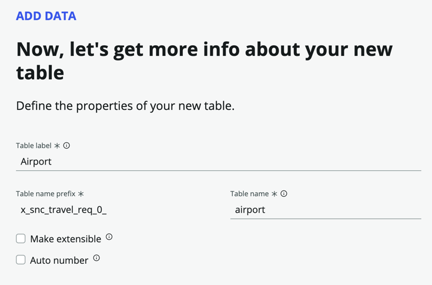
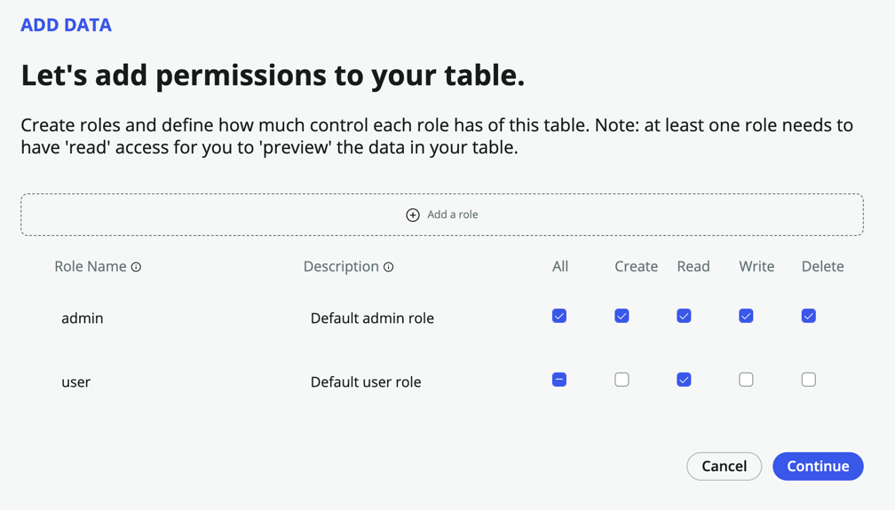
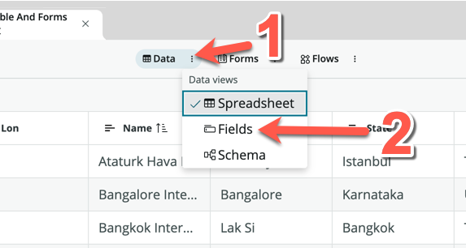

**Duration: 10 minutes**

1. Click the **App Home** tab to return to the main view

2. Under **Data**, click **Add**

3. Click **Import a spreadsheet**

4. Click **Continue**

5. Download this file: [airports.xlsx](https://github.com/CreatorWorkflowsNow/creatorworkflowsnow.github.io/raw/source/labs/travelrequest/downloads/airports.xlsx)

6. Upload the downloaded file to the upload box. You should see the following screen once the upload is successful

7. Ensure that **Enter a row number for the table header** is set to **1**

8. Check the **Import spreadsheet data** box

9. Click **Continue**

10. On the following page, click **Create new table**

11. Click **Continue**

12. You should land on the page that says: "Great! Here's the info we brought over from your spreadsheet"

13. Scroll through the list to see all the fields that will be created. Notice that you can change the data **Type** if necessary, but we can leave everything as String fields for now

14. Click **Continue**

15. Under **Table label**, enter **Airport**. **Table name** will be automatically populate

16. Click **Continue**

17. In the roles page, check **All** for *admin*, and only **Read** for *user*

18. Click **Continue**

19. Click **Edit table**

20. You should see the imported data in the Table spreadsheet view

:::info
In case you were wondering, the Lat and Lon fields are deliberately left empty. In the optional bonus exercise, we will use an API to get these values, but has no impact on our exercises.
:::

21. Click more next to the **Data** pill, and change the **Data views** to **Fields**

22. Toggle **Display** to true for the **Name** field

23. Click **Save**

:::note
Great, you now have a table to store the list of Airports!
:::
