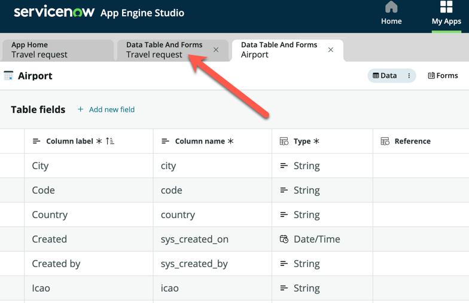
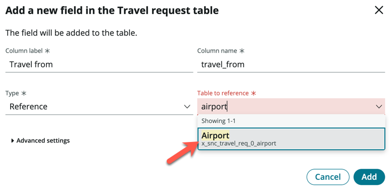
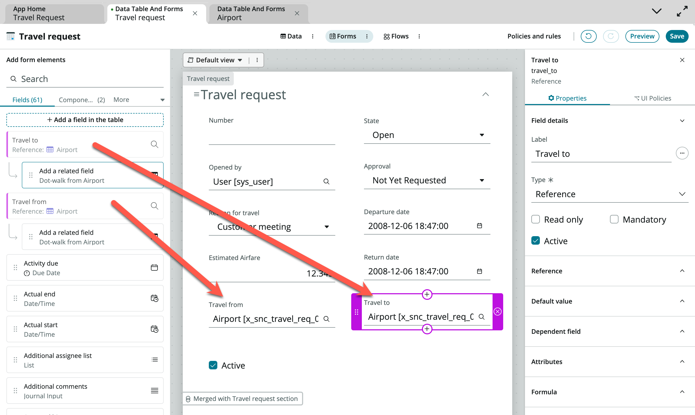

**Duration: 5 minutes**

1. If the **Travel request** tab is still open, click to navigate to it

2. If not, return to **App Home** and open the **Travel request** table, ensure you are in the **Form** view

3. Click **+ Add a field in the table**, and add the following fields:

    |Column label | Type
    |-------------- | --------------
    |Travel from | Reference (Airport)
    |Travel to | Reference (Airport) 

    

4. Drag and drop your two newly created custom fields onto the form

5. Click **Save**

:::info
For simplicity, we are not adding additional fields like Daily estimated expenses, etc. You can always choose to add those fields if you want to.
:::

Congratulations, you have completed Exercise 2 and now have a complete way to store the Travel requests from your employees.