**Duration: 30 minutes**

For this exercise, we will focus on exposing your newly created table on one of the employee portals so that your employees can easily access and create a travel request for themselves.

This is also known as a Record Producer in ServiceNow terminology. 

1. Click the **App Home** tab to return to the main view

2. Click **Add** under **Experience**
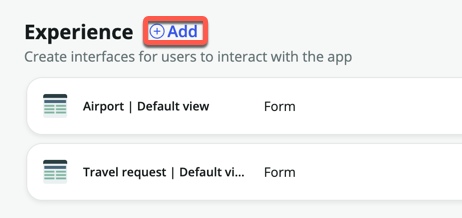

3. On the following screen, click **Record Producer**
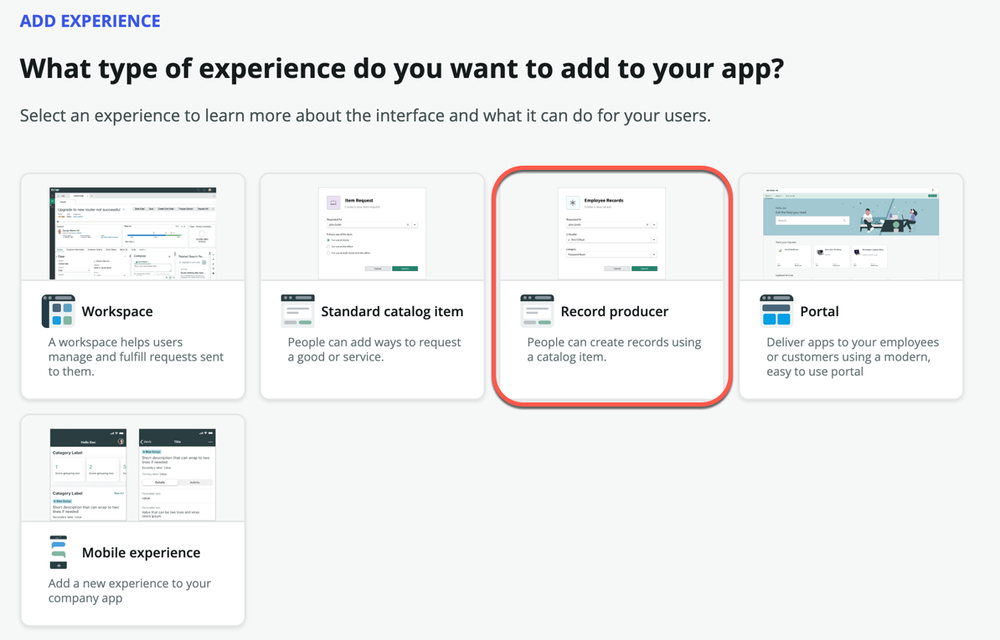 

4. Click **Begin**

5. On the **ADD EXPERIENCE** screen, enter *Raise a travel request* under **Name**, and *Capture employee travel requests* for description
    

6. Click **Continue**

7. Click **Edit record producer**

8. Under **Description**, enter the following text: "Use this form to raise a travel request for all international flights. Approval will be routed to your manager."

9. (Optional) Add an image if you wish (You can use anything you find online)
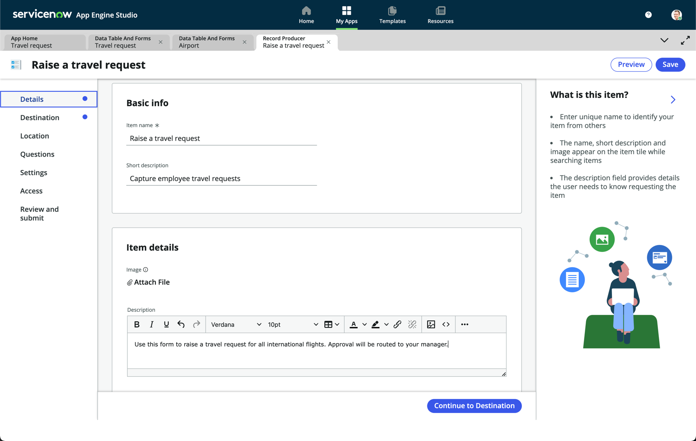

10. On the left sidebar, click **Destination**

11. We will define where this form will route requests to. Search and select **Travel request**. This is the table we first created.
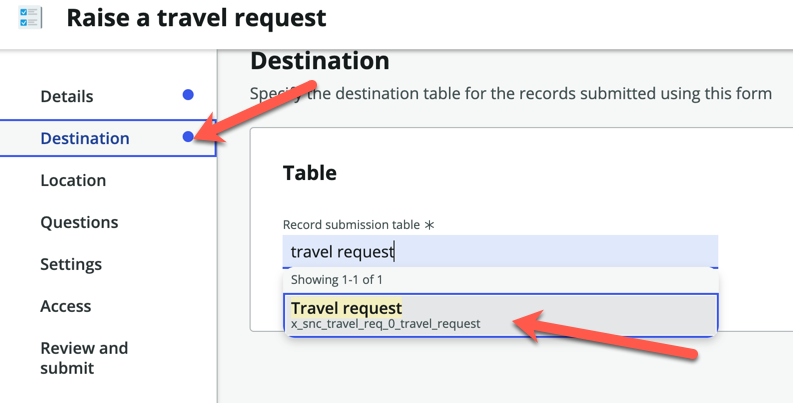

12. On the left sidebar, click **Location**. We will define which portal this form will be located in. A form can belong to multiple portals on ServiceNow

13. On the main area, click **Browse**
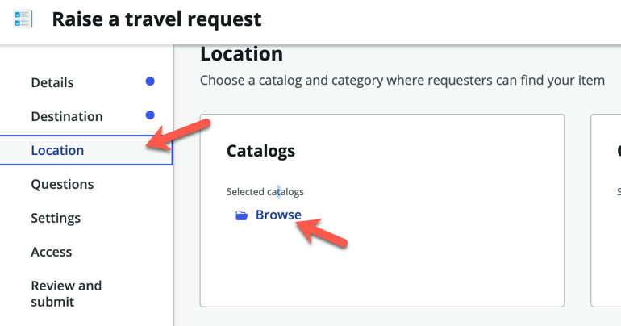

14. On the next screen, look for **Service Catalog** under the **Available** section and move it to the right

15. Ensure that **Service Catalog** now appears in the **Selected** section
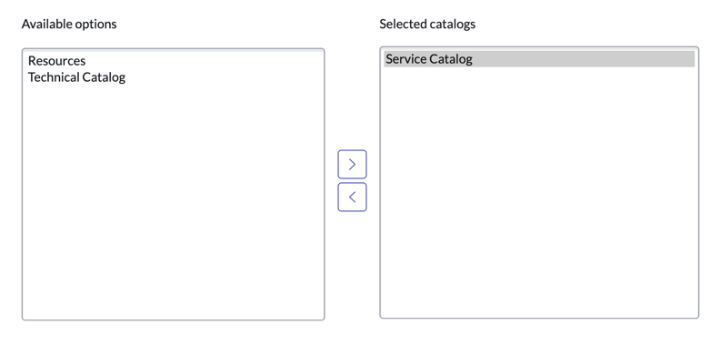

16. On the bottom right, click **Save selections**

17. Click **Browse** under **Categories**

18. This time, do the same as before, and select **Can We Help You?** from the **Available** list

19. On the bottom right, click **Save selections**

20. On the left sidebar, select **Questions**

21. Click on the dropdown arrow next to **Insert new question**, and click **Single column container**
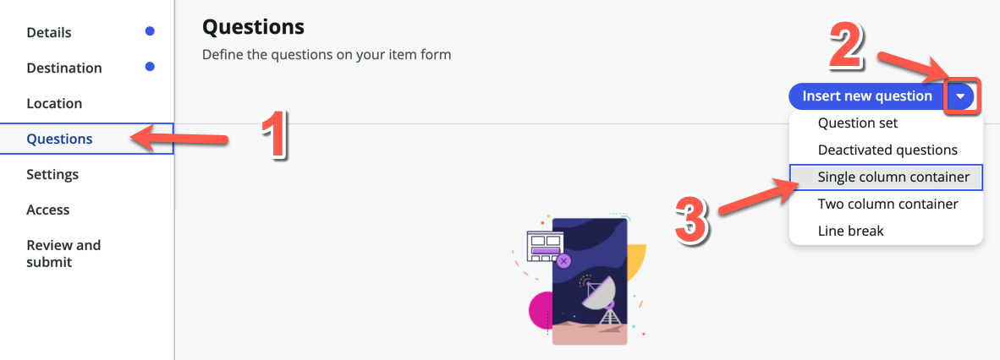

22. In the pop-up box, enter **Information** under **Title**

23. Click **Submit**

24. Repeat the top 3 steps again, but this time select **Two column container** and enter **Dates and locations**
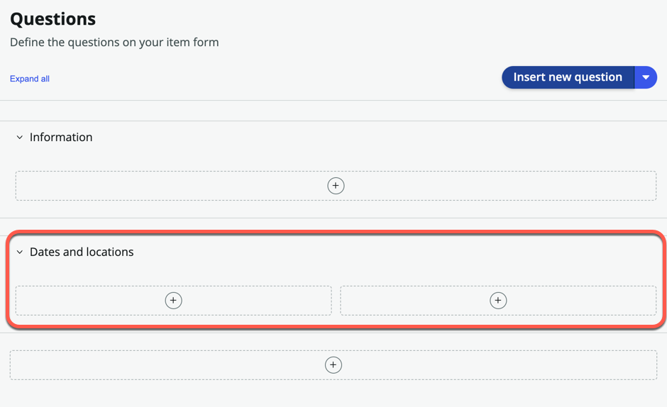

25. Expand the **Information** section, click the **Insert** icon, and select **New question**
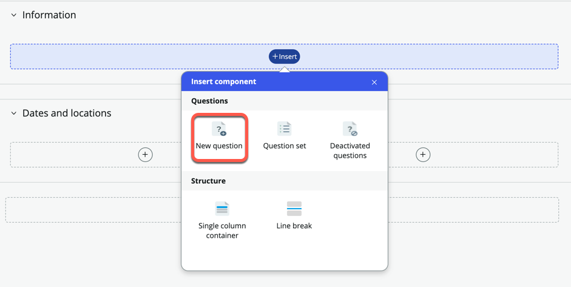

26. In the next form, fill it out as below

    Name | Selection
    -------------- | --------------
    Question type | Choice
    Question subtype | Dropdown (fixed values)
    Map to a specific field on the table | **Checked**
    Table field | Reason for travel
    Question label | What is the reason for travel?
    Mandatory | **Checked**

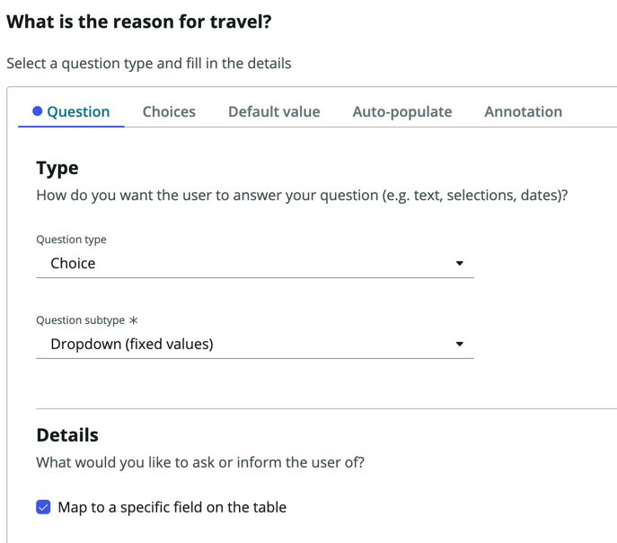

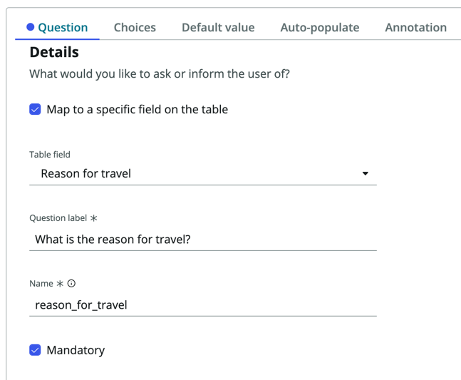

27. Click **Choices**

28. Check **Include none choice**

29. Under **Available Choices**, add the 3 reasons you added during table creation for **Display name**: Customer meeting, Internal meeting, Training

30. Copy each of these onto the **Value** column as well (Both **Display name** and **Value** will be the same)
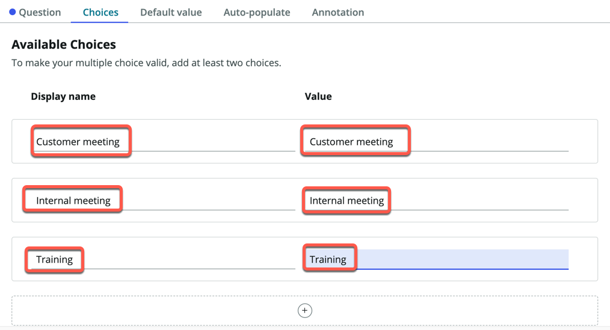

31. On the bottom right, click **Insert Question**

32. Expand the **Dates and locations** section

33. On the left column, add a **New question**
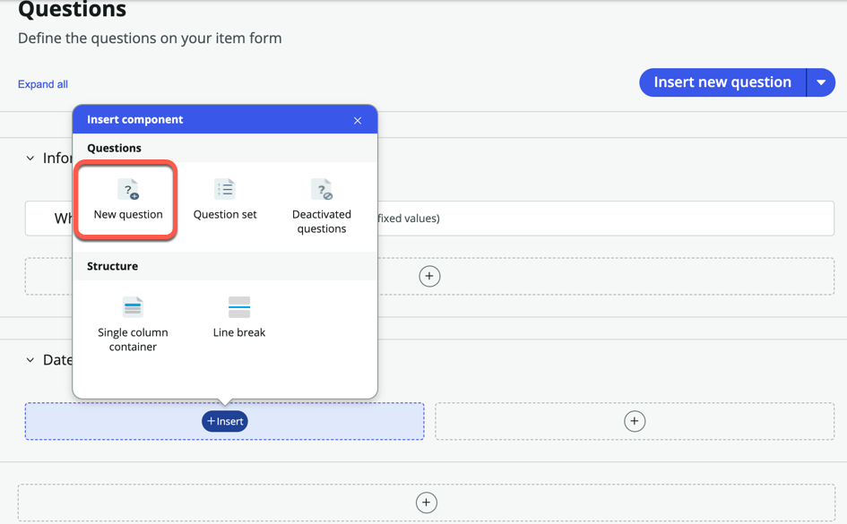

34. Fill out the form as follows

    Name | Selection
    -------------- | --------------
    Question type | Date / Time
    Question subtype | Date
    Map to a specific field on the table | **Checked**
    Table field | Departure date
    Question label | When are you leaving?

35. Click **Insert Question** at the bottom right

36. Repeat the steps above again for **Return date**

    Name | Selection
    -------------- | --------------
    Question type | Date / Time
    Question subtype | Date
    Map to a specific field on the table | **Checked**
    Table field | Return date
    Question label | When do you return?

37. Now we will capture the locations by looking at the **Airport** table we created

38. Under the same **Dates and locations** section, add a new question

    Name | Selection
    -------------- | --------------
    Question type | Choice
    Question subtype | Record reference
    Map to a specific field on the table | **Checked**
    Table field | Travel from
    Question label | Where are you departing from?
    Mandatory | **Checked**

39. Click the **Additional details** tab

40. Under **Source table**, search and select **Airport** (This is the table you imported from the spreadsheet)
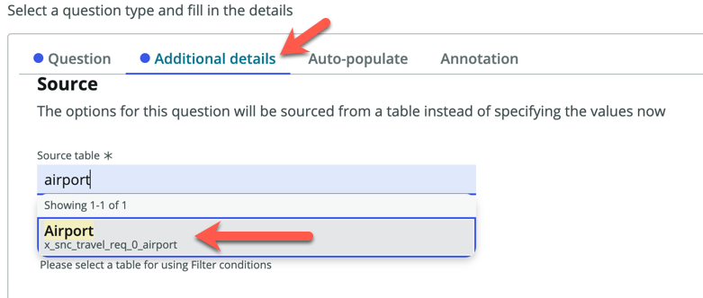

41. On the bottom right, click **Insert Question**

42. In the main screen, follow the steps above once more for **Travel to**

    Name | Selection
    -------------- | --------------
    Question type | Choice
    Question subtype | Record reference
    Map to a specific field on the table | **Checked**
    Table field | Travel to
    Question label | Where are you traveling to?
    Mandatory | **Checked**

43. Remember to choose **Airport** for the **Source table** under the **Additional details** tab

44. Your form should now look like this
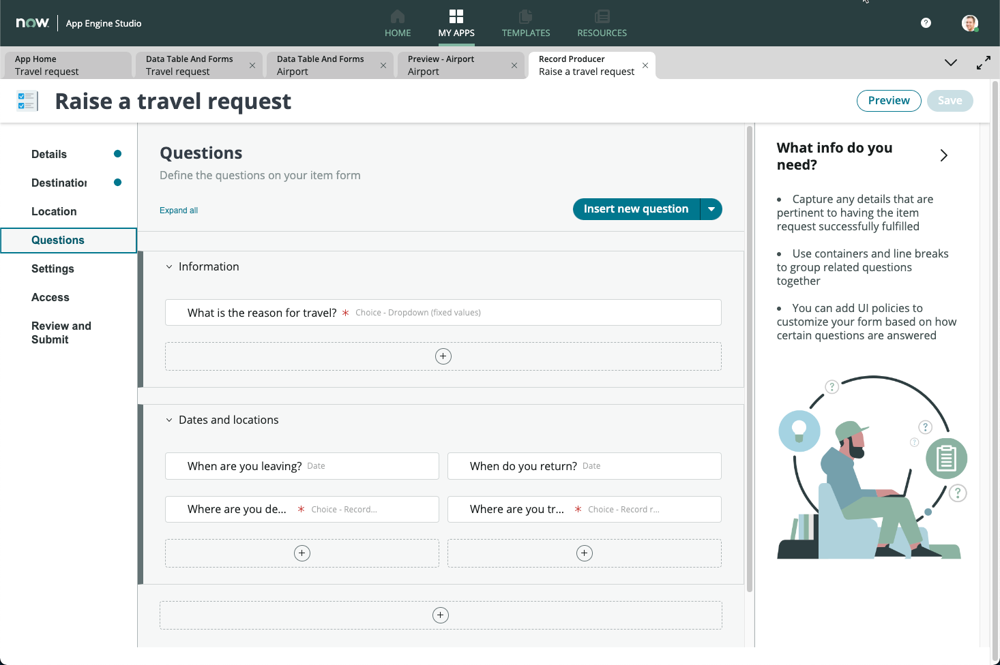

45. Preview how your form will look like by clicking on the **Preview** button on the top right
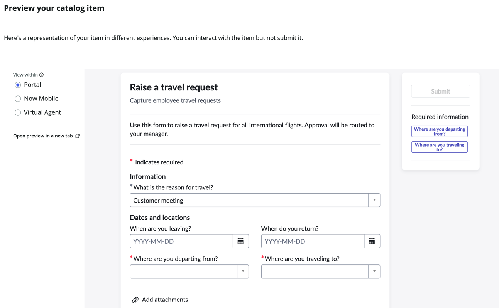
    

46. Try filling in the form with any details, but you won't be able to submit the form as it is in preview mode only

47. Click **Now Mobile** on the left sidebar
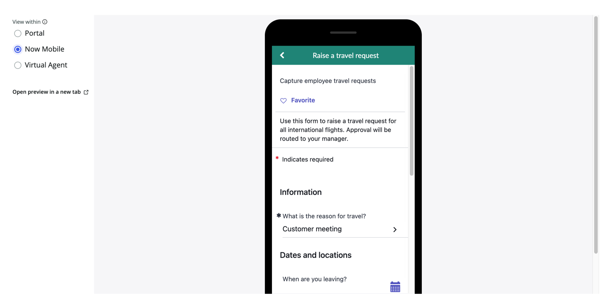

:::note
Virtual agent is not installed so you will not be able to preview the conversation.
:::

48. The experience also automatically gets added to the mobile catalog, so your users can request for travel on the go

49. Close the preview by clicking the cross icon on the top right

50. On the left sidebar, click **Review and submit**

51. Click the **Submit** button

We will test this form on the *Employee Center Portal* at the end of this session. Now it's time for us to create an approval workflow for this travel request!