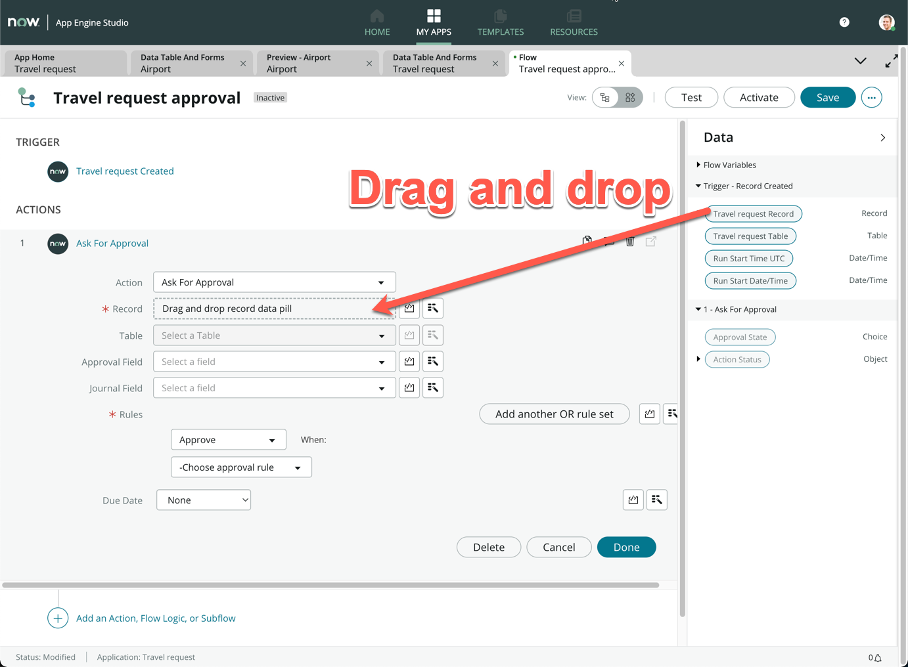
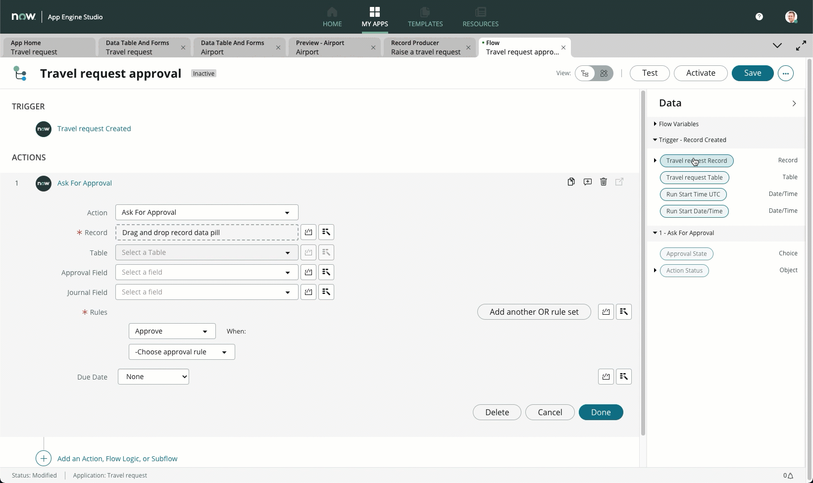
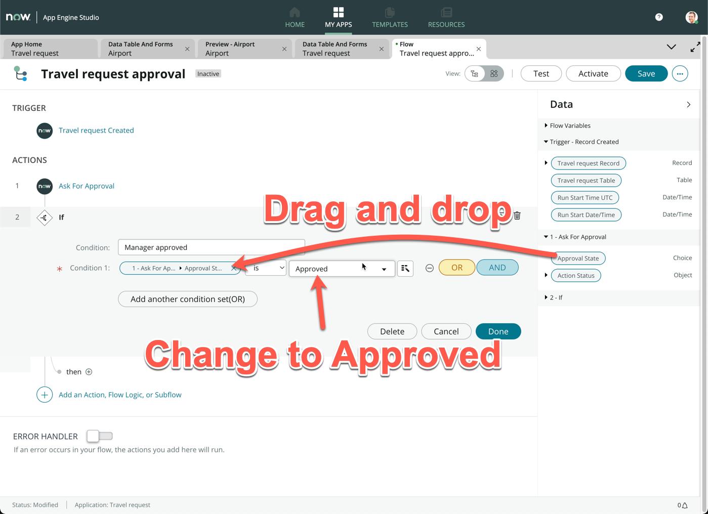
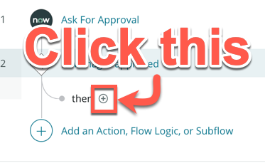
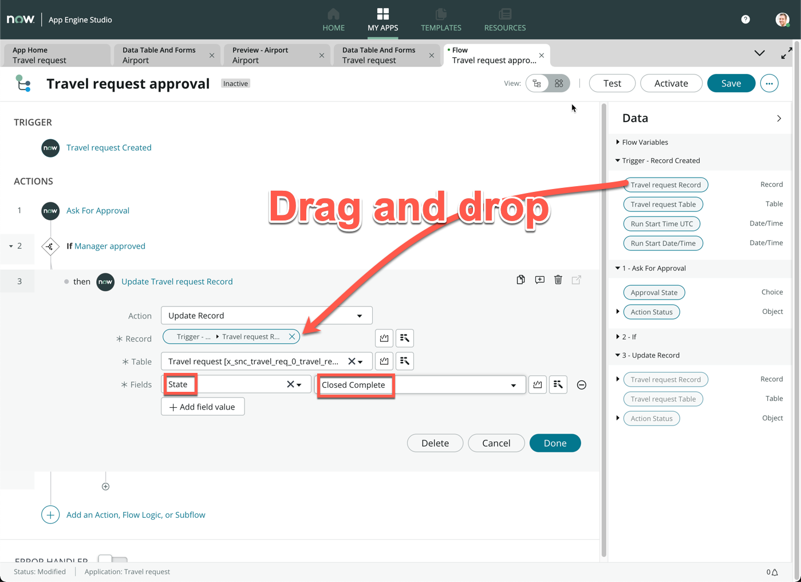
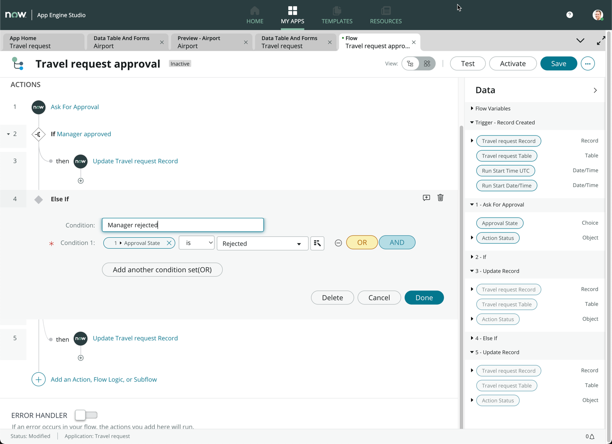

# Exercise 3: Creating an approval workflow

**Duration: 30 minutes**

Within this exercise, we will be creating an approval workflow. Let's describe what we will be designing in a sentence: *Whenever a new travel request is raised, we will route the request to the requestor's manager for approval. Once approved, we will mark the status of the request as complete*

1. Navigate back to the **App Home** tab

1. Click **Add** under **Logic and automation**

1. Click **Flow**

1. Click **Build from scratch**

1. For **Name**, enter **Travel request approval**

1. For **Description**, enter **Route travel request approval to requestor's manager**

1. Expand **Show advanced options**

1. Change **Run as** to **System user**

1. Click **Continue**

1. Click **Edit this flow**

1. Close the **Getting started** pop-up box

1. Click **Add a trigger**

1. Under **RECORD**, click **Created**

    
1. Under **Table**, search and select **Travel request**

1. Click **Done**

1. Click **Add an Action, Flow Logic, or Subflow**

1. Click **Action**

1. Search and select **Ask for approval**

1. In the **Ask for Approval** action box, drag and drop the **Travel request Record** from the Data pill picker on the right sidebar, into the **Record** box

1. Under **Rules**, change **Approve** to **Approve or Reject**

1. Change **-Choose approval rule** to **Anyone approves or rejects**

    >We want the approval to be routed to the requestor's manager, so we will perform what is known as dot-walking to find the related user's manager.

1. From the right sidebar (Data pill picker), expand the **Travel request Record** by clicking the expand arrow

1. Look for the **Opened by** data pill, and expand it

1. Under the **Opened by** section, look for the **Manager** data pill

1. Click **Done**

1. Here is a full video walkthrough in case you had difficulties at any step

   

    >What we have achieved here is that we are looking for the user who opened the record's manager to be the approver for this record.

1. Click **Add an Action, Flow Logic, or Subflow**

1. Click **Flow Logic**

1. Click **If**

1. Under **Condition**, enter **Manager approved**

1. Drag and drop the **Approval State** data pill from the right sidebar onto **Condition 1**

1. Change the choice to **Approved**

1. Click **Done**

1. Click **Save** on the top right of the screen

1. Click on the **+** icon **next to then**

1. Click **Action**

1. Search and select **Update Record**

1. Drag and drop the **Travel request Record** onto the **Record** field

1. Under **Fields**, select the **State** field and change the choice to **Closed Complete**

1. Click **Done**

1. Click **Save** on the top right of the screen

    *(Optional)* Now we will complete the flow by creating the logic of a rejected approval. As a challenge, can you complete the rest of the flow yourself? The end result should look like this:

 

1. Hint: You can always toggle the flow diagramming view by clicking on this icon

1. Click **Activate** on the top right of the screen