**Duration: 30 minutes**

Within this exercise, we will be creating an approval workflow. Let's describe what we will be designing in a sentence: *Whenever a new travel request is raised, we will route the request to the requestor's manager for approval. Once approved, we will mark the status of the request as complete*

1. Navigate back to the **App Home** tab

2. Click **Add** under **Logic and automation**
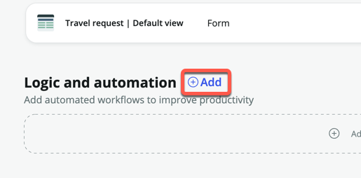

3. Click **Flow**
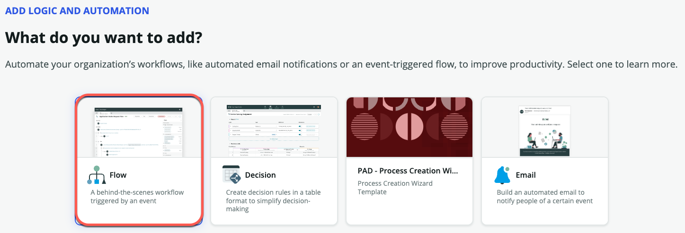

4. Click **Build from scratch**

5. For **Name**, enter **Travel request approval**

6. For **Description**, enter **Route travel request approval to requestor's manager**

7. Expand **Show advanced options**

8. Change **Run as** to **System user**
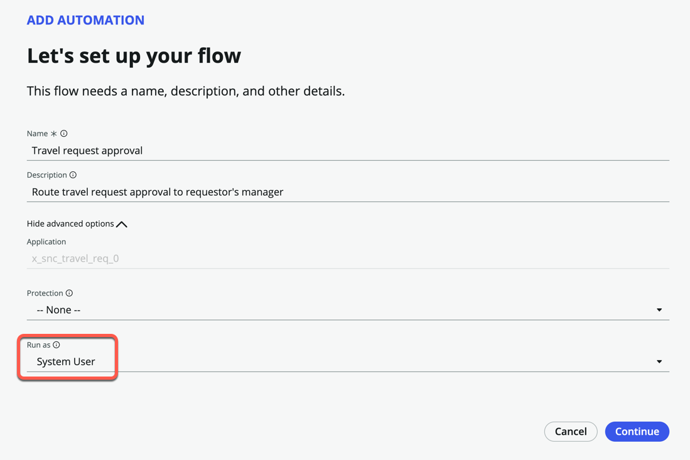

9. Click **Continue**

10. Click **Edit this flow**

11. Close the **Getting started** pop-up box

12. Click **Add a trigger**

13. Under **RECORD**, click **Created**
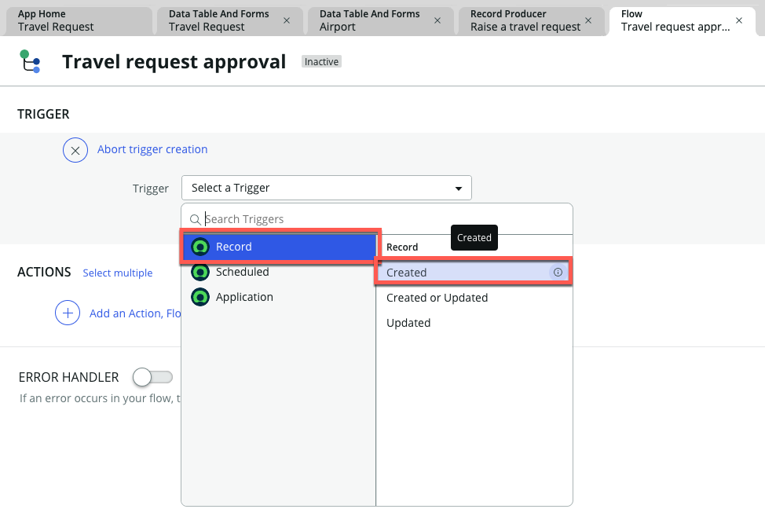

14. Under **Table**, search and select **Travel request**
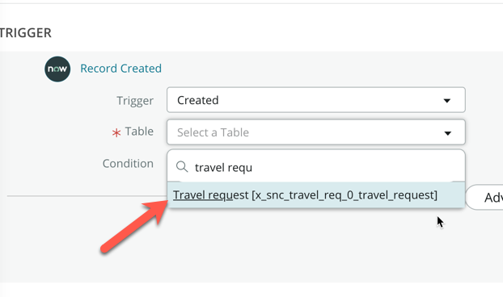

15. Click **Done**

16. Click **Add an Action, Flow Logic, or Subflow**

17. Click **Action**

18. Search and select **Ask for approval**
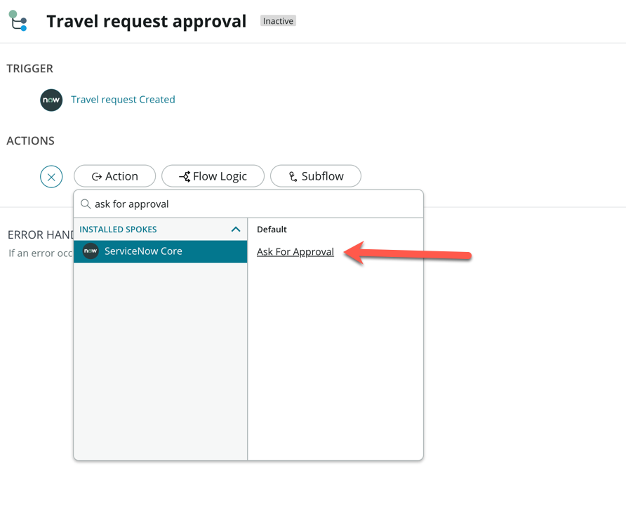

19. In the **Ask for Approval** action box, drag and drop the **Travel request Record** from the Data pill picker on the right sidebar, into the **Record** box
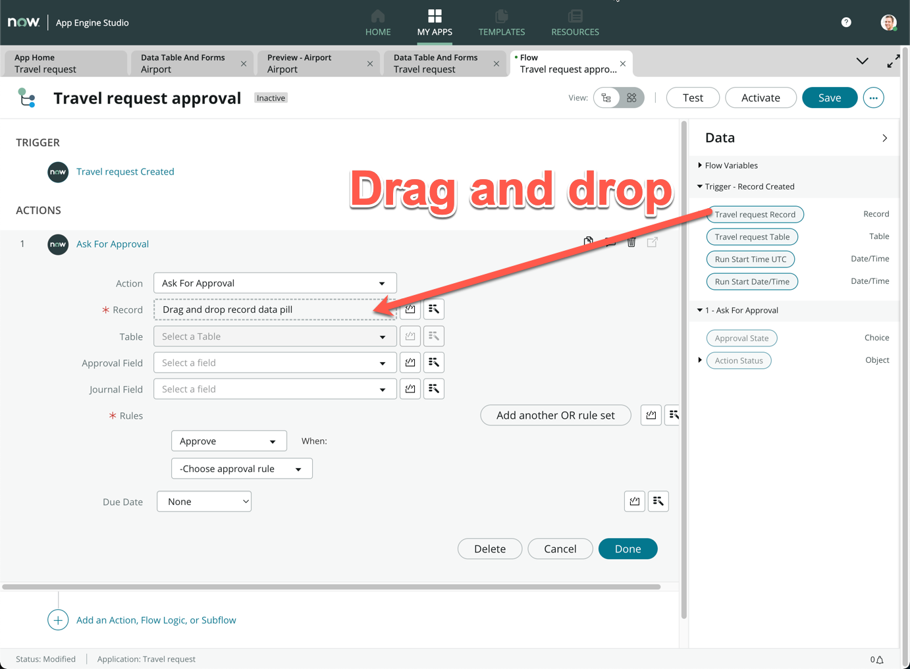

20. Under **Rules**, change **Approve** to **Approve or Reject**

21. Change **-Choose approval rule** to **Anyone approves or rejects**
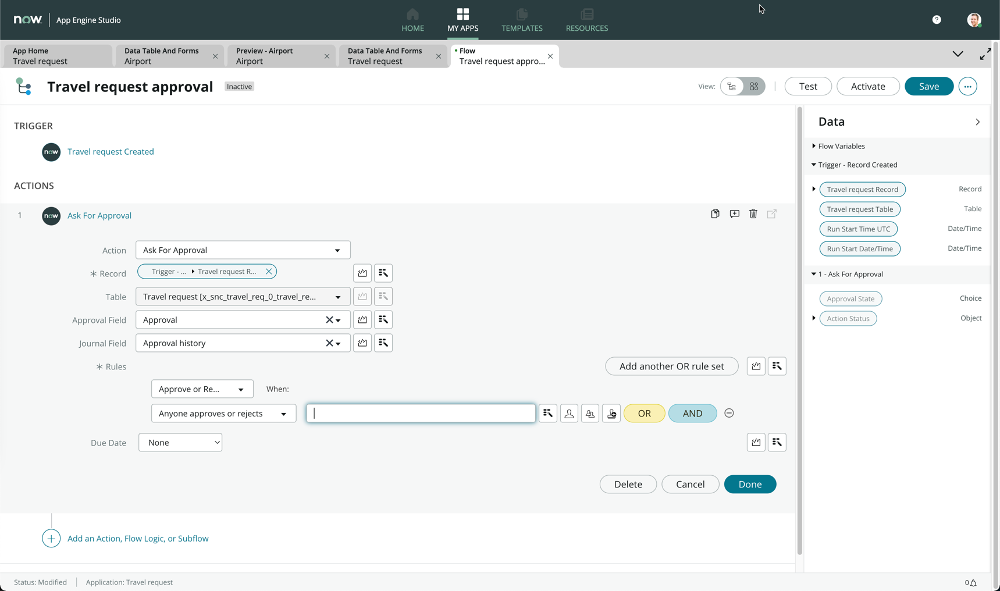

:::info
We want the approval to be routed to the requestor's manager, so we will perform what is known as dot-walking to find the related user's manager.
:::

22. From the right sidebar (Data pill picker), expand the **Travel request Record** by clicking the expand arrow
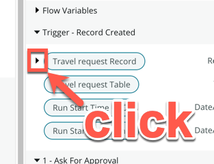

23. Look for the **Opened by** data pill, and expand it
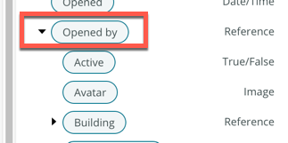

24. Under the **Opened by** section, look for the **Manager** data pill
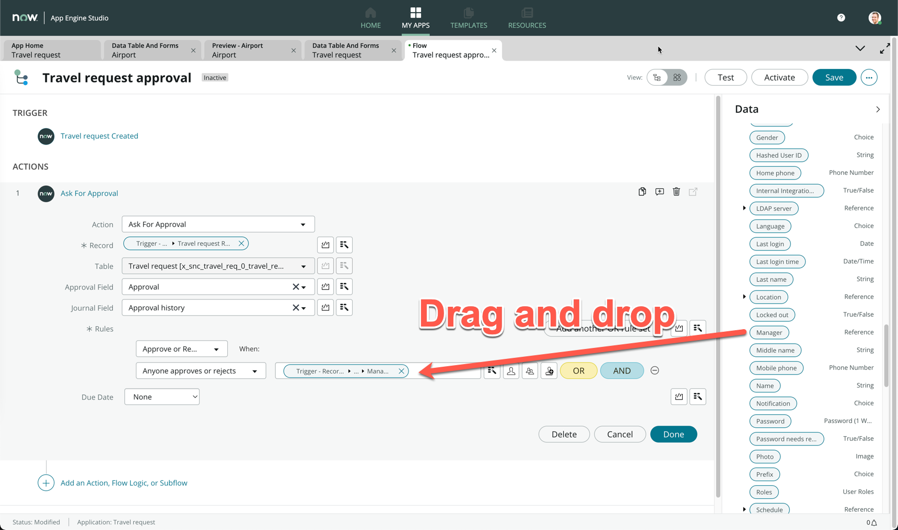

25. Click **Done**

26. Here is a full video walkthrough in case you had difficulties at any step
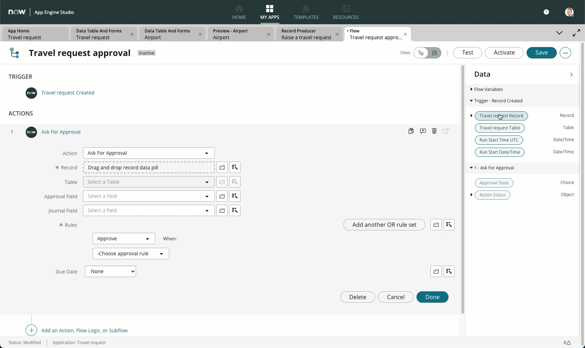

What we have achieved here is that we are looking for the user who opened the record's manager to be the approver for this record.

27. Click **Add an Action, Flow Logic, or Subflow**

28. Click **Flow Logic**

29. Click **If**
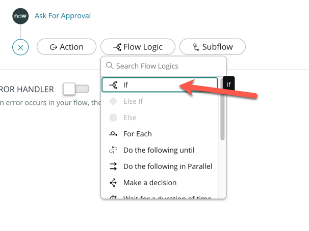

30. For **Condition Label**, enter **Manager approved**

31. Drag and drop the **Approval State** data pill from the right sidebar onto **Condition 1**

32. Change the choice to **Approved**
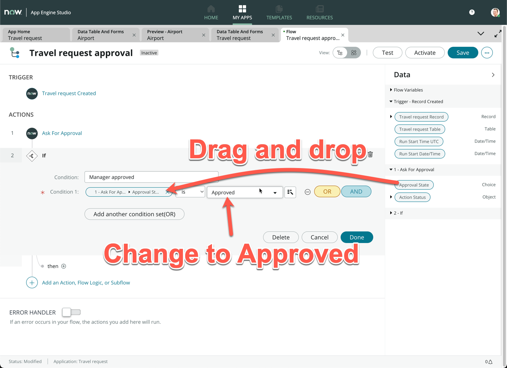

33. Click **Done**

34. Click **Save** on the top right of the screen

35. Click on the **+** icon **next to then**
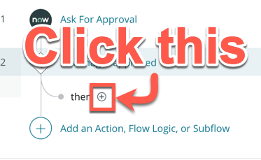

36. Click **Action**

37. Search and select **Update Record**

38. Drag and drop the **Travel request Record** onto the **Record** field

39. Under **Fields**, select the **State** field and change the choice to **Closed Complete**
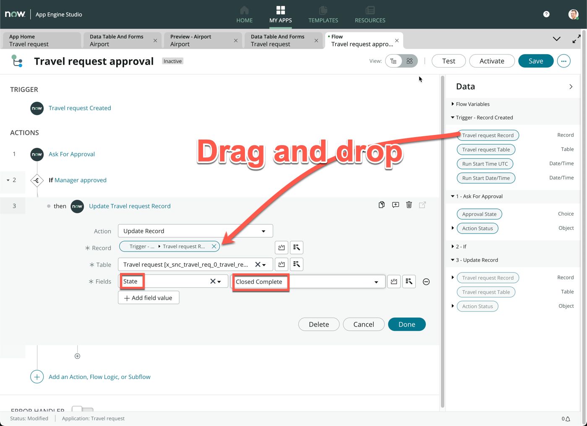

40. Click **Done**

41. Click **Save** on the top right of the screen *(Optional)* Now we will complete the flow by creating the logic of a rejected approval. As a challenge, can you complete the rest of the flow yourself? The end result should look like this:
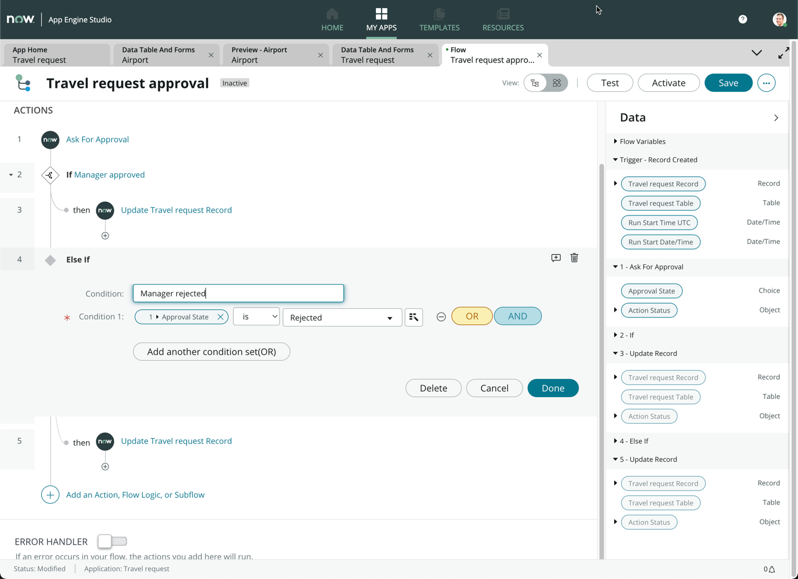 
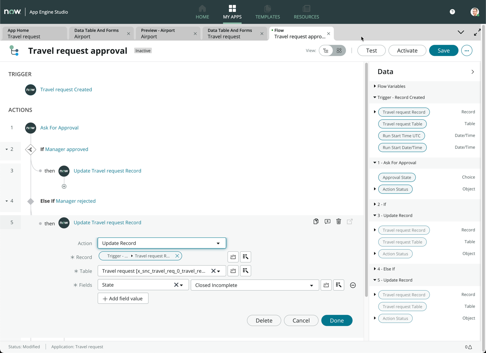

:::tip
Hint: You can always toggle the flow diagramming view by clicking on this icon
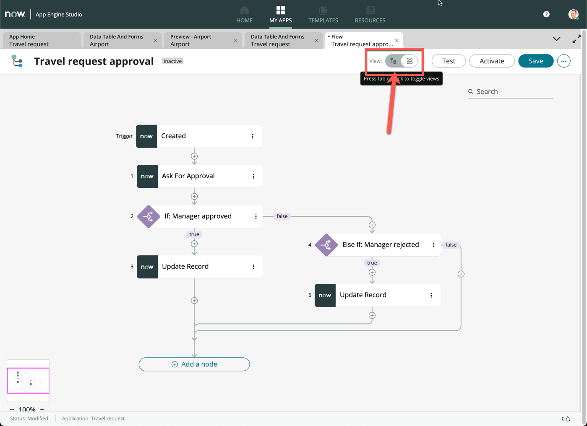
:::

42. Click **Activate** on the top right of the screen