# Exercise 4: Putting it all together - Testing our application

**Duration: 20 minutes**

Congratulations on making it so far! We have one last thing to do, which is to test our application. Our person of interest here is Billie Cowley who is wanting to raise a travel request. His direct manager is Krystle Stika, and this relationship has already inherited through an Microsoft AD integration. We will first directly grant the Travel request user role to one of our employees for the test.

1. Head back into the main ServiceNow interface

1. On the global search, enter **billie.cowley** and click **View results**

1. Click **Billie Cowley**

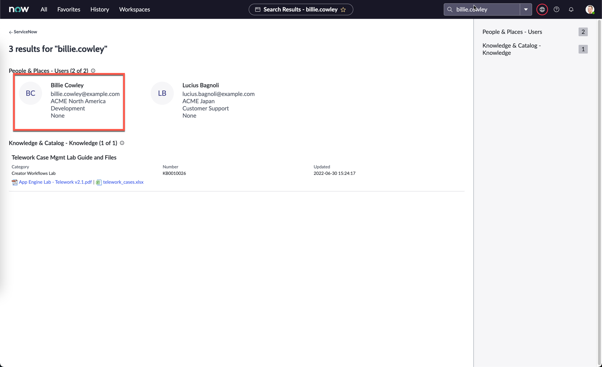

1. On Billie's user record, click the **Roles** tab below, then click **Edit**

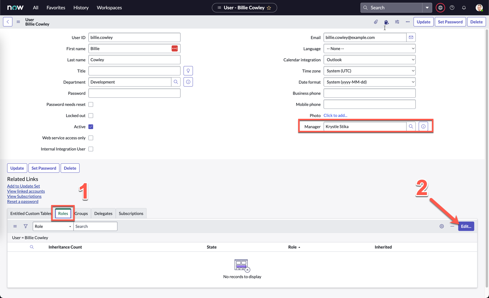

    >Also notice on the screenshot above that Billie's manager is Krystle Stika. You won't be able to see this on your screen, but note that this has been preconfigured for you.

1. Under **Collection**, search **x_snc_travel**, you should see the two roles you created for your custom application.

1. Grant the **user** role to Billie by moving it into the **Roles List**
    

1. Click **Save**

    >This is actually not best practice, but only for the purposes of today's activity. In a real implementation, it would be best to assign a role to a group, and then assign users to that group so they all inherit that role.

1. Click on the profile picture on the top right, and click **Impersonate user**

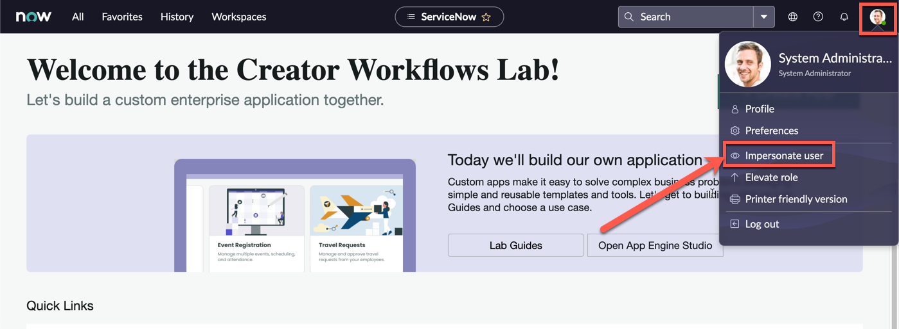

1. Search and select **Billie Cowley**

1. Click **Impersonate user**

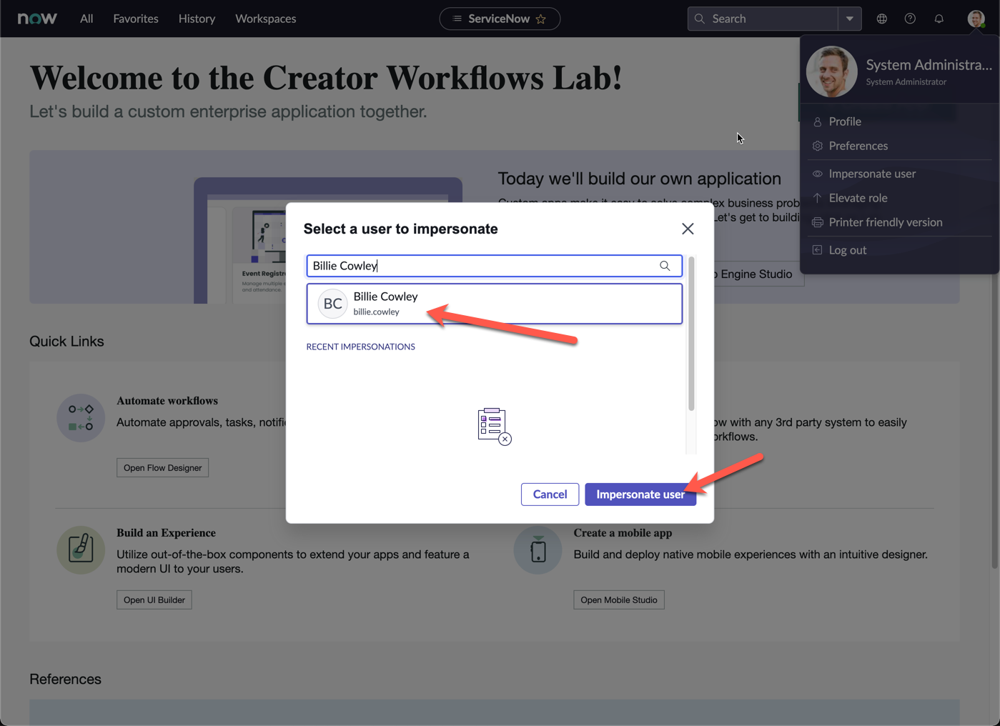

1. Close the pop-up screen

1. Copy the current URL of the page, and open a new Browser tab

1. Paste the URL, and replace everything after **service-now.com** with **/sp**

    > e.g. **if the copied URL is**: https://sad-oct-123-001.lab.service-now.com/now/nav/ui/classic/params/target/ui_page.do%3Fsys_id%3De7766625074130102b8affa08c1ed037   
    **change it to:**
    https://sad-oct-123-001.lab.service-now.com/sp 

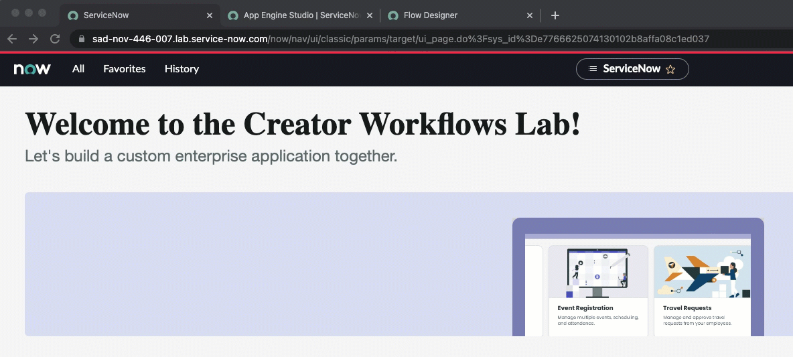

1. The Service Portal page should now open

1. Under **How can we help?**, search for **Travel request**

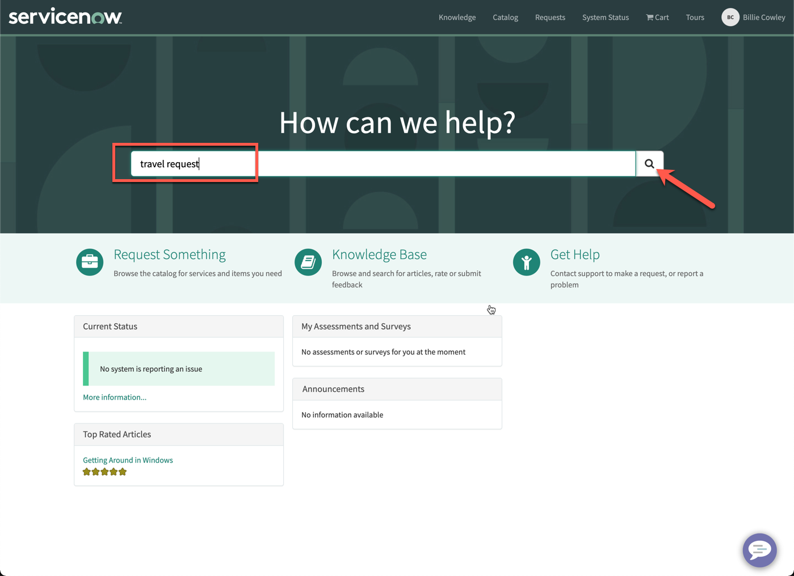

1. Click the **Search icon**

1. The top result should return the form we had created in Exercise 2

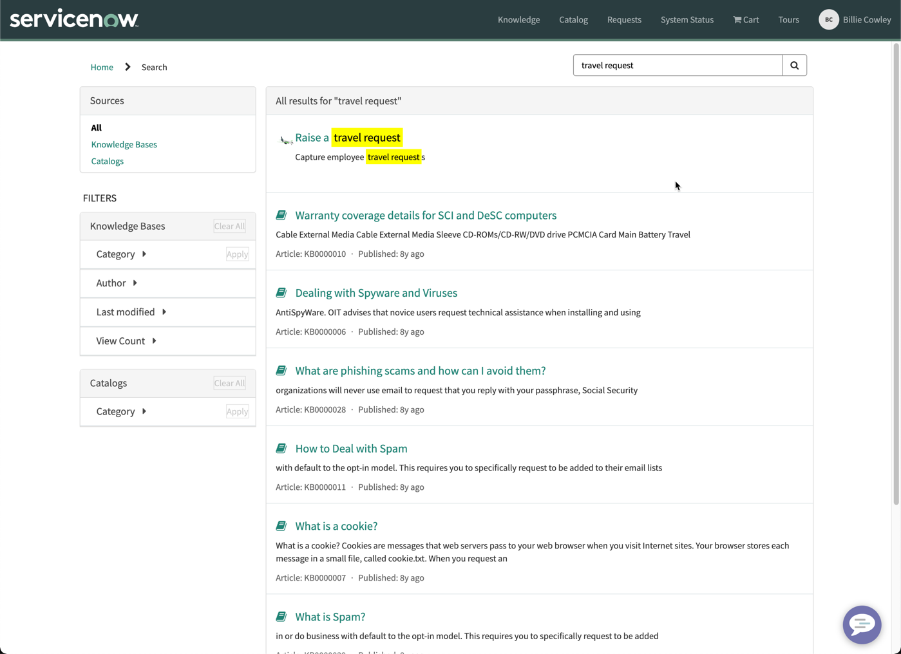

1. Click **Raise a travel request**

1. Confirm that the form appears as expected, then fill in all the fields

1. Click **Submit**

1. The next screen can be used to track the status of the request and add attachments

1. Go back to the ServiceNow main interface, and **End impersonation**
    
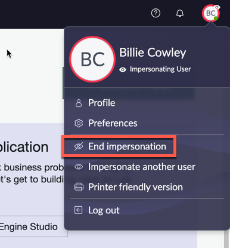

1. Under **All**, search and select **My Approvals**

1. Remove the filter by clicking **All**

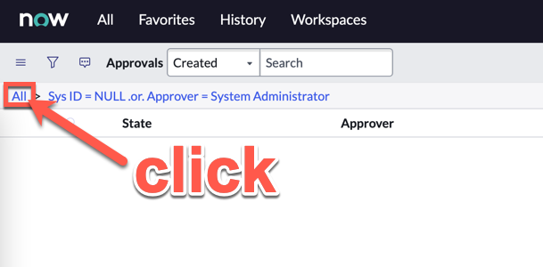

1. Filter by the latest created approval date by clicking **Created**

1. Click on the **Requested** record for **Krystle Stika** as the **Approver**

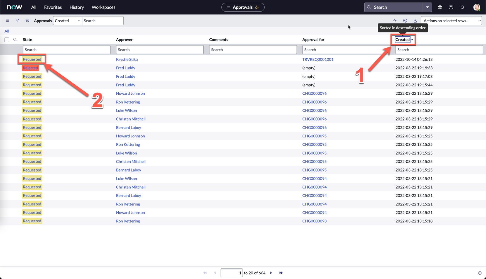

1. Review the details you submitted on the bottom of the form, then click **Approve**

1. You will be brought back to the list view

1. Click on the Approved record for your Travel request, if you followed all the steps so far, this should be the first record created: TRVREQ0001001

1. On the record, notice that the **State** was automatically changed to **Closed Complete**, as per our approval flow that was designed
    

## (Optional) Activity tracking

1. Click the 3 line menu icon on the top left

1. Click **Configure**, then **Form Design**

1. A new tab will open with Form Designer

1. On the left sidebar, search **activities**

1. Drag and drop **Activities (filtered)** below **Work notes**

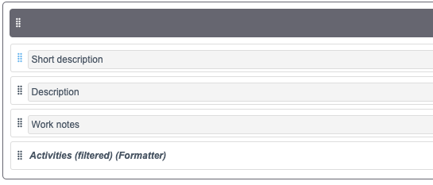

1. Click **Save** on the top right

1. Go back to your previous tab with the form view and refresh the page

1. Your form should now show the **Activities** section. This will allow you to track any changes to the fields in the form

1. Changing the **State** field to **Work in Progress**

1. Right click anywhere on the grey header bar, and click **Save**

1. The **Activities** section should now show the State change

1. As an approver or fulfiller, you can also add work notes for communications both internally and with the requester.

1. Try typing something into **Work notes** then click **Post**. What do you see?

# Congratulations, you did it!

You've successfully built a simple application for employees to raise travel requests and seek manager approval!

There are obviously so much more you can do with the application to make it even better, some ideas:

1. Integrate with APIs to get a list of flights on specific travel dates so you get as accurate a travel estimate as possible

1. Add functionality to capture multiple location travel itineraries

1. Run all requests and approvals via Email / Microsoft Teams / Slack / Virtual Agent etc.

1. Build dashboards to track requests

1. Build a travel workspace with playbooks that can monitor requests and also have direct communication with the requestors

You get the idea... the list is endless. You are only limited by your imagination on making the experience seamless for every one involved. This is only the beginning.

ServiceNow makes the world of work, work better for people!
