**Duration: 15 minutes**

Congratulations on making it so far! 

We have one last thing to do, which is to test our application. Our person of interest here is Billie Cowley who is wanting to raise a travel request. His direct manager is Krystle Stika, and this relationship has already been inherited through a Microsoft AD integration. We will first directly grant the Travel request user role to one of our employees for the test.

1. Head back into the main ServiceNow interface

2. On the global search, enter **billie.cowley** and click **View results**
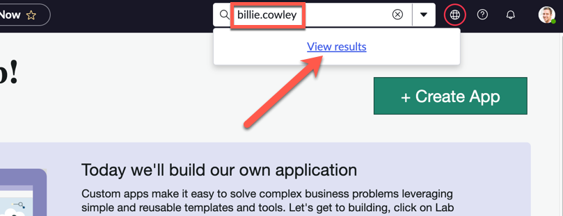

3. Click **Billie Cowley**
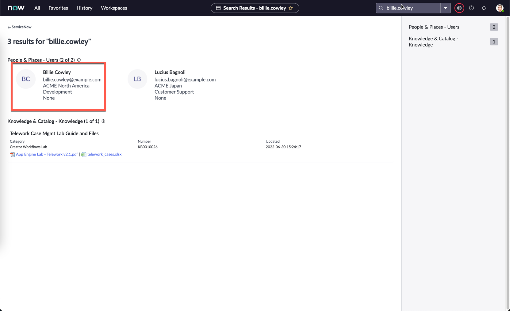

4. On Billie's user record, click the **Roles** tab below, then click **Edit** on the right hand side
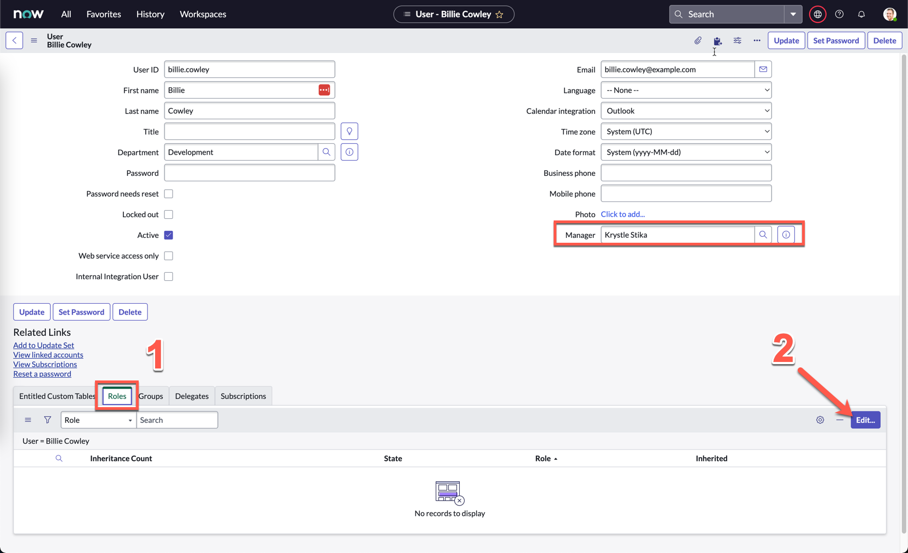

:::info
Also notice on the screenshot above that Billie's manager is Krystle Stika. You won't be able to see this on your screen, but note that this has been preconfigured for you.
:::

5. Under **Collection**, search **x_snc_travel**, you should see the two roles you created for your custom application.

6. Grant the **user** role to Billie by moving it into the **Roles List**
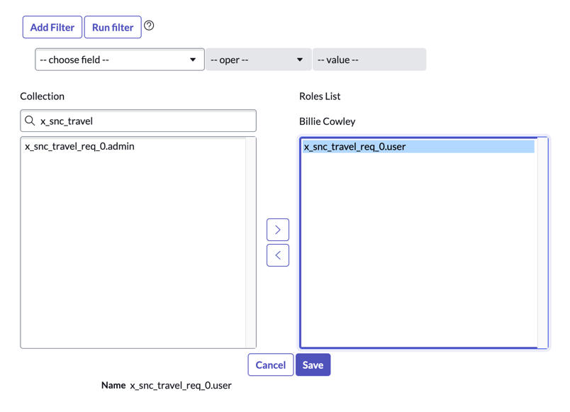
    

7. Click **Save**

:::info
This is actually not best practice, but only for the purposes of today's activity. In a real implementation, it would be best to assign a role to a group, and then assign users to that group so they all inherit that role.
:::

8. Click on the profile picture on the top right, and click **Impersonate user**
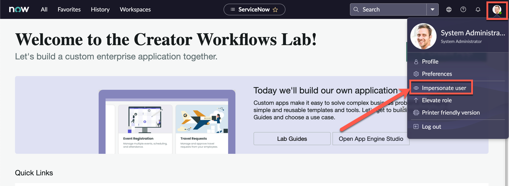

9. Search and select **Billie Cowley**

10. Click **Impersonate user**
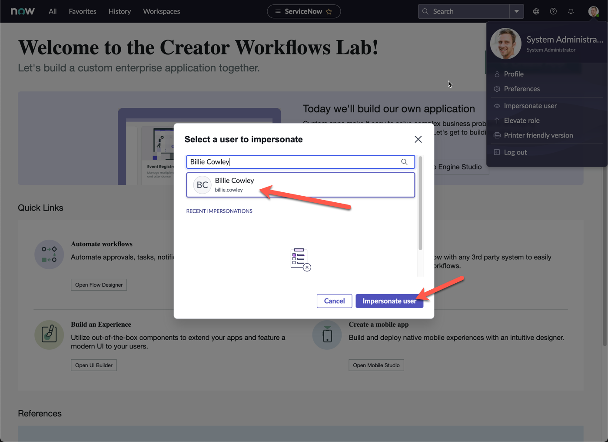

11. Close the pop-up screen

12. Copy the current URL of the page, and open a new Browser tab

13. Paste the URL, and replace everything after **service-now.com** with **/sp**

:::tip
**if the copied URL is**: 

**https://sad-oct-123-001.lab.service-now.com/**now/nav/ui/classic/params/target/ui_page.do%3Fsys_id%3De7766625074130102b8affa08c1ed037

**change it to:**

**https://sad-oct-123-001.lab.service-now.com/**sp 
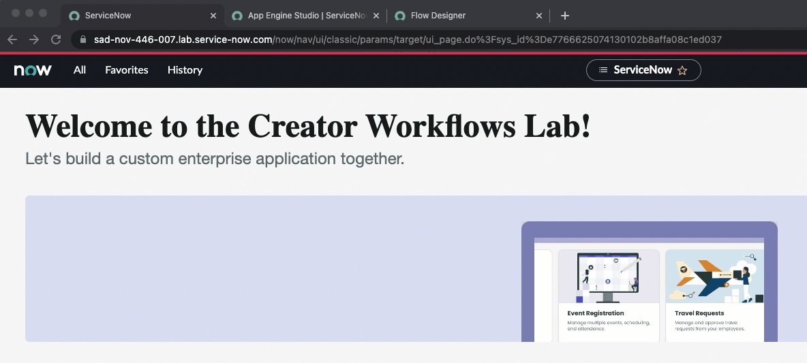
:::

14. The Service Portal home page should now open

15. Under **How can we help?**, search for **Travel request**
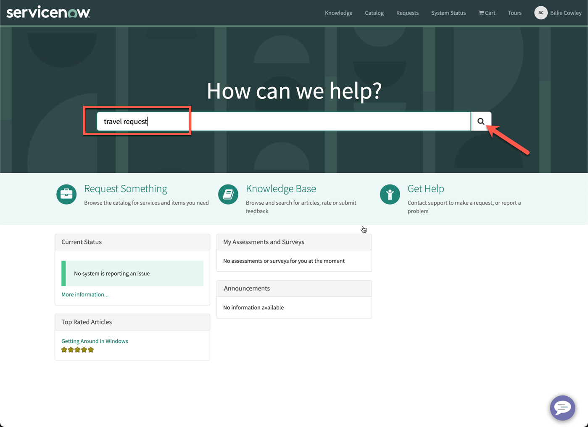

16. Click the **Search icon**

17. The top result should return the form we had created in Exercise 3
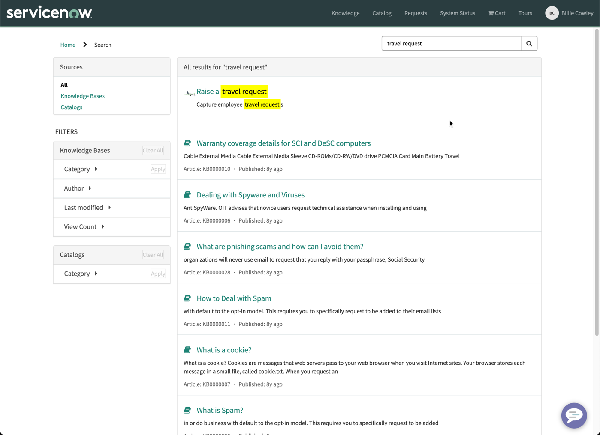

18. Click **Raise a travel request**

19. Confirm that the form appears as expected, then fill in all the fields
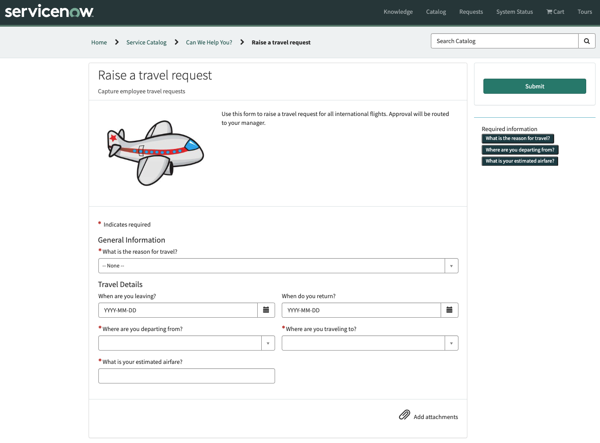

20. Click **Submit**

21. The next screen can be used to track the status of the request and add attachments

22. Go back to the ServiceNow main interface, and **End impersonation**
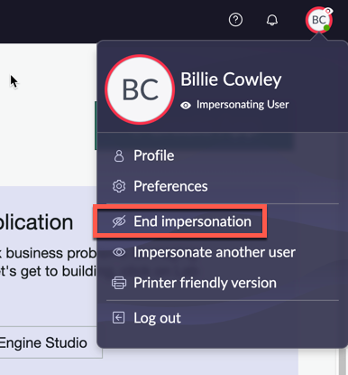
    

23. Under **All**, search and select **My Approvals**
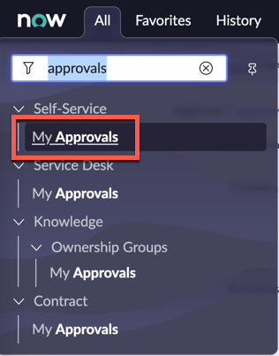

24. Remove the filter by clicking **All**
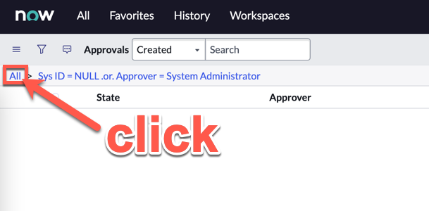

25. Filter by the latest created approval date by clicking **Created**

26. Click on the **Requested** record for **Krystle Stika** as the **Approver**
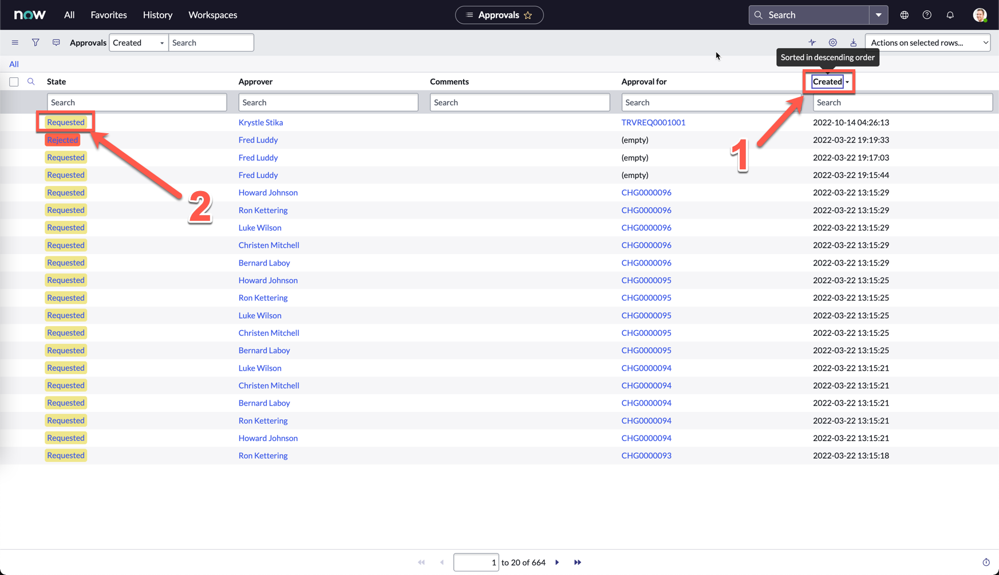

27. Review the details you submitted on the bottom of the form, then click **Approve**
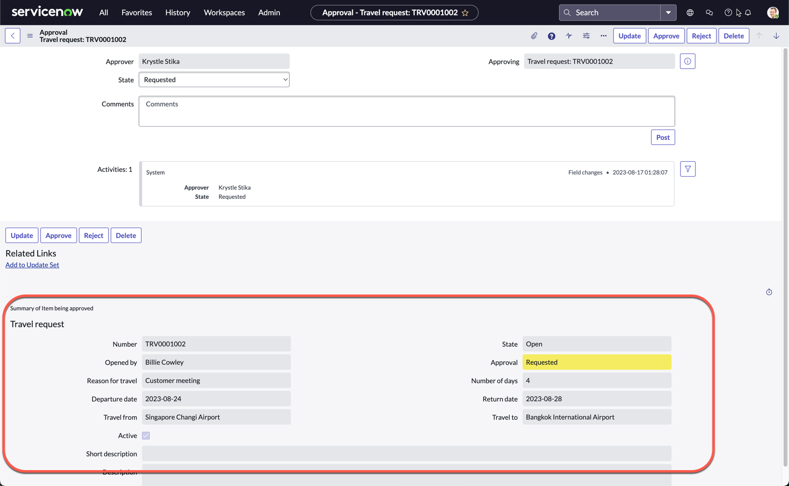

28. You will be brought back to the list view

29. Click on the Approved record for your Travel request, if you followed all the steps so far, this should be the first record created: TRV0001001
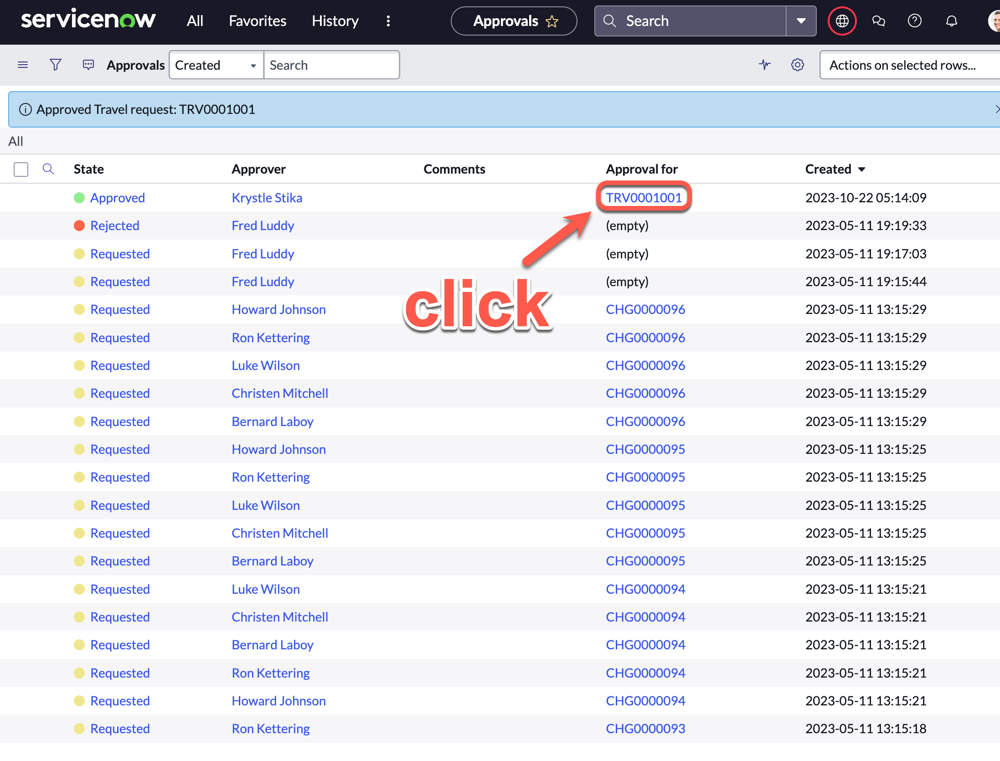

30. On the record, notice that the **State** was automatically changed to **Closed Complete**, as per our approval flow that was designed
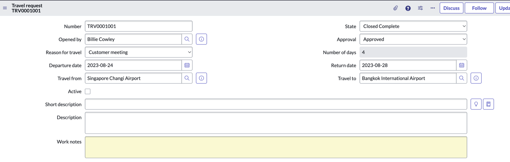
