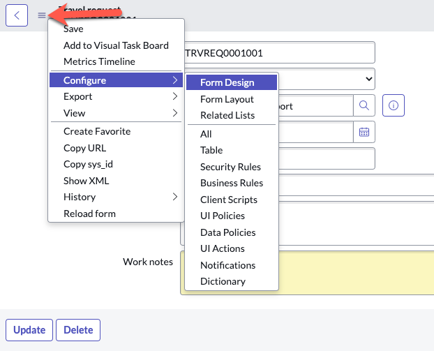
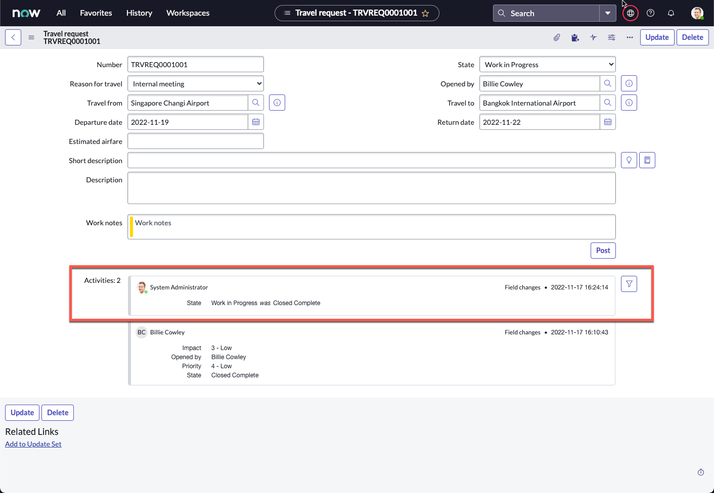
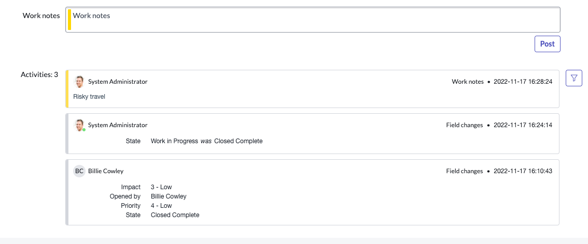

**Duration: 5 minutes**

1. Click the 3 line menu icon on the top left

2. Click **Configure**, then **Form Design**

3. A new tab will open with Form Designer

4. On the left sidebar, search **activities**

5. Drag and drop **Activities (filtered)** below **Work notes**

6. Click **Save** on the top right

7. Go back to your previous tab with the form view and refresh the page

8. Your form should now show the **Activities** section. This will allow you to track any changes to the fields in the form

9. Changing the **State** field to **Work in Progress**

10. Right click anywhere on the grey header bar, and click **Save**

11. The **Activities** section should now show the State change

12. As an approver or fulfiller, you can also add work notes for communications both internally and with the requester.

13. Try typing something into **Work notes** then click **Post**. What do you see?

