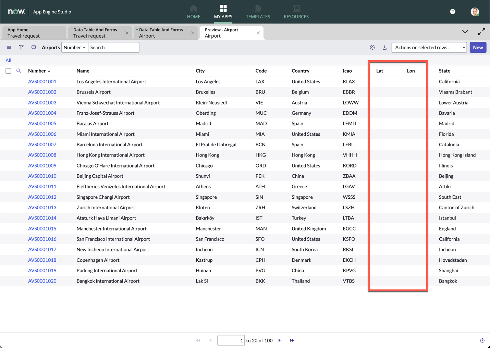
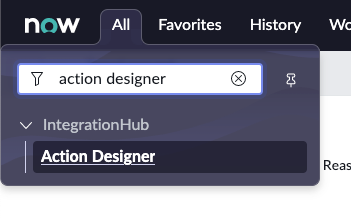
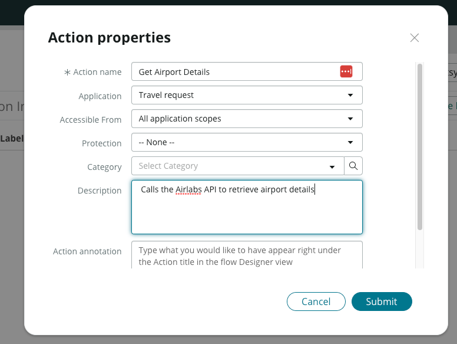
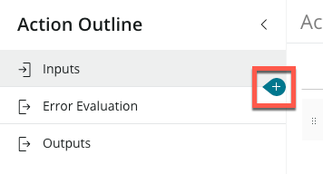
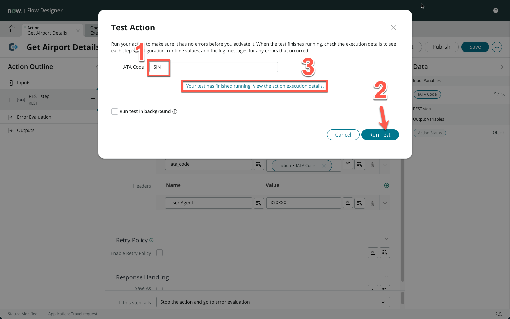
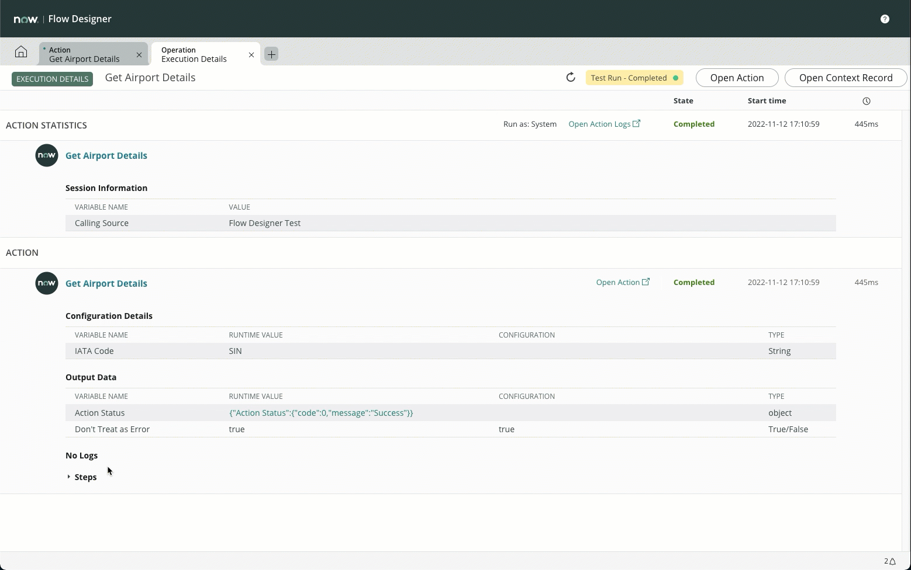
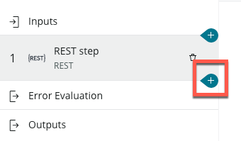
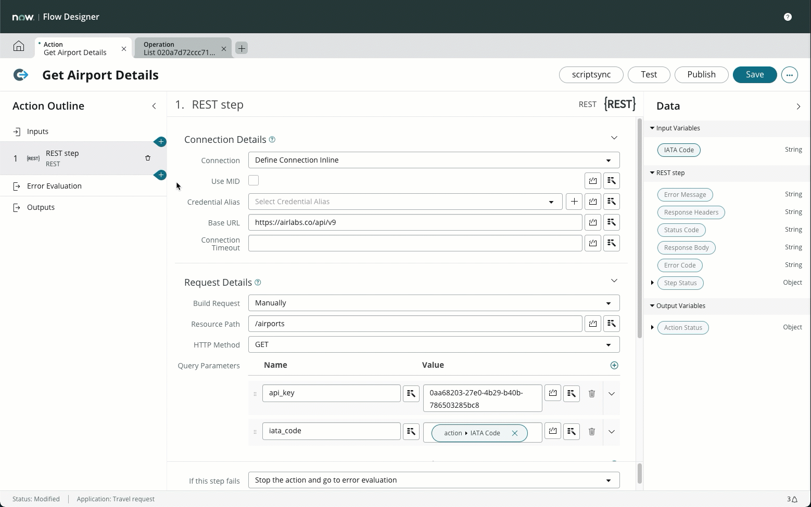
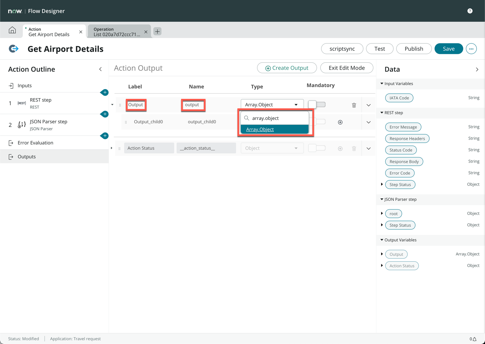
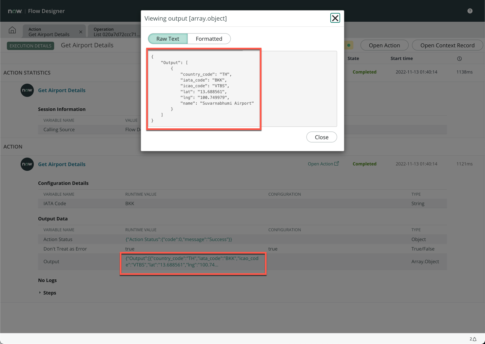

**Duration: 30 minutes**

In this bonus exercise, we will use a real webservice API to update our list of airports which we previously imported via an excel spreadsheet. This will ensure that the locations all remain up to date with some additional data fields for tracking.

If you noticed in exercise 1, when we imported the Airports from the excel sheet, the **Lat** and **Lon** data is empty, we will fix that in this exercise. 



:::caution
*This session will require you to use a 3rd party API service to get data. Your personal data will be required to sign up to this service. If you are not comfortable with exposing this data, skip this exercise or let your instructor know.*
:::

1. Go to https://airlabs.co/ and click **Sign Up**


2. Fill in the relevant details to sign up for an account


3. Verify your account with the email sent to the email address sent to your email account


4. Sign in to your airlabs account on the next page


5. Click **Copy** next to **API Key**


6. Paste your copied **API Key** somewhere that you are able to retrieve later


7. Click **Documentation**, then **Airports**


8. Quickly read through this API documentation, notice that the API request has already been populated for you - We will rebuild this


9. Navigate back to your main ServiceNow interface, and search and click **Action Designer** under **All**



10. You are brought to the **Flow Designer** interface


11. Click the **New** button on the top right, then click **Action**


12. In the pop-up, enter **Get Airport Details** under *Action name*. For description, enter **Calls the Airlabs API to retrieve airport details**



13. Click **Submit**


14. Click **Create Input**


15. Under **Label**, enter **IATA Code**, then press enter


16. Click on the **+** icon in between **Inputs** and **Error Evaluation** on the left sidebar



17. In the pop-up box, scroll down and click **REST**


18. Change **Connection** to **Define Connection Inline**


19. Copy this URL and paste it under **Base URL**:
```
https://airlabs.co/api/v9
```

:::tip
Use the copy button above to make sure you have the correct URL
:::

20. Enter **/airports** under **Resource Path**


21. Click on the **+** icon for **Query Parameters**


22. Enter **api_key** under **Name**, then paste your previously copied API Key under **Value**


23. Click on the **+** icon for **Query Parameters**


24. Enter **iata_code** under **Name**, then drag and drop the **IATA Code** data pill on the right sidebar onto the **Value** field


25. Click on the **+** icon for **Headers**


26. Enter **User-Agent** under **Name**, and **XXXXXX** under **Value**


27. Your form should now look like this:


28. Click **Save** at the top right


29. Click **Test** at the top right


30. Enter **SIN** under the IATA Code field, then click **Run Test**


31. Click **Your test has finished running. View the action execution details.**



32. The new tab shows every step of the execution so far. Expand **Steps** (towards the bottom of the screen) and scroll down to the line that shows **Response Body**


33. Click on the corresponding value and copy the entire block of text



34. Navigate back the the main **Action Get Aiport Details** tab


35. Close the pop-up


36. Click on the **+** icon on the left sidebar after **REST step**



37. Scroll down and click **JSON Parser**


38. Drag and drop the **Response Body** data pill from the right sidebar onto the **Source data** field


39. Paste what you copied onto the main body


40. Toggle the **Structured Payload View**


41. Click **Generate Target**


42. The **Target** on the right should be generated


43. Here are all the steps in sequence:



44. Click **Outputs** on the left sidebar


45. Click **Create Output**


46. In the new row, change **Label** to **Output**, **Name** to **output** and **Type** to **Array.Object**



47. Click **Exit Edit Mode**


48. On the right sidebar, expand **root** under **JSON Parser Step**


49. Drag and drop the **response** data pill onto the **Output** Value field


50. Click **Publish** on the top right


51. Click **Test**


52. Enter **BKK** and run test, then **view execution details**


53. Ensure that the **Output** is defined, and when clicking on it you see a result similar to what is shown below



You've create an Integration Hub action! It will automatically integrate with the remote API to gather information about the airports. Now let's use it in a workflow.