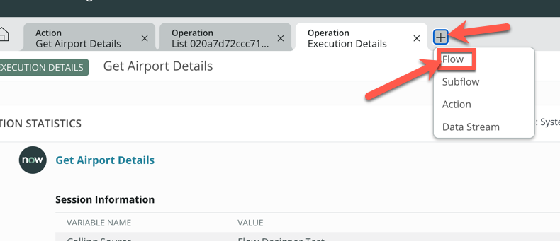
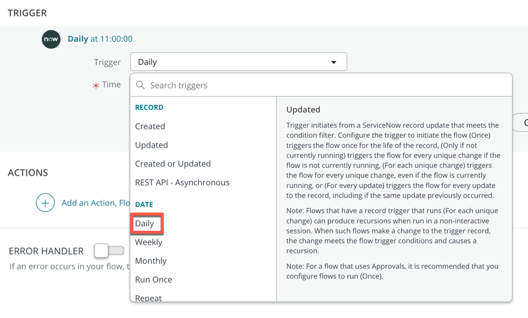
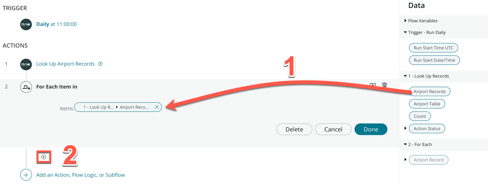
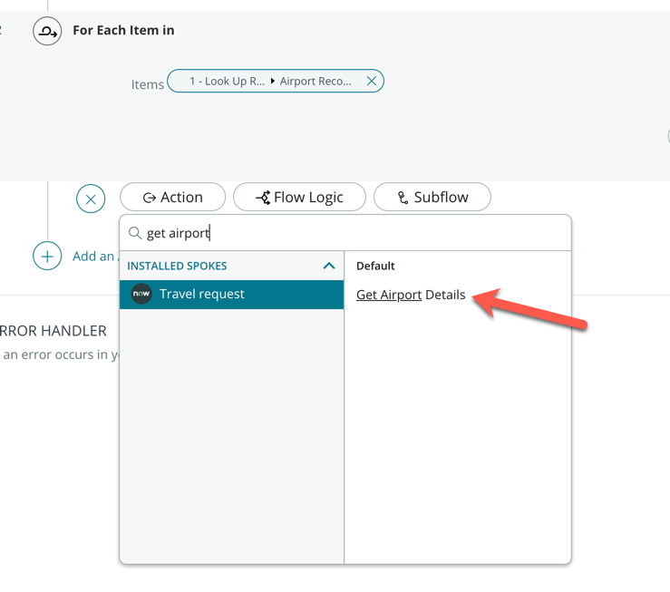
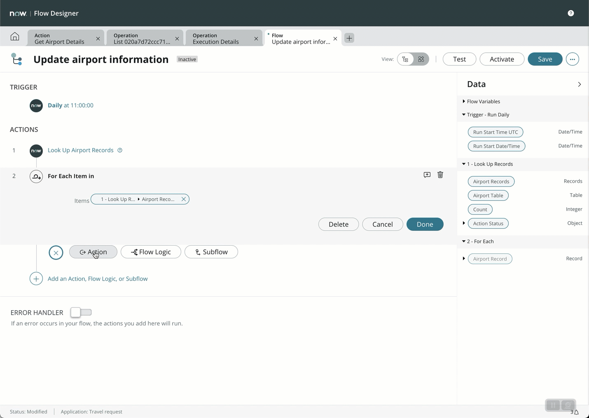
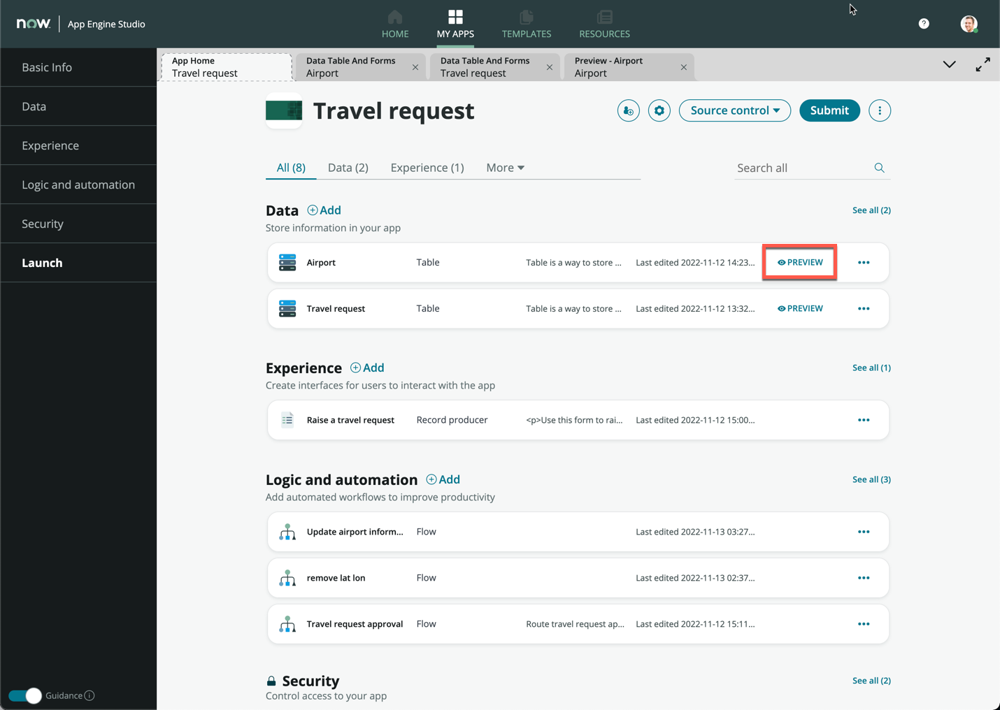
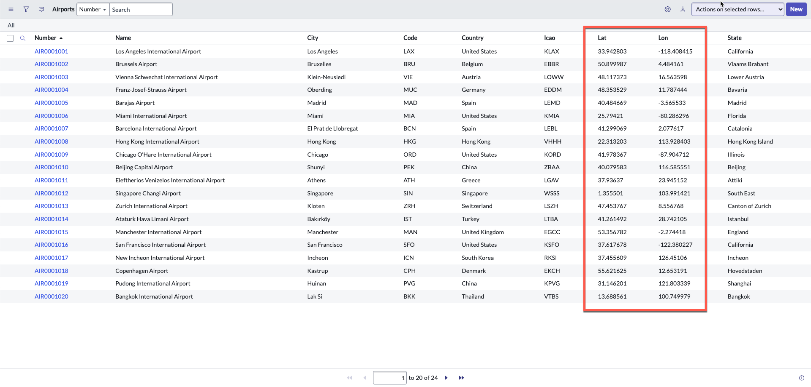

**Duration: 15 minutes**

In this bonus exercise, we will add the Action to a scheduled Flow to keep our Airport information up to date on a regular basis. 

1. Close all the pop-up boxes and click on the **+** tab

2. Click **Flow**

3. Under **Flow name**, enter **Update airport information**

4. Set **Run As** to **System User**

5. Click **Submit**

6. Click **Add a trigger**, then select **Daily** under date. This will run this workflow everyday

7. Click **Done**

8. Click **Add an Action, Flow Logic, or Subflow**

9. Click **Action**

10. Search and select **Look Up Records** - Pay special attention to selecting **Look Up Records** and not **Look Up Record**

11. Search and select **Airport** under **Table**

12. Click **Done**

13. Click **Add an Action, Flow Logic, or Subflow**

14. Click **Flow Logic**

15. Click **For Each**

16. Drag and drop the **Airport Records** data pill from the right sidebar onto the **Items** field

17. Click the small **+** icon directly under the **For Each Item in** step

18. Click **Action**

19. Search and click **Get Airport Details** (this was the API integration action we just created)

20. Expand **Airport Record** on the right sidebar under the **2 - For Each** section

21. Drag and drop the **Code** data pill onto the **IATA Code** field

22. Click **Done**

23. Add a new **For Each** Flow Logic under **Get Airport Details**

24. Drag and drop the **Output** data pill from the **3 - Get Airport details** section onto **Items**

25. Click the small **+** icon directly under the new **For Each Item in** step

26. Click **Action**, then search and select **Update Record**

27. Drag and drop the **Airport Record** data pill under **2 - For Each** onto the **Record** field

29. Click **+ Add field value**

30. Search and select **Lat**, expand the **response_object** data pill under **4 - For Each**

31. Drag and drop the **lat** data pill on the empty field

32. Click **+ Add field value**

33. Search and select **Lon**, expand the **response_object** data pill under **4 - For Each**

34. Drag and drop the **lng** data pill on the empty field

35. Refer to the full animation below:

36. Click **Done**

37. Click **Activate** on the top right

38. Click **Test**

39. Click **Run Test**

40. This will take a few minutes to run as we have 24 airports to update. Once done, click **Your test has finished running. View the flow execution details.**

41. Review the execution, take some time to expand each step to understand what has happened in this flow

42. Go back to App Engine Studio and preview the **Airport** table

43. This will open in a new tab, verify that all the **Lat** and **Lon** fields are now populated

This flow should now run everyday to update the latitude and longitude of each airport in your table. 

In a real life scenario, you could do so much more with the API, but this is just an example to show you the possibilites. 

For example, you could integrate with a complex booking API like Amadeus, and your users could search for flights and book flights and hotels directly from your custom application!