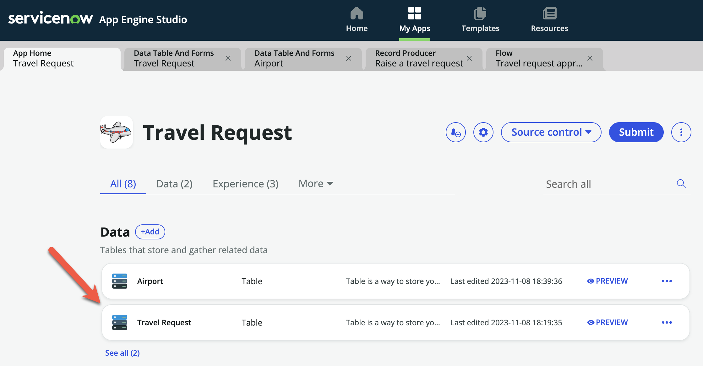
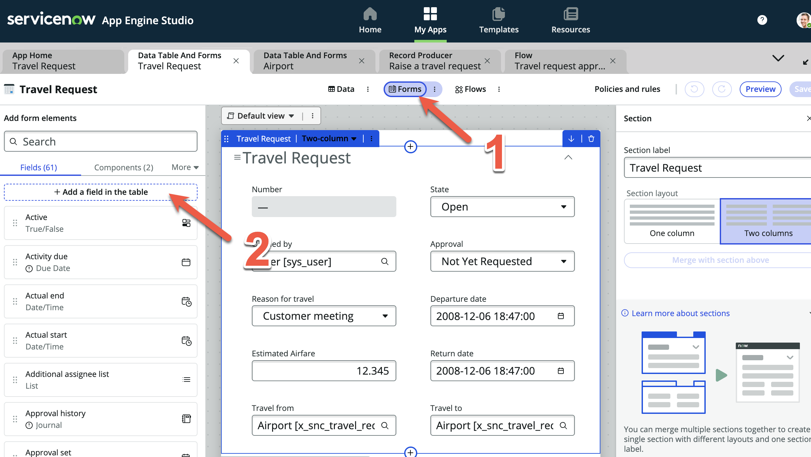
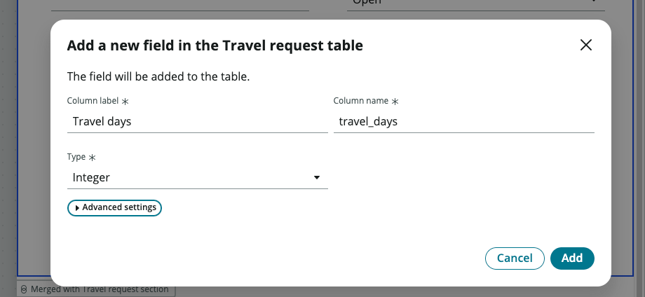
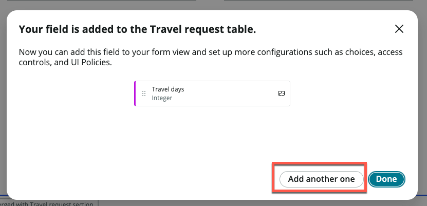
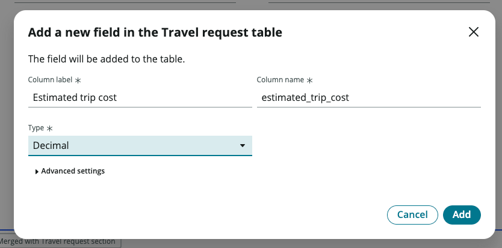
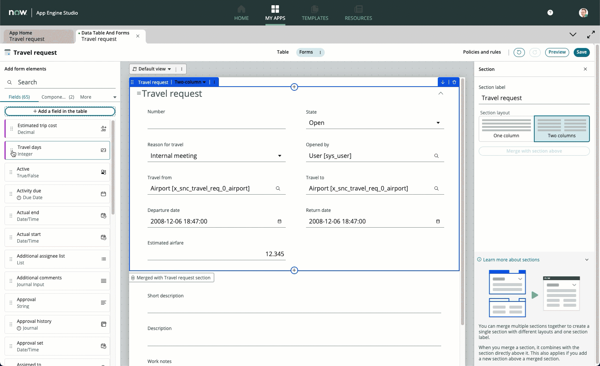
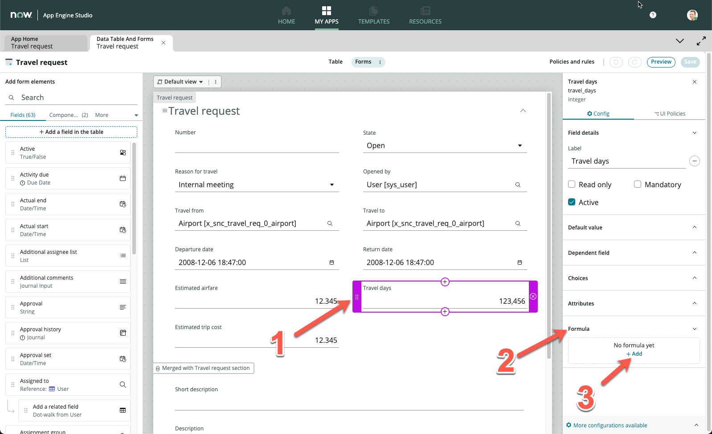
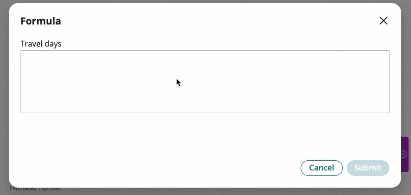
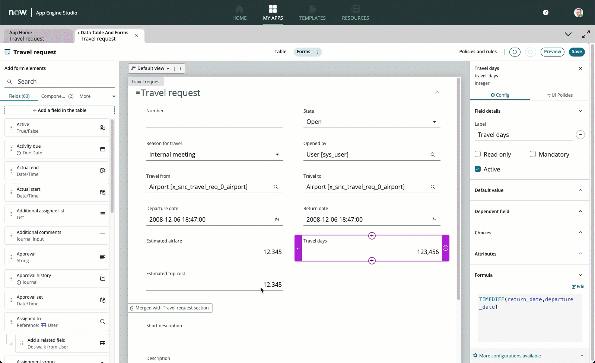

1. Navigate back to your **App Home** screen if you are not currently on it, then click the **Travel request** table to open table builder

2. Click the **Forms** button to get to form builder

3. Click **Add a field in the table**

4. In the pop-up, enter **Travel days** in **Column label**, and change **Type** to **Integer**. Leave the auto-populated field under **Column name**

5. Click **Add**

6. Click **Add another one**

7. Enter **Estimated trip cost** in **Column label**, and change **Type** to **Decimal**. Leave the auto-populated field under **Column name**

8. Click **Add**

9. Click **Done**

10. You should notice now on the left sidebar two form elements highlighted with a purple left border. These are your new fields you added

11. Drag and drop the **Travel days** and **Estimated trip cost** form elements onto your form

12. Click **Save**

13. Click the **Travel days** form element

14. On the rightside bar, you should see the options change

15. Click **Formula**

16. Click **Add**

17. In the pop-up Formula box, enter the following formula:

    `TIMEDIFF(return_date,departure_date)`

18. Click **Submit**

19. On the top right, click **Save**

20. Click **Estimated trip cost**

21. Click **Formula**, then **Add**

22. In the pop-up Formula box, enter the following formula:

    `SUM(estimated_airfare,MULTIPLY(travel_days, 150))`

:::info
Our formula here takes into account that each travel day, the employee is given $150 per diem
:::

23. Click **Submit**

24. On the top right, click **Save**

