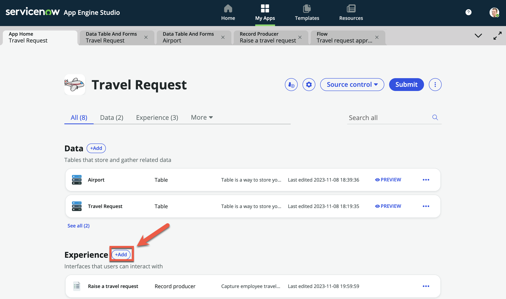
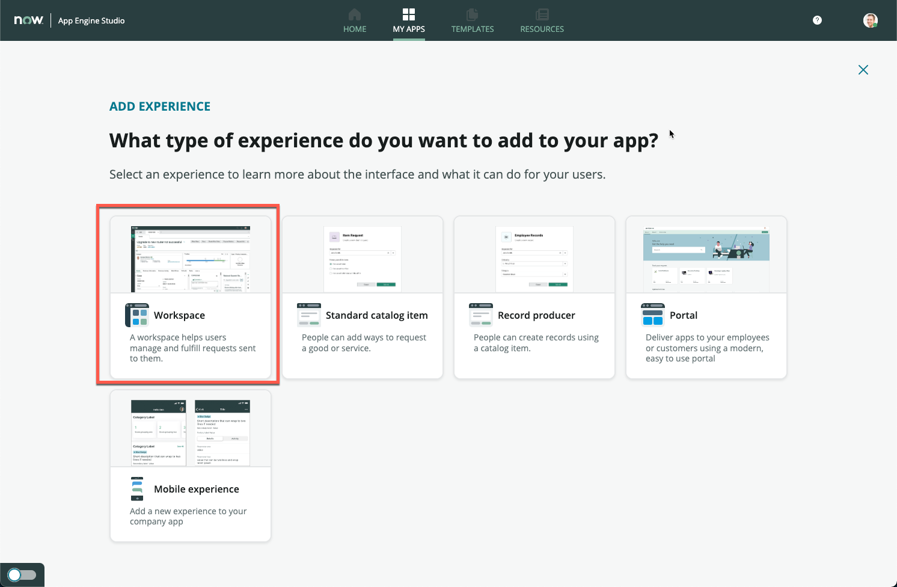
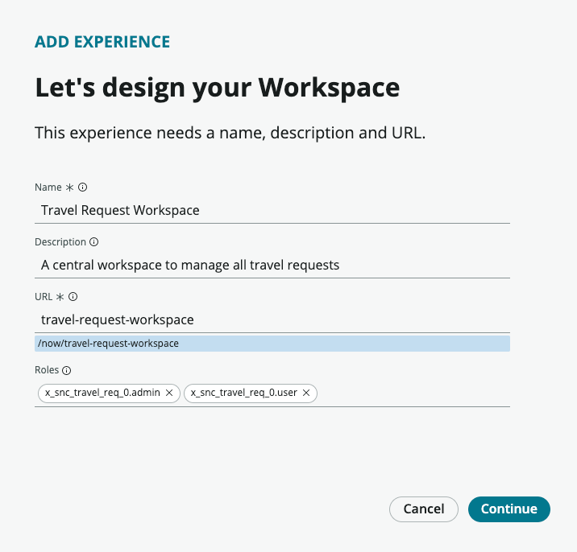
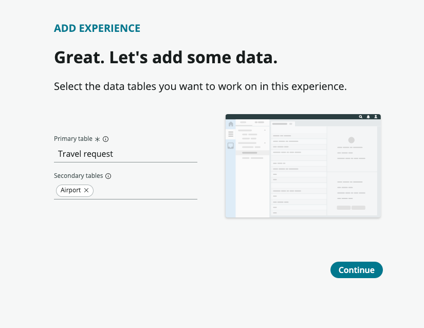
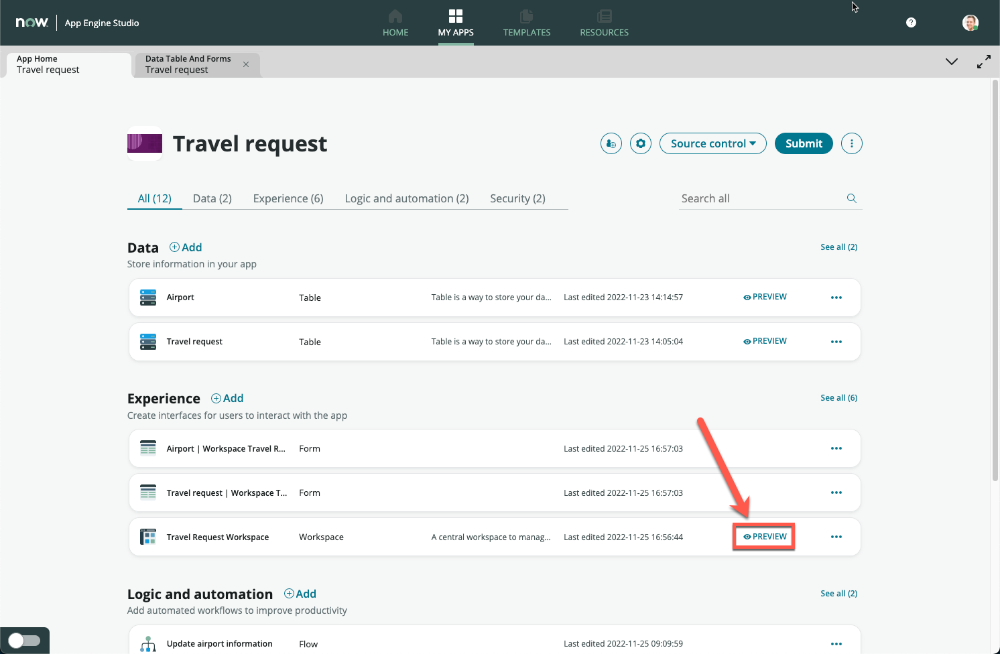
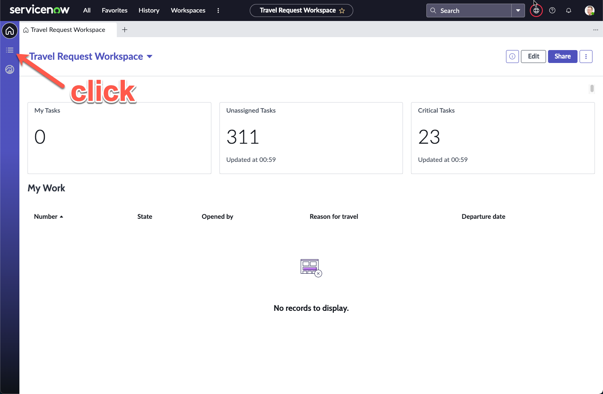
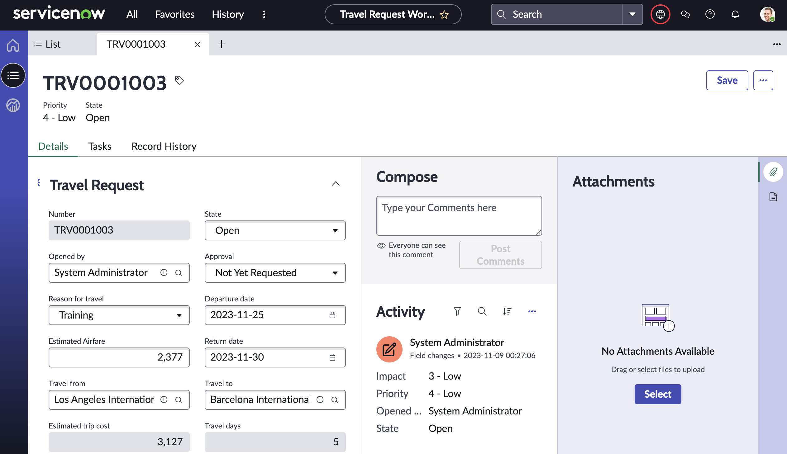

**Duration: 30 minutes**

:::caution
**Pre-requisites: Bonus Exercise 1**

Some screens will show forms that were configured in Bonus Exercise 1. 

These are minor changes that will not affect the completion of this exercise.
:::

1. Navigate back to your **App Home** screen if you are not currently on it, then click **Add** under **Experience**

2. Click **Workspace**

3. Click **Begin**

4. Change **Name** to **Travel Request Workspace**, **Description** to **A central workspace to manage all travel requests**

5. Leave the rest default and click **Continue**

6. Your screen should show **Airport** as the primary table, and **Travel request** in the secondary tables, we will need to swap these two around

7. Search and select **Travel request** under **Primary table**

8. Search and select **Airport** under **Secondary tables**

9. Click **Continue** and wait for a short loading time. The experience is getting built based on your application configurations so far

10. On the next screen, click **Done**

11. You should be brought back to **App Home**

12. Click **Preview** on the new **Travel Request Workspace** row

13. A new browser tab will open and the workspace will be loaded

14. Click on the **list** icon on the left sidebar

15. Notice that on the **Lists**, your **Travel request** and **Airport** tables appear

16. Click **All** under **Travel request**, notice that this removes all filters and shows all your created travel requests

17. Click **New** on the top right

18. The form view appears. This should be the same as what you had configured in Exercise 1. There are the additional fields **Travel days** and **Estimated trip cost** from Bonus Exercise 1

19. Fill in the form with data of your liking, then click **Save**

:::tip
On the right, **Attachments** can be added at any time. Attachments submitted together with our form in Exercise 2 will also appear here for viewing and download
:::