Let's create a dashboard so that users can have an easy view to understand current requests.  Then, we will add three widgets to the dashboard. 

## Widget 1: All travel requests

1. Click on the **Home** icon on the left sidebar to return to the workspace home page

2. On the top right, click **Edit**
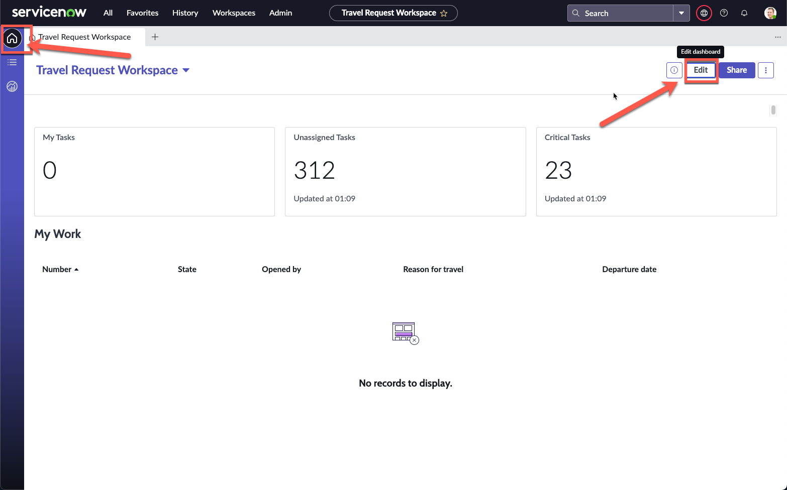

3. Click **My Tasks**, then the **Configure** button on the highlighted **Data visualization**

4. The right sidebar appears showing the Vizualization type **Single score**
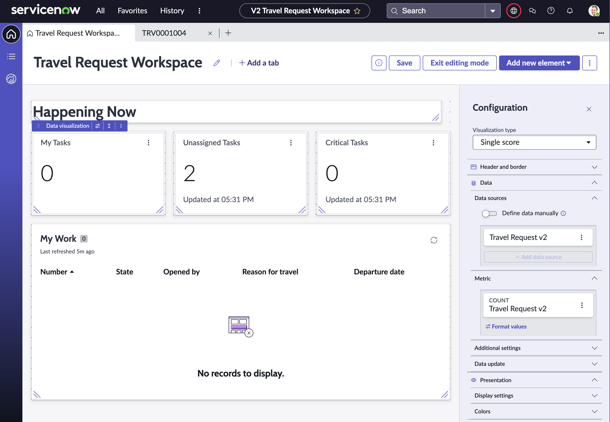

:::tip
If you face issues with the screen not loading, change to a different Vizualization type, then change it back to **Single score**
:::

5. Expand **Header and border**, then change **Chart title** to **All Travel Requests**. Here are all the steps so far:
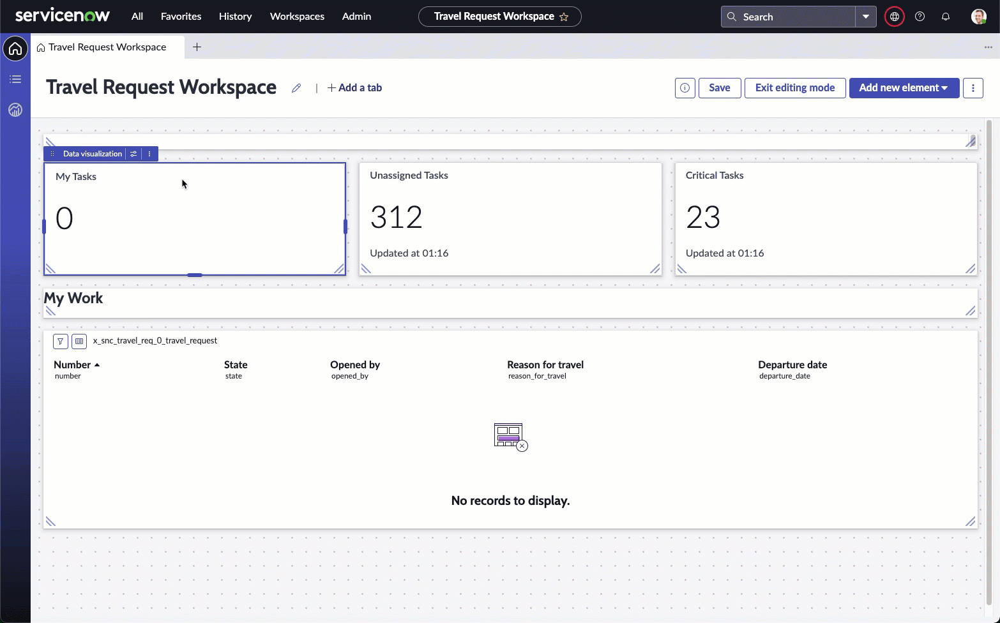

6. Under the **Data sources** section, click the 3 dot icon next to **Travel request**, then click **Edit**

7. On the **Edit data source** screen, click **Edit** under **Filters**

8. Remove the **Assigned to** condition by clicking the **X** icon

9. Click **Apply**
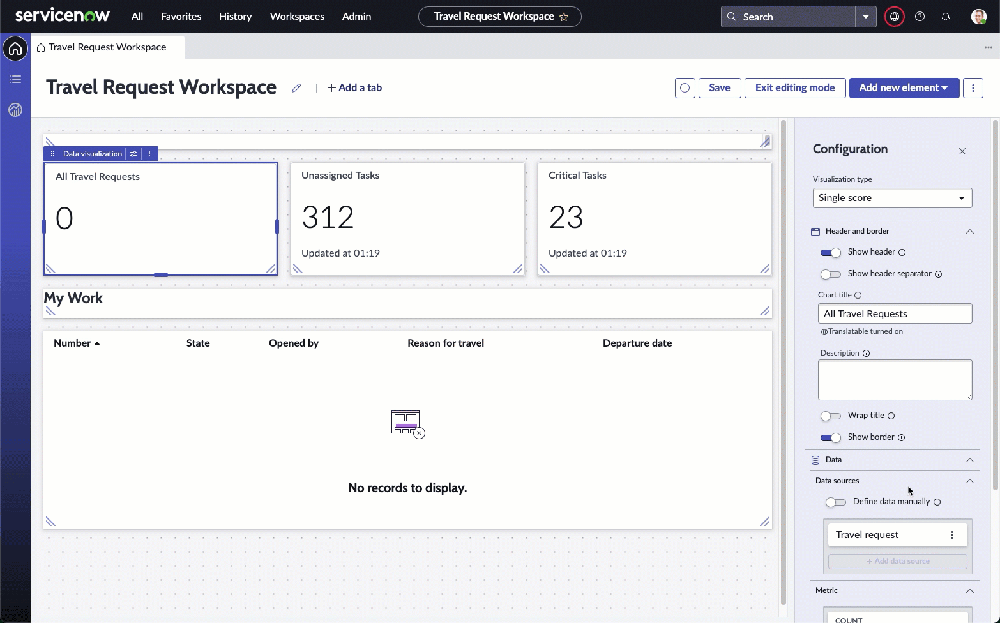

10. Confirm that the **All Travel Requests** widget now refreshes to show the number of Travel requests that you have created
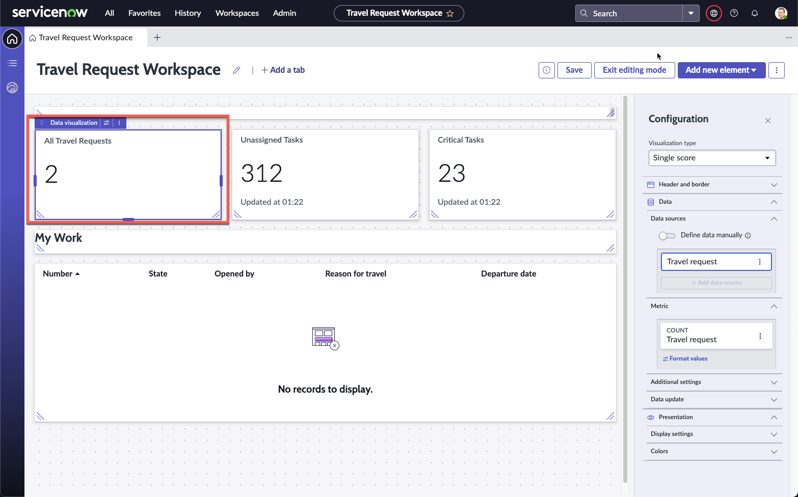

11. Click **Save** on the top right

## Widget 2: Estimated travel spend vs budget

:::danger
**This widget can only be configured if you completed Bonus Exercise 2.**

If you have not completed that, please skip this widget.
:::

1. Click and configure the next widget, **Unassigned Tasks**

2. Change the **Visualization type** to **Dial**

3. Under **Header and border** change **Chart title** to **Estimated Travel Spend**
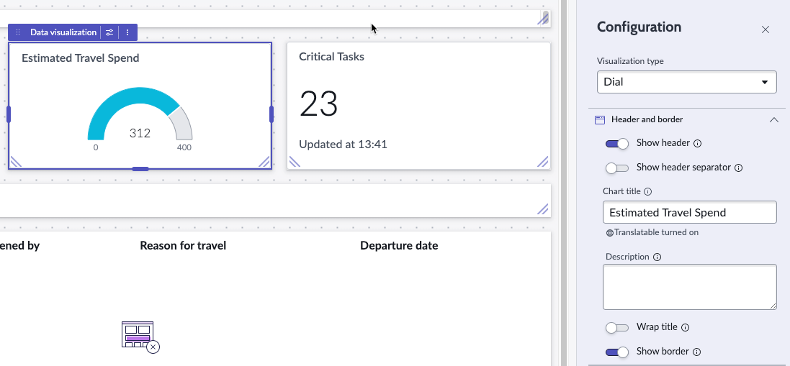

4. Under **Data sources**, edit the **Task** data source

5. On the next **Edit data source** screen, click on **Travel request [x_snc_travel_req_0_travel_request]** under **Suggested** on the left sidebar

6. Click **Add custom conditions**, then set the following condition: `Opened` on `Months -> This month`

7. Refer to the video below for a walkthrough:
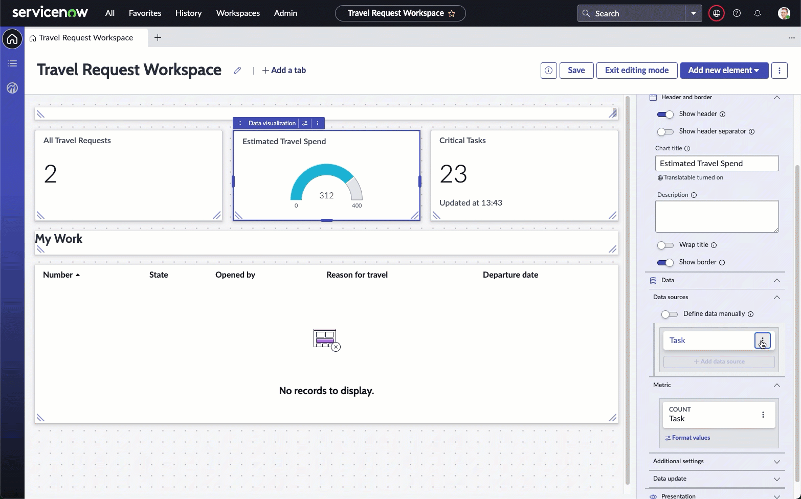

8. Back on the Edit dashboard view, on the right sidebar, click **Edit** for **Travel request** under **Metric**
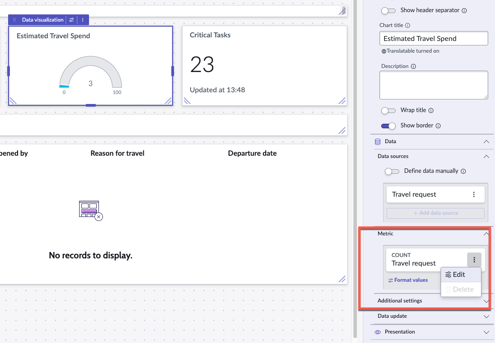

9. On the pop-up box, change **Count** under **Select an aggregation** to **Sum**

10. Change **Field** to **Estimated trip cost**
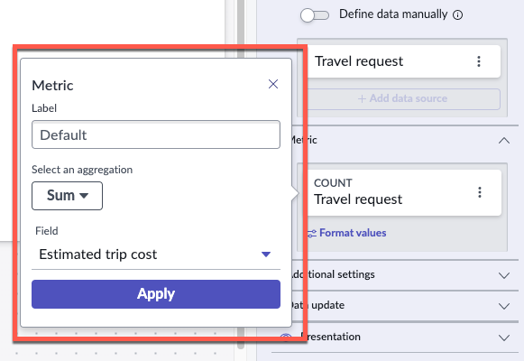

11. Click **Apply**

12. Click **Format values** under the **Estimated trip cost** metric

13. In the pop-up box, toggle **Use custom formatting**

14. Change **Rounding** to **Up**

15. Toggle **Enable abbreviation**

16. Click **Save**
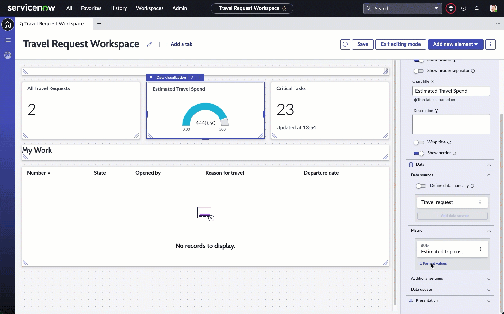

17. On the right Configuration sidebar, expand **Presentation**, then expand **Display settings**

18. Change **Max value** to a budget you think fits your current Estimated Travel Spend. e.g. here the Estimated Travel Spend is currently **4.45K** for the month, so we will put the Max value at **10K**
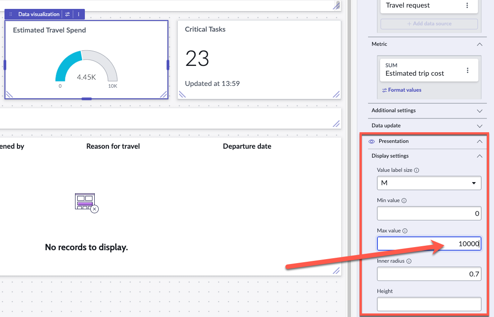

19. On the top right, click **Save**

20. Your middle **Estimated Travel Spend** widget should have been dynamically updating based on all the changes that we have been making

## Widget 3: Outstanding Approvals

:::caution
This widget will appear different if you have not completed Bonus Exercise 2, but will not impact completing the widget.
:::

1. Click the **My Work** list at the bottom of the dashboard.

2. On the right configuration sidebar, scroll to the bottom of the configuration panel to the **Header** section. Change **Label** from **My Work** to **Outstanding travel requests**
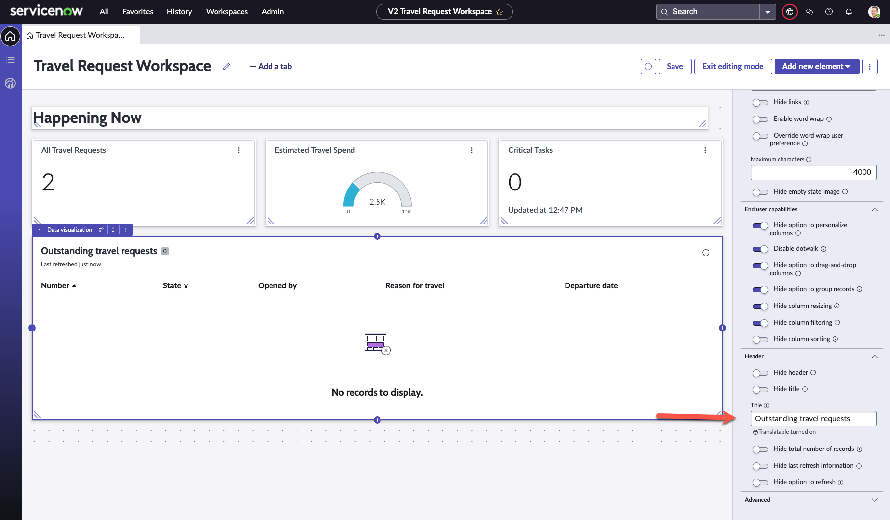

3. On the right configuration sidebar, scroll up and click **Edit filter**

4. On the pop-up box, remove **Assigned to is (dynamic) Me** by clicking **X** on the far right of the row

5. Click the **and** button

6. In the new **and** row that appears, set the following condition

    `State is one of Pending, Open, Work in Progress`

Refer to the video below:
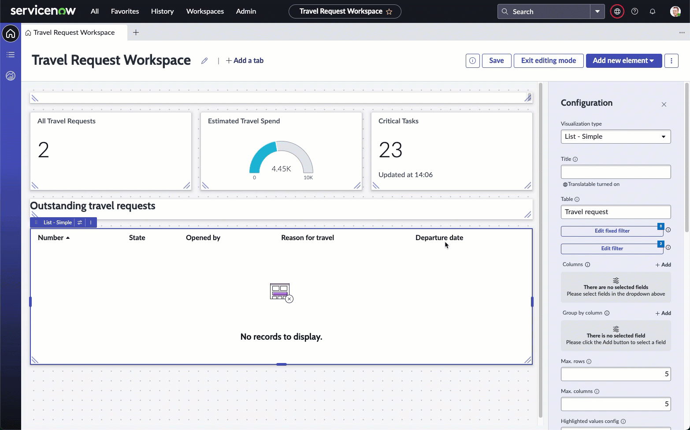

7. On the top right of the screen, click **Save**

8. Click **Exit editing mode**

9. Your dashboard should look similar to this
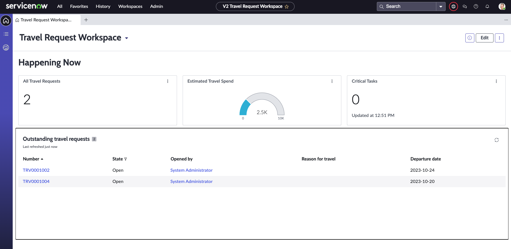

10. We have left the final **Critical Tasks** widget for you to experiement with. Feel free to make any changes that you would like with the different Vizualizations available by repeating the steps in this exercise.

:::tip
All widgets are also built with the drill-down capability. You can click on any of the widgets created to get to the underlying data supporting that widget.
:::

**Well done once again!**

In this exercise, you have built a dashboard purely through drag and drop. This is obviously just a short snippet into the possibilities here, and there is so much more that can be done to give data-rich vizualizations to those who need easy access to data as fulfillers and admins, all in a single workspace.