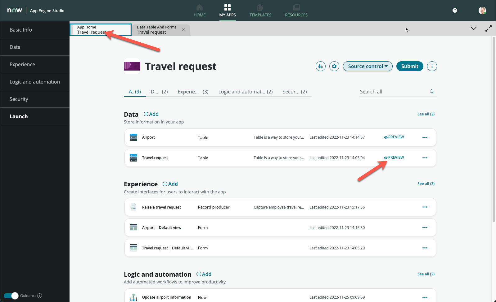
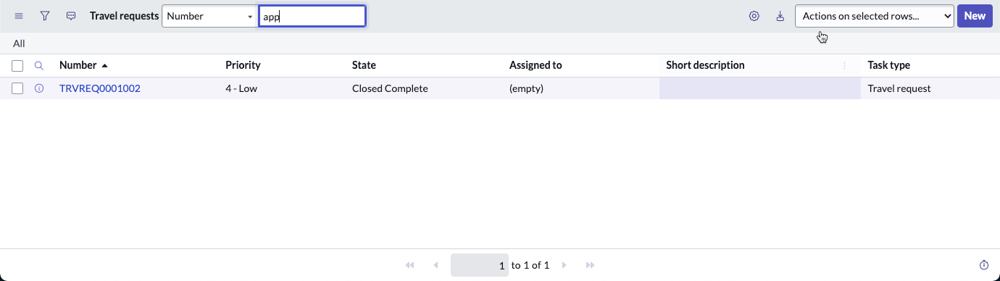
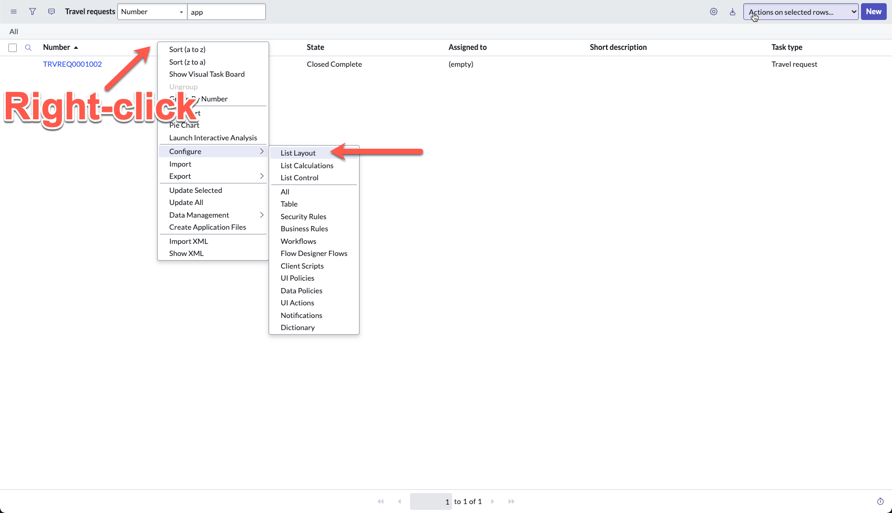
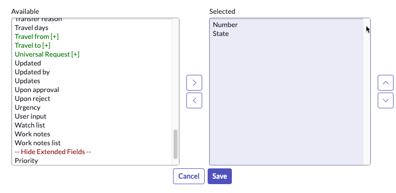
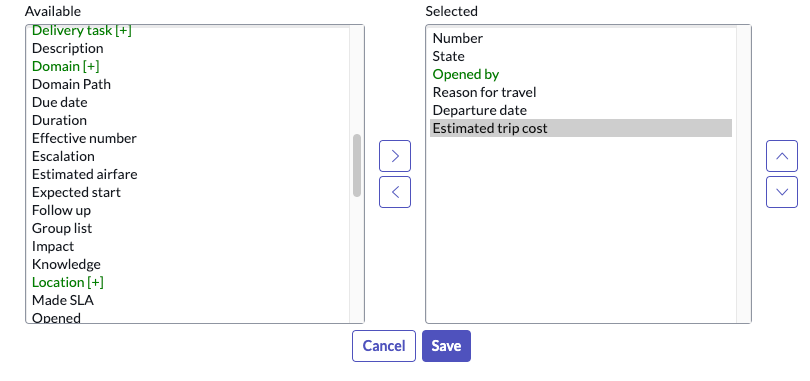
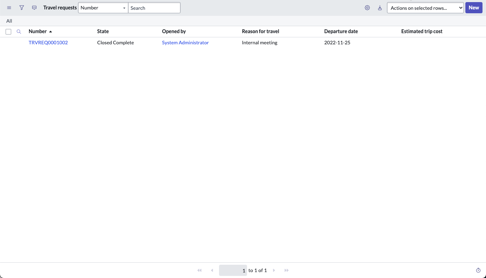
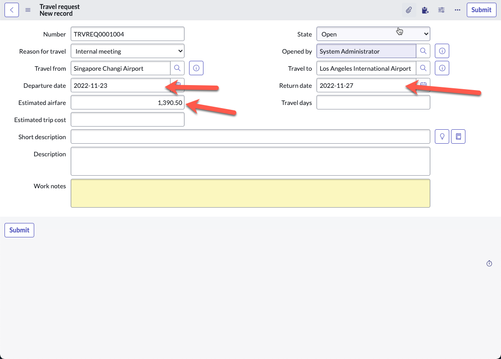
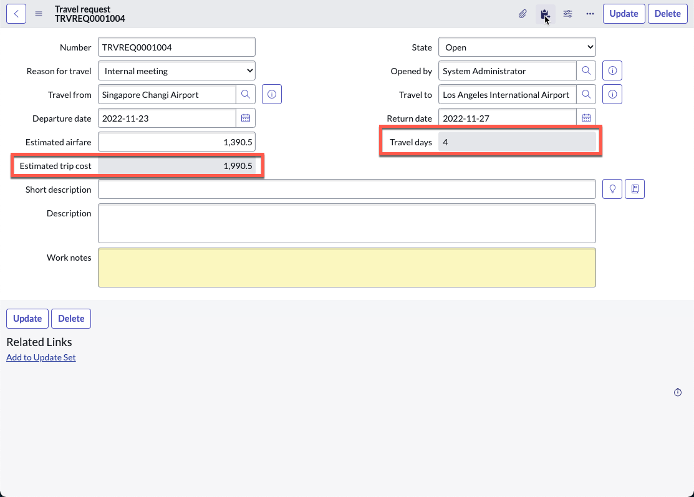

1. Go back to **App Home**

2. Click **PREVIEW** on the **Travel request** row

3. A new tab opens up to show the list of **Travel requests**

4. We did not format this list view back in Exercise 1, so let's go ahead to do that quickly

5. Right-click anywhere on one of the column headers

6. Click **List Layout** under **Configure**

7. On the right **Selected** section, remove everything except **Number** and **State**. Do this by double-clicking on each line to be removed

8. Add **Opened by, Reason for travel, Departure date, Estimated trip cost** from the left **Available** section onto the right **Selected** section

9. Click **Save**

10. You should now return to the list layout (your records will be slightly different based on what you entered in the exercise 4)

11. Click **New** on the top right

12. Fill up the form, ensure that you enter information for **Departure date**, **Return date** and any numerical figure for **Estimated airfare**

13. Right-click on the form header, then click **Save**

14. Notice that the **Travel days** and **Estimated trip cost** fields are automatically populated, ensure that the values are correct

15. In the screenshot above, the following was calculated

    `(4 * 150) + 1,390.50 = 1,990.50`

Well done, you now understand how to build excel-like formulas into your application! Here are some other possible formulas that are currently supported, but more are on the way:

* **AND** Performs a logical AND operation on the arguments.
* **AVERAGE** Returns the average value of the arguments.
* **CONCATENATE** Joins one or more input strings into a single string.
* **DIVIDE** Returns the quotient value after dividing argument 2 by argument 1.
* **IF** Executes the specified statements based on the Boolean output of the conditional expression.
* **ISBLANK** Finds white spaces or blank values in the string and returns true if there are any.
* **LENGTH** Returns the total number of characters in the input string.
* **LOWERCASE** Converts the input string to all lowercase characters.
* **MAX** Returns the highest value in the specified arguments.
* **MIN** Returns the lowest value in the specified arguments.
* **MULTIPLY** Returns the multiplied value of the arguments.
* **NOW** Returns the current date and time of the instance in ISO format.
* **OR** Performs logical OR operation on the arguments.
* **POWER** Returns the result of the base value raised to the power of the exponent value.
* **REPLACE** Replaces characters in the source string with the characters in the target string.
* **SUBTRACT** Returns the result value after subtracting argument 2 from argument 1.
* **SUM** Returns the sum of all the arguments.
* **TIMEDIFF** Finds difference between 2 dates for Duration field.
* **TITLECASE** Converts the input string to all title case characters.
* **UPPERCASE** Converts the input string to all uppercase characters.

:::info
Here is a link to the official Product Documentation with an up to date list of the formulas: 

[Product Docs: Formulas for column values in Table Builder](https://docs.servicenow.com/csh?topicname=formulas-columns-table-builder.html&version=latest)
:::